### **Universidad Peruana de Ciencias Aplicadas**

**Carrera**  Ingeniería de Software

**Ciclo**  2024-01

**Curso**   Aplicaciones Web

**Sección**   WX52

**Profesor**   Naldo Reupo-Musayon Gastulo

#### **Informe del Trabajo Final**

**Startup**  GoSteel

**Producto**   FastScooter

**Integrantes**
<table border="1" style="text-align: left;">
	<tbody>
        <tr>
            <td style="text-align:center;">
            <strong>Alumno</strong>
            </td>
            <td style="text-align:center;">
            <strong>Código</strong>
            </td>
        </tr>
		<tr>
			<td>Hidalgo Bustamante Josue Omar</td>
            <td>u202119880</td>
		</tr>
        <tr>
            <td>Barrial Marin, Sharon Antuanet Ivet</td>
            <td>U202114900</td>
        </tr>
        <tr>
            <td>Minaya Mundines, Pietro Minayat</td>
            <td>U201718387</td>
        </tr>
	 <tr>
            <td>Adrianzén Flores, Carlos Arturo</td>
            <td>U201718387</td>
        </tr>	
        <tr>
            <td>Huachaca Advincula, Scott Jacobo</td>
            <td>U201914294</td>
        </tr>
        <tr>
            <td>Apellido Apellido, Nombre Nombre</td>
            <td>uxxxxxxxxx</td>
        </tr>
	</tbody>
</table>

Junio del 2024

---
# Registro de Versiones del Informe

---
# Project Report Collaboration Insights

---
# Student Outcome
El curso contribuye al cumplimiento del Student Outcome ABET: **ABET – EAC - Student Outcome 5**   Criterio: *La capacidad de funcionar efectivamente en un equipo cuyos miembros juntos proporcionan liderazgo, crean un entorno de colaboración e inclusivo, establecen objetivos, planifican tareas y cumplen objetivos.*

En el siguiente cuadro se describe las acciones realizadas y enunciados de conclusiones por parte del grupo, que permiten sustentar el haber alcanzado el logro del ABET – EAC - Student Outcome 5.

| Criterio específico | Acciones realizadas | Conclusiones |
| - | - | - |
| Participa en equipos multidisciplinarios con eficacia, eficiencia y objetividad, en el marco de un proyecto en soluciones de ingeniería de software. | **Apellido Apellido Nombre Nombre**   ***TB1:*** Morbi vel tortor id eros dictum venenatis id ut dui.Mauris quis tellus sed nunc hendrerit vehicula ac id mauris.   ***TP:*** Morbi vel tortor id eros dictum venenatis id ut dui.Mauris quis tellus sed nunc hendrerit vehicula ac id mauris.   ***TB2:*** Morbi vel tortor id eros dictum venenatis id ut dui.Mauris quis tellus sed nunc hendrerit vehicula ac id mauris.   ***TF:*** Morbi vel tortor id eros dictum venenatis id ut dui.Mauris quis tellus sed nunc hendrerit vehicula ac id mauris.    **Apellido Apellido Nombre Nombre**   ***TB1:*** Morbi vel tortor id eros dictum venenatis id ut dui.Mauris quis tellus sed nunc hendrerit vehicula ac id mauris.   ***TP:*** Morbi vel tortor id eros dictum venenatis id ut dui.Mauris quis tellus sed nunc hendrerit vehicula ac id mauris.   ***TB2:*** Morbi vel tortor id eros dictum venenatis id ut dui.Mauris quis tellus sed nunc hendrerit vehicula ac id mauris.   ***TF:*** Morbi vel tortor id eros dictum venenatis id ut dui.Mauris quis tellus sed nunc hendrerit vehicula ac id mauris.    | ***TB1:*** Fusce cursus dolor et nulla suscipit, sit amet ullamcorper nibh vestibulum.    ***TP:*** Fusce cursus dolor et nulla suscipit, sit amet ullamcorper nibh vestibulum.    ***TB2:*** Fusce cursus dolor et nulla suscipit, sit amet ullamcorper nibh vestibulum.    ***TF:*** Fusce cursus dolor et nulla suscipit, sit amet ullamcorper nibh vestibulum. | 
| Conoce al menos un sector empresarial o dominio de aplicación de soluciones de software. | ***Apellido Apellido Nombre Nombre***   ***TB1:*** Cras sed diam suscipit, malesuada ex rutrum, fringilla orci. Vestibulum in nunc quis elit suscipit sollicitudin.   ***TP:*** Cras sed diam suscipit, malesuada ex rutrum, fringilla orci. Vestibulum in nunc quis elit suscipit sollicitudin.   ***TB2:*** Cras sed diam suscipit, malesuada ex rutrum, fringilla orci. Vestibulum in nunc quis elit suscipit sollicitudin.   ***TF:*** Cras sed diam suscipit, malesuada ex rutrum, fringilla orci. Vestibulum in nunc quis elit suscipit sollicitudin.    ***Apellido Apellido Nombre Nombre***   ***TB1:*** Cras sed diam suscipit, malesuada ex rutrum, fringilla orci. Vestibulum in nunc quis elit suscipit sollicitudin.   ***TP:*** Cras sed diam suscipit, malesuada ex rutrum, fringilla orci. Vestibulum in nunc quis elit suscipit sollicitudin.   ***TB2:*** Cras sed diam suscipit, malesuada ex rutrum, fringilla orci. Vestibulum in nunc quis elit suscipit sollicitudin.   ***TF:*** Cras sed diam suscipit, malesuada ex rutrum, fringilla orci. Vestibulum in nunc quis elit suscipit sollicitudin. | ***TB1:*** FEtiam imperdiet quam condimentum velit tempor porttitor.    ***TP:*** FEtiam imperdiet quam condimentum velit tempor porttitor.    ***TB2:*** FEtiam imperdiet quam condimentum velit tempor porttitor.    ***TF:*** FEtiam imperdiet quam condimentum velit tempor porttitor. |

---
# Contenido 
## Tabla de contenidos

### [Capítulo I: Introducción]()
- [1.1. Startup Profile]()
    - [1.1.1 Descripción de la Startup]()
    - [1.1.2 Perfiles de integrantes del equipo]()
- [1.2 Solution Profile]()
    - [1.2.1 Antecedentes y problemática]()
    - [1.2.2 Lean UX Process]()
        - [1.2.2.1. Lean UX Problem Statements]()
        - [1.2.2.2. Lean UX Assumptions]()
        - [1.2.2.3. Lean UX Hypothesis Statements]()
        - [1.2.2.4. Lean UX Canvas]()
- [1.3. Segmentos objetivo]()

### [Capítulo II: Requirements Elicitation & Analysis]()
- [2.1. Competidores]()
    - [2.1.1. Análisis competitivo]()
    - [2.1.2. Estrategias y tácticas frente a competidores]()
- [2.2. Entrevistas]()
    - [2.2.1. Diseño de entrevistas]()
    - [2.2.2. Registro de entrevistas]()
    - [2.2.3. Análisis de entrevistas]()
- [2.3. Needfinding]()
    - [2.3.1. User Personas]()
    - [2.3.2. User Task Matrix]()
    - [2.3.3. User Journey Mapping]()
    - [2.3.4. Empathy Mapping]()
    - [2.3.5. As-is Scenario Mapping]()
- [2.4. Ubiquitous Language]()

### [Capítulo III: Requirements Specification]()
- [3.1. To-Be Scenario Mapping]()
- [3.2. User Stories]()
- [3.3. Impact Mapping]()
- [3.4. Product Backlog]()

### [Capítulo IV: Product Design]()
- [4.1. Style Guidelines]()
    - [4.1.1. General Style Guidelines]()
    - [4.1.2. Web Style Guidelines]()
- [4.2. Information Architecture]()  
    - [4.2.1. Organization Systems]()
    - [4.2.2. Labeling Systems]()
    - [4.2.3. SEO Tags and Meta Tags]()
    - [4.2.4. Searching Systems]()
    - [4.2.5. Navigation Systems]()
- [4.3. Landing Page UI Design]()
    - [4.3.1. Landing Page Wireframe]()
    - [4.3.2. Landing Page Mock-up]()
- [4.4. Web Applications UX/UI Design]()
    - [4.4.1. Web Applications Wireframes]()
    - [4.4.2. Web Applications Wireflow Diagrams]()
    - [4.4.3. Web Applications Mock-ups]()
    - [4.4.4. Web Applications User Flow Diagrams]()
- [4.5. Web Applications Prototyping]()
- [4.6. Domain-Driven Software Architecture]()
    - [4.6.1. Software Architecture Context Diagram]()
    - [4.6.2. Software Architecture Container Diagrams]()
    - [4.6.3. Software Architecture Components Diagrams]()
- [4.7. Software Object-Oriented Design]()
    - [4.7.1. Class Diagrams]()
    - [4.7.2. Class Dictionary]()
- [4.8. Database Design]()
    - [4.8.1. Database Diagram]()

### [Capítulo V: Product Implementation, Validation & Deployment]()
- [5.1. Software Configuration Management]()
    - [5.1.1. Software Development Environment Configuration]()
    - [5.1.2. Source Code Management]()
    - [5.1.3. Source Code Style Guide & Conventions]()
    - [5.1.4. Software Deployment Configuration]()
- [5.2. Landing Page, Services & Applications Implementation]()
    - [5.2.1. Sprint 1]()
        - [5.2.1.1. Sprint Planning 1]()
        - [5.2.1.2. Sprint Backlog 1]()
        - [5.2.1.3. Development Evidence for Sprint Review]()
        - [5.2.1.4. Testing Suite Evidence for Sprint Review]()
        - [5.2.1.5. Execution Evidence for Sprint Review]()
        - [5.2.1.6. Services Documentation Evidence for Sprint Review]()
        - [5.2.1.7. Software Deployment Evidence for Sprint Review]()
        - [5.2.1.8. Team Collaboration Insights during Sprint]()
    - [5.2.2. Sprint 2]()
        - [5.2.2.1. Sprint Planning 2]()
        - [5.2.2.2. Sprint Backlog 2]()
        - [5.2.2.3. Development Evidence for Sprint Review]()
        - [5.2.2.4. Testing Suite Evidence for Sprint Review]()
        - [5.2.2.5. Execution Evidence for Sprint Review]()
        - [5.2.2.6. Services Documentation Evidence for Sprint Review]()
        - [5.2.2.7. Software Deployment Evidence for Sprint Review]()
        - [5.2.2.8. Team Collaboration Insights during Sprint]()
    - [5.2.3. Sprint 3]()
        - [5.2.3.1. Sprint Planning 3]()
        - [5.2.3.2. Sprint Backlog 3]()
        - [5.2.3.3. Development Evidence for Sprint Review]()
        - [5.2.3.4. Testing Suite Evidence for Sprint Review]()
        - [5.2.3.5. Execution Evidence for Sprint Review]()
        - [5.2.3.6. Services Documentation Evidence for Sprint Review]()
        - [5.2.3.7. Software Deployment Evidence for Sprint Review]()
        - [5.2.3.8. Team Collaboration Insights during Sprint]()
    - [5.2.4. Sprint 4]()
        - [5.2.4.1. Sprint Planning 4]()
        - [5.2.4.2. Sprint Backlog 4]()
        - [5.2.4.3. Development Evidence for Sprint Review]()
        - [5.2.4.4. Testing Suite Evidence for Sprint Review]()
        - [5.2.4.5. Execution Evidence for Sprint Review]()
        - [5.2.4.6. Services Documentation Evidence for Sprint Review]()
        - [5.2.4.7. Software Deployment Evidence for Sprint Review]()
        - [5.2.4.8. Team Collaboration Insights during Sprint]()
- [5.3. Validation Interviews]()
    - [5.3.1. Diseño de Entrevistas]()
    - [5.3.2. Registro de Entrevistas]()
    - [5.3.3. Evaluaciones según heurísticas]()
- [5.4. Video About-the-Product]()

---
# Capítulo I: Introducción
## 1.1. Startup Profile
### 1.1.1 Descripción de la Startup

GoSteel: Simplificando la movilidad urbana con FastScooter

<ins>**Misión:**</ins>
En GoSteel, nuestra misión es proporcionar soluciones de movilidad eficientes y sostenibles para empresas de todos los tamaños. Nos comprometemos a ofrecer un servicio de renta de scooters eléctricos empresariales, FastScooter, que permita a nuestros clientes optimizar sus desplazamientos, reducir costos operativos y contribuir positivamente al medio ambiente.

<ins>**Visión:**</ins>
Nuestra visión en GoSteel es liderar la transformación del transporte urbano, ofreciendo una alternativa innovadora y ecoamigable a los métodos de movilidad tradicionales. Nos esforzamos por convertirnos en socios estratégicos de los transeuntes, brindándoles soluciones de movilidad flexibles y personalizadas que impulsen su crecimiento, eficiencia y sostenibilidad a largo plazo.

<ins>**Valores:**</ins>
1. **Sostenibilidad Ambiental:** Nos comprometemos a promover prácticas de movilidad sostenibles y respetuosas con el medio ambiente, contribuyendo activamente a la reducción de emisiones de carbono y la preservación de recursos naturales.
2. **Innovación Tecnológica:** Buscamos constantemente innovar y mejorar nuestros servicios, aprovechando tecnologías avanzadas para ofrecer una experiencia de movilidad eficiente, segura y conveniente.
3. **Excelencia en el Servicio al Cliente: ** Priorizamos la satisfacción y el éxito de nuestros clientes, brindándoles un servicio de alta calidad, atención personalizada y soluciones adaptadas a sus necesidades específicas.
4. **Transparencia y Confianza:** Actuamos con integridad y transparencia en todas nuestras operaciones, estableciendo relaciones de confianza y colaboración tanto con nuestros clientes como con nuestros colaboradores y socios comerciales.
5. **Responsabilidad Social Corporativa:** Nos comprometemos a ser agentes de cambio positivo en nuestras comunidades, apoyando iniciativas sociales y ambientales que contribuyan al bienestar y desarrollo sostenible de la sociedad en su conjunto.

Con FastScooter, en GoSteel estamos comprometidos a proporcionar a las transeuntes una solución de movilidad ágil, eficiente y ecológica que les permita optimizar sus rutas y promover un futuro más sostenible para todos.

### 1.1.2 Perfiles de integrantes del equipo

Nombre completo: Sharon Antuanet Ivet Barrial Marin 

Código de estudiante: U202114900

Carrera: Ingeniería de Software

Acerca de mí: Soy una estudiante que se caracteriza por poseer cualidades como la perseverencia, el compañerismo y la comunicación interpersonal. Además de tener conocimientos en diversos lenguajes de programación (Python, C++, C#...), también tengo habilidades en la edición de fotos y videos, y en el enfoque al marketing digital. Espero que estas pocas cualidades sirvan como aporte al proyecto durante el presente ciclo y curso.

Nombre completo: Pietro Gerardo Minaya Mundines 

Código de estudiante: U201718387

Carrera: Ingeniería de Software

Acerca de mí: Soy un apasionado por la tecnologia y me apasiona el Ajedrez.

Nombre completo: Carlos Arturo Adrianzén Flores

Código de estudiante: U202215705

Carrera: Ingeniería de Software

Acerca de mí: Soy estudiante de la UPC, curso el 5to ciclo. Me gusta jugar fútbol y tocar guitarra. Respecto al trabajo en equipo espero poder ayudar con todas mis capacidades. Me considero optimista y alegre.

Nombre completo: Scott Jacobo Huachaca Advincula

Código de estudiante: U201914294

Carrera: Ingeniería de Software

Acerca de mí: Soy estudiante de la UPC, la razon por la que elegi la carrera es porque combina las cosas que me gustan como la tecnologia y la creacion de aplicaciones. Ademas siempre me ha intrigado como funcionan las aplicaciones que utilizamos a diario, como las redes sociales o aplicaciones de productividad.

Nombre completo: Josue Hidalgo Bustamante 

Código de estudiante: U202119880

Carrera: Ingeniería de Software

Acerca de mí: Soy estudiante de la UPC,me gusta mucho la tecnologia y los videojuegos

## 1.2 Solution Profile
### 1.2.1 Antecedentes y problemática

En entornos urbanos el tráfico y la contaminación representan desafíos importantes, con congestiones viales que aumentan el estrés y emiten gases nocivos, afectando la salud pública y el medio ambiente. Frente a esto *GoStell* identficó que se necesitan soluciones sostenibles, como el transporte público y medios de movilidad alternativos, junto con políticas urbanas que reduzcan el tráfico y las emisiones.

**What?**

La renta de scooters es un proceso donde las personas dentro de Lima Metropolitana adquieren una alternativa de transportes frente a la problemática del congestionamiento vehicular y la conciencia ambiental. La contribución al medio ambiente se refiere a la idea de que esta práctica puede tener un impacto positivo en el entorno, al reducir el uso de automóviles que emiten gases como el dióxido de carbono provocando polución.

**Who?**

Nuestro enfoque principal son las personas que transitan dentro de Lima Metropolitana. Esto puede incluir:
- Residentes locales que quieren un transporte para uso diaro.
- Turistas extranjeros y locales, para realizar turismo por las calles o incentivar diferentes actividades.
- Personas dueñas de empresas delivery o que ofrecen este tipo de servicio para la entrega de sus productos.

**When?**

La renta de scooters solo estará disponible durante la duración de 15 horas, desde las 7 de la mañana hasta las 10 de la noche, considerando el timing de personas que mayormente transitan por esas zonas. 

**Where?**

La renta de scooters estará premitida dentro de toda la zona de Lima Metropolitana, cada vez que un usuario inicie sesión en nuestra aplicación  y alquile un scooter.

**Why?**

- **Antecedentes:** El uso de automóviles que emiten gas de carbono es conocido por su impacto ambiental negativo debido a la producción masiva de sus componentes en fábricas y al uso cotidiano como transporte.

- **Problemática:** La renta de scooters busca abordar la problemática de la carencia de transportes ágiles y eco-friendly, reduciendo el uso de trasnportes que tanto en su producción como en su uso final, generan mucho impacto negativo en nuestro medio ambiente

**How?**

Las personas que se registran a nuestra aplicación pueden acceder a la función de aquilar los scooters de nuestros provedores.

**How Much?**

El impacto en la contribución al medio ambiente puede variar, pero el potencial para reducir la producción y la polución que generan los automóviles al emitir gases de dióxido de carbono.

### 1.2.2 Lean UX Process
#### 1.2.2.1. Lean UX Problem Statements
Para los usuarios interesados en la movilidad urbana ágil y económica, la falta de opciones accesibles y convenientes para el alquiler de scooters representa un obstáculo significativo. Actualmente, las alternativas disponibles carecen de una plataforma centralizada que facilite el contacto entre los usuarios y los proveedores, lo que conduce a una experiencia fragmentada y poco satisfactoria. Además, la ausencia de un modelo de negocio rentable para ambas partes impide el desarrollo de un ecosistema de alquiler de scooters sostenible y efectivo. Esta falta de solución integral obstaculiza tanto a los usuarios que buscan una alternativa de movilidad eficiente como a empresas de delivery que buscan una opcion de transporte para sus empleados que sea tanto económica como sostenible.

Usuarios interesados en movilidad urbana ágil y económica:

* Problema: Carencia de opciones accesibles y convenientes para el alquiler de scooters
* Causa: Falta de una plataforma para facilitar el contacto entre usuario y proveedores
* Efecto: Experiencia de usuario fragmentada y poco satisfactoria

Empresas de delivery buscando opciones de transporte Económicas y sostenibles:

* Problema: Dificultad para encontrar soluciones de transporte adecuadas para empleados
* Causa: Ausencia de un modelo de negocio rentable que beneficie tanto a proveedores como a empresas
* Efecto: Limitaciones para desarrollar un sistema de entrega eficiente y sostenible

Desarrollo de un ecosistema sostenible de alquiler de scooters:

* Problema: Falta de un ecosistema de alquiler de scooters sostenible y efectivo
* Causa: Inexistencia de soluciones integrales que atiendan tanto a usuarios individuales como a empresas
* Efecto: Limitaciones para desarrollar un sistema de entrega eficiente y sostenible

Impacto de la contaminación en la salud y economia:

* Problema: La contaminación del aire en las ciudades afecta la salud y economia
* Causa: Emisiones de CO2 del transporte urbano y congestion vehicular
* Efecto: Mas de 1600 muertes anuales atribuidas al aire contaminado en Lima, ademas de impactos economicos negativos.

#### 1.2.2.2. Lean UX Assumptions
* Los usuarios prefieren opciones de movilidad ágil y económica para desplazarse
* Los usuarios buscan opciones de movilidad que no solo sean ágiles y económicas, sino también seguras y confiables.
* Los proveedores de scooters están dispuestos a participar en una plataforma centralizada de alquiler de scooters.
* Los usuarios están dispuestos a utilizar una aplicación web para gestionar el alquiler de scooters debido a su conveniencia y accesibilidad.
* Existe una preocupación creciente por la congestión del tráfico y la contaminación en áreas urbanas, lo que aumenta la demanda de opciones de movilidad sostenible como el alquiler de scooters.
* La transparencia en cuanto a precios y políticas de uso contribuirá a generar confianza y lealtad entre los usuarios de la aplicación de alquiler de scooters.
* Los usuarios valoran la flexibilidad en el modelo de alquiler, preferiendo opciones que se adapten a diferentes necesidades, como tarifas por minuto, planes de suscripción o paquetes de uso diario/semanal

#### 1.2.2.3. Lean UX Hypothesis Statements
- Creemos que los usuarios de servicios de movilidad urbana prefieren opciones ágiles y económicas debido a la conveniencia y flexibilidad que ofrecen en comparación con métodos de transporte tradicionales como automóviles o taxis.
- Creemos que los usuarios valoran la seguridad y confiabilidad al elegir opciones de movilidad, lo que incluye la percepción de riesgo al usar scooters eléctricos en áreas urbanas.
- Creemos que los proveedores de scooters eléctricos están dispuestos a participar en una plataforma de alquiler de scooters si les brinda beneficios como una mayor visibilidad en el mercado y una gestión simplificada de su flota.
- Creemos que la transparencia en cuanto a precios y políticas de uso contribuirá a generar confianza y lealtad entre los usuarios de la aplicación.
- Creemos que los usuarios valoran la flexibilidad en el modelo de alquiler, prefiriendo opciones que se adapten a diferentes necesidades, como tarifas por minutoi, planes de suscripción o paquetes de uso semanal.
- Creemos que existe una creciente preocupación por la congestión del tráfico y la contaminación en áreas urbanas, lo que aumenta la demanda de opciones de movilidad sostenibles.
- Creemos que los usuarios están dispuestos a utilizar una aplicación web para gestionar el alquiler de scooters debido a su conveniencia y accesibilidad, siempre y cuando la plataforma ofrezca una experiencia de usuario intuitiva y segura.

#### 1.2.2.4. Lean UX Canvas
 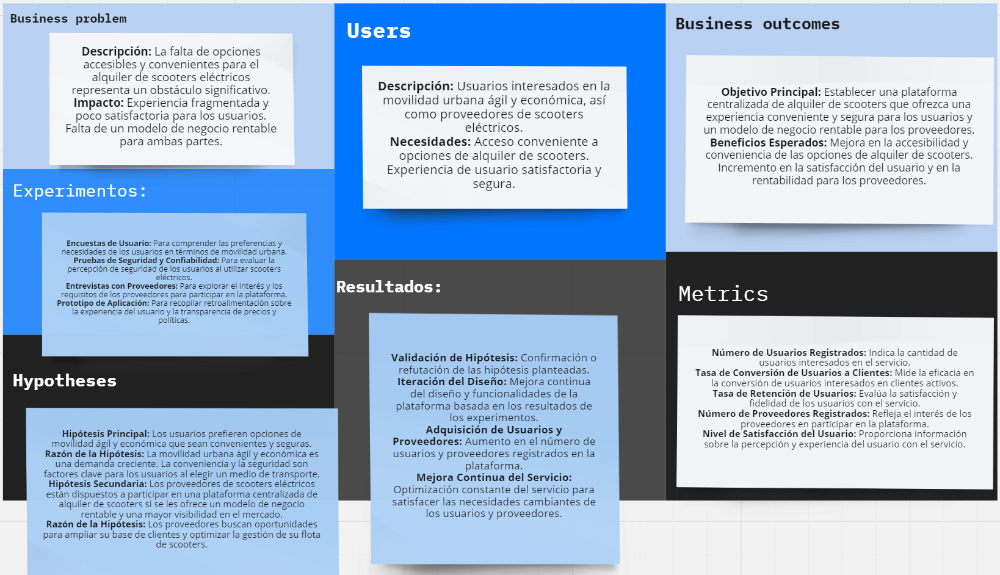
 
## 1.3. Segmentos objetivo

Para el desarrollo de FastScooter tenemos como enfoque dos segmentos objetivos:

>**Personas que transitan Lima Metropolitana**

Aunque *FastScooter* está disponible a todo público bajo su propia responsalidad, nuestro enfoque primordial son las personas que se movilizan por Lima Metropolitana de 18 a 30 años de edad, cuando cumplen la mayoría de edad y en general tienden a movilizarse por sí solos. En este tipo de casos, los scooters son una solución viable de **transporte alternativo** en las áreas urbanas, donde abunda los problemas de congestión de tráfico y estacionamiento limitado. El alquiler de scooters ofrece una solución de movilidad alternativa que es más rápida y flexible que el transporte público y más económica que el uso de un automóvil o taxi.

Además, al ser un servicio *eco-friendly*, aporta al **cuidado de nuestro medio ambiente**, debido a que reduce las emisiones de carbono y la creciete polución que crean los vehículos de combustión interna en la actualidad. Asimismo, y debido a la creciente toma de conciencia ambiental en los últimos años, ha hecho que muchas personas hagan uso de scooters eléctricos, fomentando un estilo de vida más respetuoso con el medio ambiente.

Por otro lado, según RPP (2020), la mayoría de los ciudadanos no poseen un vehículo propio y en comparación con otros países de Latianoamérica, Perú cuenta con una cantidad de autos menor al promedio. El alquiler de scooters es una opción conveniente y flexible para desplazarse por la ciudad. Pueden usar los scooters para viajes cortos o esporádicos sin la necesidad de comprometerse con la propiedad y el mantenimiento de un vehículo.

Por último, la renta de scooters estimula el turismo en la **realización de actividades** recreativas entre Los residentes locales y turistas, desde paseos por el vecindario a visitas a parques locales o exploración de lugares de interés turístico dentro de la ciudad.

>**Empresas delivery**

Las empresas delivery o con servicio delivery en Lima metropolitana son un enfoque importante para nuestro producto, ya que *FastScooter* les da como beneficio la **eficiencia en la entrega**. Debido a que los scooters son vehículos pequeños y ágiles, consiguen acceder a áreas de la ciudad a las que los automóviles no pueden llegar fácilmente haciendo que las entregas sean más rápidas y cumplan con los plazos acordados sin que el tráfico congestionado de Lima Metropolitana sea un problema.

Asimismo, resuelve el problema de la **reducción de costos operativos**, puesto que al hacer uso de scooters en lugar de vehículos más grandes ocasionan que los costos operativos asociados con el mantenimiento y el combustible disminuya, lo que puede ser beneficioso para las empresas de entrega en términos de rentabilidad. A su vez, alquilar scooters en lugar de comprarlos puede proporcionar a las empresas de entrega la flexibilidad de aumentar o reducir su flota según la demanda, lo que les permite ajustarse a los cambios estacionales o a las fluctuaciones en la demanda del mercado.

Además de estas razones empresariales, también existe una mejora en la **sostenibilidad ambiental**. El uso de scooters eléctricos produce bajas emisiones de polución lo que ayuda a reducir la huella de carbono de las operaciones de entrega de la empresa y esto es un punto de venta importante para aquellas empresas que buscan mejorar su imagen y compromiso con el ambiente.

# Capítulo II: Requirements Elicitation & Analysis
## 2.1 Competidores

***Lime:*** Una de las empresas líderes en el alquiler de scooters eléctricos. Opera en varias ciudades de todo el mundo y se ha convertido en una opción popular para la movilidad urbana.

***Bird:*** Empresa importante en este sector. Ofrece scooters eléctricos para alquilar en áreas urbanas. Su presencia global y su enfoque en la sostenibilidad los hacen destacar.

***Voi:*** es otra empresa importante en este sector. Ofrece scooters eléctricos para alquilar en áreas urbanas. Su presencia global y su enfoque en la sostenibilidad los hacen destacar.

### 2.1.1 Análisis competitivo
<table border="1" style="text-align: center;">
	<tbody>
		<tr>
			<td colspan="6">Competitive Analysis Landscape</td>
		</tr>
		<tr>
			<td colspan="2">¿Por que llevar a cabo este análisis?</td>
			<td colspan="4">Llevar a cabo este análisis nos brindará información crítica que nos permitirá tomar decisiones más informadas y estratégicas para el desarrollo, comercialización y crecimiento de nuestra aplicación</td>
		</tr>
		<tr>
			<td colspan="2"></td>
			<td>GoSteel</td>
			<td>Lime</td>
			<td>Bird</td>
			<td>Voi</td>
		</tr>
		<tr>
			<td rowspan="2">Perfil</td>
			<td>Overview</td>
			<td>Aplicación web diseñada para el alquiler de scooters</td>
			<td>Aplicación web diseñada para la compra/alquiler de scooters</td>
			<td>Aplicación web diseñada para la compra/alquiler de scooters</td>
			<td>Aplicación web diseñada para la compra/alquiler de scooters</td>
		</tr>
		<tr>
			<td>Ventaja competitiva ¿Que valor ofrece a los clientes?</td>
			<td>Ser una plataforma que ofrece </td>
			<td>Ser una plataforma que facilita  </td>
			<td>Ser una plataforma que proporciona </td>
			<td>Ser una plataforma que administra </td>
		</tr>
		<tr>
			<td rowspan="2">Perfil de Marketing</td>
			<td>Mercado objetivo</td>
			<td>
                <ul>
                    <li>Segmento Objetivo 1</li>
                    <li>Segmento Objetivo 2</li>
                </ul>
            </td>
			<td>
                <ul>
                    <li>Segmento Objetivo 1</li>
                    <li>Segmento Objetivo 2</li>
                </ul>
            </td>
			<td>
                <ul>
                    <li>Segmento Objetivo 1</li>
                    <li>Segmento Objetivo 2</li>
                </ul>
            </td>
			<td>
                <ul>
                    <li>Segmento Objetivo 1</li>
                    <li>Segmento Objetivo 2</li>
                </ul>
            </td>
		</tr>
		<tr>
			<td>Estrategias de marketing</td>
			<td>
                <ul>
                    <li>Marketing de contenido</li>
                    <li>Página web</li>
                </ul>
            </td>
			<td>
                <ul>
                    <li>Marketing de contenido</li>
                    <li>Página web</li>
                </ul>
            </td>
			<td>
                <ul>
                    <li>Marketing de contenido</li>
                    <li>Página web</li>
                </ul>
            </td>
			<td>
                <ul>
                    <li>Marketing de contenido</li>
                    <li>Página web</li>
                </ul>
            </td>
		</tr>
		<tr>
			<td rowspan="3">Perfil de Producto</td>
			<td>Productos &amp; Servicios</td>
			<td>
                <ul>
                    <li>Aplicación web</li>
                </ul>
            </td>
			<td>
                <ul>
                    <li>Aplicación web</li>
                </ul>
            </td>
			<td>
                <ul>
                    <li>Aplicación web</li>
                </ul>
            </td>
			<td>
                <ul>
                    <li>Aplicación web</li>
                </ul>
            </td>
		</tr>
		<tr>
			<td>Precios &amp; Costos</td>
			<td>
                <ul>
                    <li>Plataforma de Pago</li>
                </ul>
            </td>
			<td>
                <ul>
                    <li>Plataforma de Pago</li>
                </ul>
            </td>
			<td>
                <ul>
                    <li>Plataforma de Pago</li>
                </ul>
            </td>
			<td>
                <ul>
                    <li>Plataforma de Pago</li>
                </ul>
            </td>
		</tr>
		<tr>
			<td>Canales de distribución (Web y/o Móvil)</td>
			<td>
                <ul>
                    <li>Aplicación web</li>
                </ul>
            </td>
			<td>
                <ul>
                    <li>Aplicación web</li>
                </ul>
            </td>
			<td>
                <ul>
                    <li>Aplicación web</li>
                </ul>
            </td>
			<td>
                <ul>
                    <li>Aplicación web</li>
                </ul>
            </td>
		</tr>
		<tr>
			<td rowspan="4">Análisis SWOT</td>
			<td>Fortalezas</td>
			<td>
                <ul>
                    <li></li>
                    <li>Actualizaciones continuas</li>
                </ul>
            </td>
			<td>
                <ul>
                    <li>Precios transparentes</li>
                    <li>Permite la comunicación entre interesados</li>
                </ul>
            </td>
			<td>
                <ul>
                    <li>Optimiza las rutas cada día siendo más eficiente</li>
                </ul>
            </td>
			<td>
                <ul>
                    <li>Brinda capacidad de administrar todos los aspectos del alquiler</li>
                </ul>
            </td>
		</tr>
		<tr>
			<td>Debilidades</td>
			<td>
                <ul>
                    <li>Carece de ciertas características específicas</li>
                </ul>
            </td>
			<td>
                <ul>
                    <li>Plataforma poco intuitiva</li>
                </ul>
            </td>
			<td>
                <ul>
                    <li>Precio de renta elevados</li>
                </ul>
            </td>
			<td>
                <ul>
                    <li>Tiene un costo muy alto para lo que ofrece</li>
                </ul>
            </td>
		</tr>
		<tr>
			<td>Oportunidades</td>
			<td>
                <ul>
                    <li>Expansión de la plataformaa mercados internacionales</li>
                </ul>
            </td>
			<td>
                <ul>
                    <li>Mejores condiciones de uso en la aplicación</li>
                </ul>
            </td>
			<td>
                <ul>
                    <li>Reputacion</li>
                    <li>Buen reconocimiento</li>
                </ul>
            </td>
			<td>
                <ul>
                    <li>Funciona correctamente para ayudar a los interesados</li>
                </ul>
            </td>
		</tr>
		<tr>
			<td>Amenazas</td>
			<td>
                <ul>
                    <li>Presencia de competidores estalecidos</li>
                </ul>
            </td>
			<td>
                <ul>
                    <li>App similar</li>
                </ul>
            </td>
			<td>
                <ul>
                    <li>App similar</li>
                </ul>
            </td>
			<td>
                <ul>
                    <li>App similar</li>
                </ul>
            </td>
		</tr>
	</tbody>
</table>

### 2.1.2. Estrategias y tácticas frente a competidores
- CALIDAD: Después de estudiar a nuestros competidores en el mercado de alquiler de scooters, hemos identificado que uno de los principales problemas que enfrentan es la falta de mantenimiento de sus aplicaciones web, lo que resulta en numerosas quejas por errores frecuentes y tiempos de carga prolongados. Para diferenciarnos y obtener una ventaja competitiva, nos enfocaremos en optimizar los tiempos de carga de nuestra aplicación web y garantizar una experiencia sin inconvenientes para el usuario, abordando temas de disponibilidad, funcionalidad y accesibilidad.
- MARKETING: Al analizar el caso de "Lime" en relación con la popularidad en el mercado de alquiler de scooters, hemos observado que uno de sus principales desafíos radica en su limitado alcance y la falta de estrategias de marketing digital efectivas. Su dependencia de un modelo de publicidad insuficiente ha obstaculizado su crecimiento y ha dificultado ofrecer una solución sostenible a largo plazo para sus problemas. Para evitar este obstáculo, nos centraremos en implementar estrategias de marketing digital sólidas que amplíen nuestro alcance y promuevan de manera efectiva nuestros servicios de alquiler de scooters en el mercado."

## 2.2. Entrevistas
### 2.2.1. Diseño de entrevistas

>**Segmento Objetivo 1: Personas que transitan Lima Metropolitana**

1. ¿Con qué frecuencia utilizas scooters como medio de transporte?
2. ¿Cuáles crees que son los principales beneficios de usar scooters en comparación con otros medios de transporte, como automóviles o bicicletas?
3. ¿Has experimentado algún desafío o limitación al usar scooters en tu distrito?
4. ¿Qué características valoras más al alquilar un scooter, como la comodidad, la velocidad o la autonomía de la batería?
5. ¿Has utilizado servicios de alquiler de scooters antes? Si es así, ¿cómo ha sido tu experiencia general?
6. ¿Hay aspectos específicos que hayas encontrado especialmente positivos o negativos al utilizar servicios de alquiler de scooters?
7. ¿Hay aspectos específicos que hayas encontrado especialmente positivos o negativos al utilizar servicios de alquiler de scooters?
8. ¿Qué características te gustaría ver en una aplicación de alquiler de scooters para que sea más fácil y conveniente para ti?
9. ¿Qué medidas de seguridad consideras importantes al alquilar y usar scooters, tanto para ti como para otros usuarios y peatones?
10. ¿Crees que seguirás utilizando scooters como medio de transporte en el futuro?

>**Segmento Objetivo 2: Empresas delivery**

1. Actualmente, ¿cuál es el medio de transporte que usted utiliza para realizar el servicio delivery?
2. ¿Cuáles son los principales desafíos que enfrentan al hacer las entregas?
3. ¿Qué le parece la idea de implementar scooters en su servicio de delivery?
4. ¿Qué características buscan en una plataforma web para gestionar el alquiler de scooters?
5. ¿Qué medidas tomarían para garantizar el mantenimiento adecuado de los scooters?
6. ¿Cómo manejarían el seguimiento de la ubicación de los scooters y su disponibilidad para los repartidores?
7. ¿Qué opciones de personalización necesitarían en la plataforma web para adaptarse a las necesidades específicas de su empresa?
8. ¿Qué integraciones con otras herramientas o sistemas consideran importantes para optimizar sus operaciones de entrega?
9. ¿Cuáles son los criterios clave que utilizan para evaluar el rendimiento de la plataforma web y cómo los aplican en su negocio?
10. Si yo le propongo una aplicación web con todas estas características y funciones usted la utilizaría?

### 2.2.2. Registro de entrevistas

Segmento Objetivo: Segemento Objetivo 1

Entrevistado: 1

Nombre y apellidos: Luis Carbajal

Edad: 20

Distrito: San Isidro

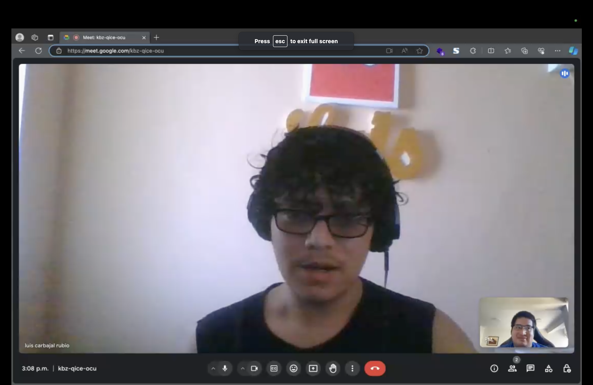

[URL: Entrevista](https://upcedupe-my.sharepoint.com/:v:/g/personal/ 201718387_upc_edu_pe/EcP3udKBWfNMoRhxyVpas0MBwYe2gqcMm4UizBRFioqaGg?nav=eyJyZWZlcnJhbEluZm8iOnsicmVmZXJyYWxBcHAiOiJPbmVEcml2ZUZvckJ1c2luZXNzIiwicmVmZXJyYWxBcHBQbGF0Zm9ybSI6IldlYiIsInJlZmVycmFsTW9kZSI6InZpZXciLCJyZWZlcnJhbFZpZXciOiJNeUZpbGVzTGlua0NvcHkifX0&e=MtI3Vr)

Resumen: El entrevistado utiliza scooters varias veces a la semana, especialmente para distancias cortas en áreas urbanas congestionadas, destacando su conveniencia y agilidad en comparación con otros medios de transporte. Sin embargo, señala desafíos como la disponibilidad y el estado de los scooters, así como problemas de infraestructura vial. Valora la comodidad, seguridad y autonomía de la batería al alquilar un scooter, y ha tenido experiencias mixtas con servicios de alquiler, destacando la disponibilidad y la falta de mantenimiento como aspectos positivos y negativos. Espera ver en una aplicación de alquiler de scooters una interfaz intuitiva y datos en tiempo real sobre la disponibilidad. Considera importante el mantenimiento y el respeto a las normas de seguridad para todos los usuarios y peatones, y planea seguir utilizando scooters como medio de transporte en el futuro debido a su conveniencia y sostenibilidad.

Segmento Objetivo: Segemento Objetivo 1

Entrevistado: 2

Nombre y apellidos: Maria Hinostroza

Edad: 21

Distrito: San Isidro

 

[URL: Entrevista](https://youtu.be/Ric4PU5pKqI)

Resumen:El entrevistado emplea scooters regularmente para trayectos cortos en entornos urbanos, valorando su conveniencia y agilidad. Sin embargo, señala desafíos como la disponibilidad limitada y la infraestructura vial deficiente. Prioriza la comodidad, seguridad y autonomía al alquilar un scooter, aunque su experiencia con los servicios de alquiler ha sido mixta. Espera aplicaciones intuitivas y datos en tiempo real sobre la disponibilidad. Destaca la importancia del mantenimiento y la seguridad vial. Aunque seguirá utilizando scooters por su conveniencia, los reserva para emergencias.

**Segmento Objetivo: Segemento Objetivo 2**

Nombre y apellidos: Janet Bustamante

Edad: 41

Districto: Villa el salvador

[URL: Entrevista dueño de empresa de delivery](https://upcedupe-my.sharepoint.com/:v:/g/personal/u201914294_upc_edu_pe/Ed97wuf6Sk9MuTW6C__Rgh8BURBBMiMqCRKqWaLkiG_WaA?e=KalkQS&nav=eyJyZWZlcnJhbEluZm8iOnsicmVmZXJyYWxBcHAiOiJTdHJlYW1XZWJBcHAiLCJyZWZlcnJhbFZpZXciOiJTaGFyZURpYWxvZy1MaW5rIiwicmVmZXJyYWxBcHBQbGF0Zm9ybSI6IldlYiIsInJlZmVycmFsTW9kZSI6InZpZXcifX0%3D)

Resumen: La entrevistada es dueña de una empresa de delivery y nos cuenta que el medio de transporte que usa la empresa son las motos ya que son mas rapidos al momento de entregar el pedido. Uno de los desafios que tienen es el de llevar la comida rapido y en buen estado, tambien nos comenta que le gustaria implementar scooters al servicio de delivery pero que solo lo aplicaria a ciertas zonas, otra cosa que nos dice es que un caracteristica principal que debe tener una plataforma web para el alquiler de scooter es la que sea facil de navegar y facil de gestionar los scooters. Nos afirma que no le importa tanto al personalizacion sino el facilidad de utilizar la aplicacion web. Por ultimo nos dice que si hubiese una aplicacion web sobre el alquiler de scooter que le ofrece las necesidades que necesita por su puesto que la usaria.

Nombre y apellidos: Jeremy Quispe

Edad: 19

Districto: San Juan de Lurigancho

[URL: Entrevista dueño de empresa de delivery](https://youtu.be/JRuP-yDurrU).

Resumen: El entrevistado es dueño junto a su tio de una polleria que realiza delivery, sus repartidores usan el transporte de moto. Dentro de sus principales problemas se encuentra el tráfico denso en horas pico, y el estacionamiento y problemas para acceder a ciertas zonas. Considera que los scooters son más manobriables, además de que son más sostenibles ecologicamente. En la aplicación web busca que sea intuitiva, que se pueda rastrear el estado de los scooters. Considera que se le deberían realizar constantemente revisiones a los scooters para verificar su correcto funcionamiento. Le gustaría una opción de asignar scooters a repartidores individuales y generar rendimiento de la flota de scooters.
---

### 2.2.3. Análisis de entrevistas

 Segemento Objetivo 1:  
- Frecuencia de uso de scooters: El entrevistado utiliza scooters varias veces a la semana, lo que indica una alta frecuencia de uso y dependencia de este medio de transporte.
- Beneficios de los scooters: Destaca la conveniencia y agilidad de los scooters para moverse en áreas urbanas congestionadas, así como su economía y eco-amigabilidad en comparación con otros medios de transporte.
- Desafíos y limitaciones: Señala desafíos como la disponibilidad y el estado de los scooters, así como problemas con la infraestructura vial, lo que sugiere áreas de mejora en el servicio de alquiler de scooters y la planificación urbana.
- Características valoradas en un scooter: Valora la comodidad, seguridad y autonomía de la batería al alquilar un scooter, lo que resalta la importancia de estos aspectos para la satisfacción del usuario.
- Experiencia con servicios de alquiler de scooters: Ha tenido experiencias mixtas con servicios de alquiler, destacando aspectos positivos como la disponibilidad y negativos como la falta de mantenimiento.
- Expectativas de una aplicación de alquiler de scooters: Espera una aplicación intuitiva y con datos en tiempo real sobre la disponibilidad de scooters, lo que resalta la importancia de la tecnología en la mejora de la experiencia del usuario.
- Medidas de seguridad: Considera importante el mantenimiento y el respeto a las normas de seguridad, lo que subraya la necesidad de garantizar la seguridad tanto para los usuarios como para los peatones.
- Futuro uso de scooters: Planea seguir utilizando scooters como medio de transporte en el futuro debido a su conveniencia y sostenibilidad, lo que indica una tendencia a largo plazo en el uso de este medio de transporte.

Segemento Objetivo 2: 
- Frecuencia de uso de scooters: Aunque el entrevistado actualmente utiliza principalmente motocicletas para su servicio de delivery, muestra interés en integrar scooters eléctricos debido a sus beneficios potenciales.
- Beneficios de los scooters: Reconoce los beneficios de los scooters en términos de eficiencia en el tráfico y sostenibilidad ambiental, lo que sugiere una inclinación hacia la adopción de tecnologías más ecológicas.
- Desafíos y limitaciones: Se identifican desafíos como el tráfico denso y la disponibilidad de estacionamiento, lo que indica áreas donde los scooters podrían ofrecer soluciones.
- Características valoradas en un scooter: El entrevistado destaca la importancia de la comodidad, seguridad y autonomía de la batería, lo que sugiere criterios importantes para la selección de scooters.
- Experiencia con servicios de alquiler de scooters: Se mencionan experiencias mixtas, lo que subraya la importancia de un servicio confiable y bien mantenido.
- Expectativas de una aplicación de alquiler de scooters: Se espera una aplicación intuitiva con datos en tiempo real sobre la disponibilidad de scooters, destacando la importancia de la tecnología para mejorar la experiencia del usuario.
- Medidas de seguridad: Se enfatiza la importancia del mantenimiento y el respeto a las normas de seguridad, lo que refleja una preocupación por la seguridad tanto de los usuarios como de los peatones.
- Futuro uso de scooters: El entrevistado planea seguir utilizando scooters en el futuro, lo que sugiere una tendencia hacia su adopción continua.

## 2.3. Needfinding
### 2.3.1. User Personas

#### User Persona 1: Ana García - Empresas de Delivery
 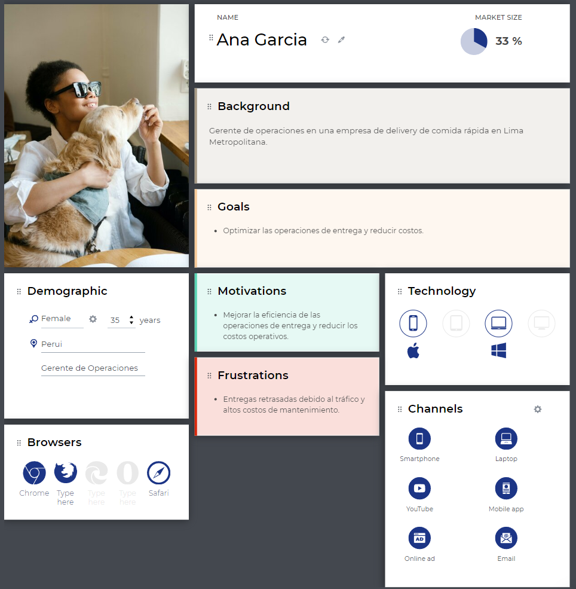

#### User Persona 2: Juan Pérez - Personas que transitan Lima Metropolitana

 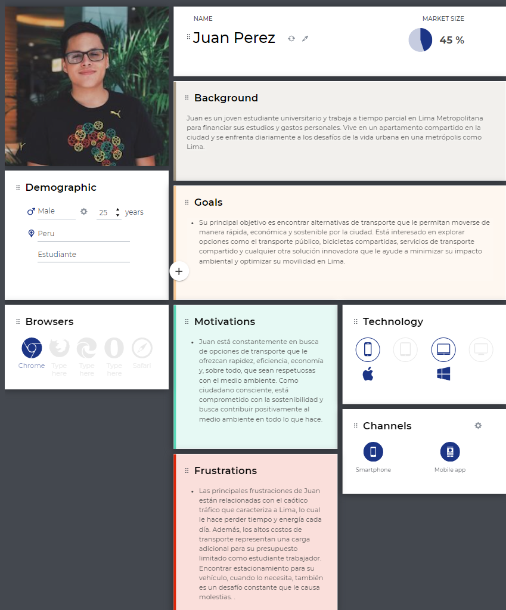

### 2.3.2. User Task Matrix

<table border="1" style="text-align: center;">
	<tbody>
		<tr>
			<td colspan="1" rowspan="2">User Tax Matrix</td>
            <td colspan="2" rowspan="1">Segmento Objetivo 1</td>
            <td colspan="2" rowspan="1">Segmento Objetivo 2</td>
		</tr>
		<tr>
			<td colspan="1">Frecuencia</td>
            <td colspan="1">Importancia</td>
            <td colspan="1">Frecuencia</td>
            <td colspan="1">Importancia</td>
		</tr>
        <tr>
			<td colspan="1">Registro y autenticación en el sistema</td>
			<td colspan="1">multiple</td>
            <td colspan="1">alta</td>
            <td colspan="1">multiple</td>
            <td colspan="1">alta</td>
		</tr>
        <tr>
			<td colspan="1">Iniciar sesión</td>
			<td colspan="1">multiple</td>
            <td colspan="1">alta</td>
            <td colspan="1">multiple</td>
            <td colspan="1">alta</td>
		</tr>
        <tr>
			<td colspan="1">Ver scooters disponibles</td>
			<td colspan="1">multiple</td>
            <td colspan="1">alta</td>
            <td colspan="1">multiple</td>
            <td colspan="1">alta</td>
		</tr>
        <tr>
			<td colspan="1">Alquilar scooters</td>
			<td colspan="1">multiple</td>
            <td colspan="1">alta</td>
            <td colspan="1">multiple</td>
            <td colspan="1">alta</td>
		</tr>
        <tr>
			<td colspan="1">Reservar scooters</td>
			<td colspan="1">multiple</td>
            <td colspan="1">alta</td>
            <td colspan="1">multiple</td>
            <td colspan="1">alta</td>
		</tr>
        <tr>
			<td colspan="1">Administrar scooters a otros usuarios</td>
			<td colspan="1">multiple</td>
            <td colspan="1">alta</td>
            <td colspan="1">rara</td>
            <td colspan="1">baja</td>
		</tr>
        <tr>
			<td colspan="1">Realizar pago</td>
			<td colspan="1">multiple</td>
            <td colspan="1">alta</td>
            <td colspan="1">multiple</td>
            <td colspan="1">alta</td>
		</tr>
        <tr>
			<td colspan="1">Escanear el código QR para desbloquear scooter</td>
			<td colspan="1">multiple</td>
            <td colspan="1">alta</td>
            <td colspan="1">multiple</td>
            <td colspan="1">alta</td>
		</tr>
        <tr>
			<td colspan="1">Iniciar viaje</td>
			<td colspan="1">multiple</td>
            <td colspan="1">alta</td>
            <td colspan="1">multiple</td>
            <td colspan="1">alta</td>
		</tr>
        <tr>
			<td colspan="1">Monitorear viaje</td>
			<td colspan="1">multiple</td>
            <td colspan="1">media</td>
            <td colspan="1">rara</td>
            <td colspan="1">baja</td>
		</tr>
         <tr>
			<td colspan="1">Historial de viajes</td>
			<td colspan="1">multiple</td>
            <td colspan="1">media</td>
            <td colspan="1">rara</td>
            <td colspan="1">media</td>
		</tr>
         <tr>
			<td colspan="1">Soporte al cliente</td>
			<td colspan="1">rara</td>
            <td colspan="1">alta</td>
            <td colspan="1">rara</td>
            <td colspan="1">baja</td>
		</tr>
        <tr>
			<td colspan="1">Reporte de mantenimiento de scooter</td>
			<td colspan="1">rara</td>
            <td colspan="1">alta</td>
            <td colspan="1">rara</td>
            <td colspan="1">alta</td>
		</tr>
	</tbody>
</table>

### 2.3.3. User Journey Mapping

 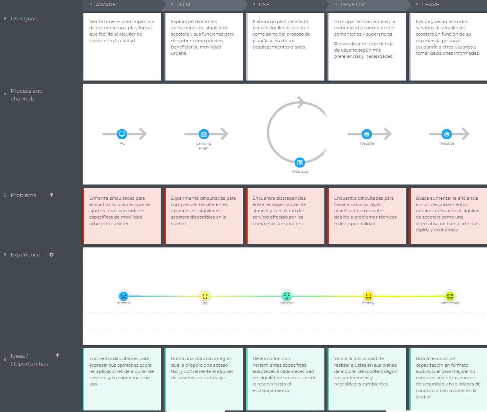

### 2.3.4. Empathy Mapping

### Segmento 1:

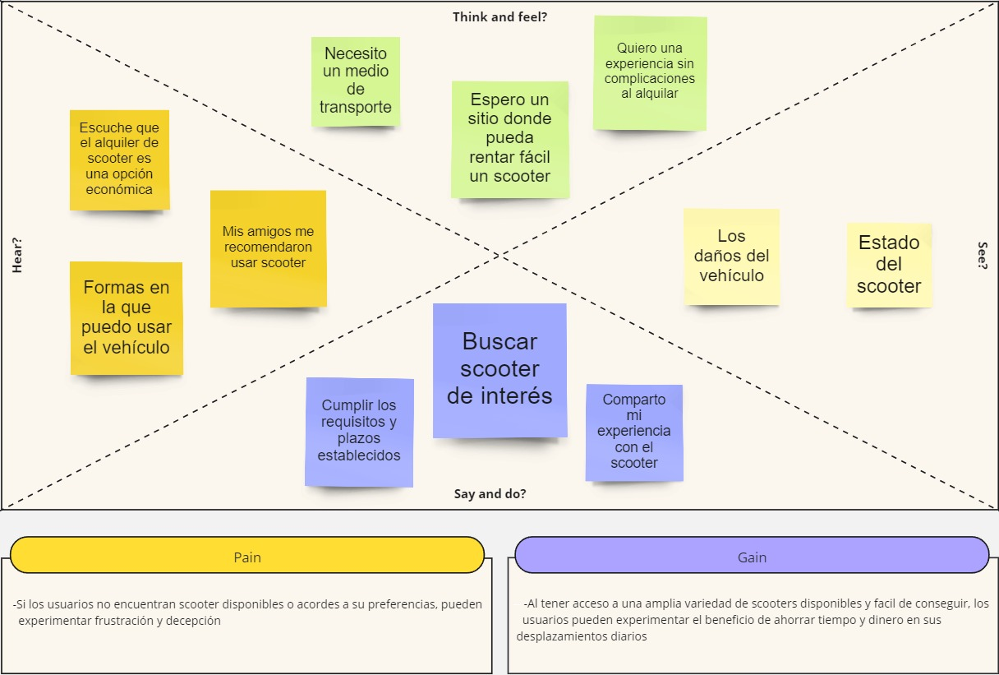

### Segmento 2:

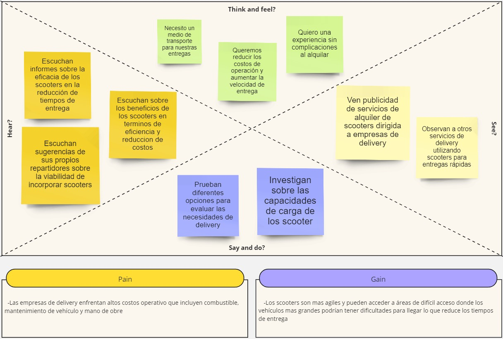

### 2.3.5. As-is Scenario Mapping
### Segmento 1:

| Escenario | Usuario buscando un scotter disponible                                  | Usuario reserva un scooter                                            | Usuario utiliza el scooter                              | Usuario devuelve el scooter                                | Usuario deja una reseña                                               |
|-----------|-------------------------------------------------------------------------|-----------------------------------------------------------------------|---------------------------------------------------------|------------------------------------------------------------|-----------------------------------------------------------------------|
| Doing     | Buscando en linea o preguntando a locales la disponibilidad de scooters | Llamando o visitando fisicamente la empresa de alquiler para reservar | Recogiendo al scooter en el lugar designado             | Devolviendo el scooter al lugar de alquiler                | Completando formularios o enviando comentarios sobre su experiencia   |
| Thinking  | Evaluando la conveniencia y costos                                      | Considerando la fiabilidad y disponibilidad del scooter reservado     | Planificando la ruta y considernado la seguridad        | Preocupandose por los terminos y condiciones de devolucion | Reflexionando sobre la calidad del servicio y el scooter utilizado    |
| Feeling   | Frustracion por la falta de informacion clara y actualizada             | Inseguridad sobre si el scooter estara disponible al llegar           | Emocion por la experiencia de conduccion y la aventura  | Satisfecho si la experiencia general fue positiva          | Esperando que su opinion influya en futuros usuarios y en la empresa  |

### Segmento 2:

| Escenario | Adquisicion de scooters                         | Asignacion de scooters                          | Mantenimiento de scooters                                    | 
|-----------|-------------------------------------------------|-------------------------------------------------|--------------------------------------------------------------|
| Doing     | Buscando proveedores de scooters en linea       | Asignando scooters a los repartidores           | Coordinando el mantenimiento y reparaciones sesgun necesidad |
| Thinking  | Evaluando opciones de compra y financiamiento   | Considerando la disponibilidad y mantenimiento  | Evaluando costos y tiempos de inactividad                    |
| Feeling   | Preocupacion por si a sido una buena inversion  | Icertidumbre sobre la eficiencia y seguimiento  | Preocupacion por el estado y fiabilidad                      |

## 2.4. Ubiquitous Language
- FastScooter:  El nombre del producto principal de la empresa, que son scooters eléctricos para renta empresarial.
- Movilidad urbana: Se refiere al desplazamiento dentro de entornos urbanos.
- Experiencia de usuario: La interacción y percepción de los clientes al utilizar los productos o servicios de la empresa.
- Plataforma centralizada: Se refiere a una única interfaz o sistema donde los usuarios pueden acceder a todas las funciones relacionadas con el alquiler de scooters eléctricos, como reservas, pagos y seguimiento de rutas.
- Flota: Conjunto de scooters que se encuentran desplegados al rededor de la ciudad listos para ser usados por los usuarios.

# Capítulo III: Requirements Specification

## 3.1 To-Be Scenario Mapping

### Segmento 1:

| Escenario | Usuario buscando un scotter disponible                   | Usuario reserva un scooter                     | Usuario utiliza el scooter                           | Usuario devuelve el scooter                                | Usuario deja una reseña                                      |
|-----------|----------------------------------------------------------|------------------------------------------------|------------------------------------------------------|------------------------------------------------------------|--------------------------------------------------------------|
| Doing     | Navegando por nuestra   pagina busca una disponible  | Completando el formulario de reserva           | Conduciendo el scooter por la zona                   | Aparcando el scooter en el lugar designado                 | Escribiendo un comentario                                    |
| Thinking  | Pensando en un scooter   deacuerdo a sus necesidades | Evaluando la tiempo y costo de alquiler        | Observando el trafico y la experiencia de conduccion | Pensando en la experiencia general del alquiler            | Considerando aspecto positivos y negativos de la experiencia |
| Feeling   | Impaciente por encontrar un   scooter adecuado       | Se siente bien por haber reservado un scooter  | Contento con la comodidad del scooter                | Aliviado por haber completado la devolucion sin problemas  | Satisfecho con la experiencia y por compartir su opinion     |

### Segmento 2:

| Escenario | Adquisicion de scooters                                   | Asignacion de scooters                        | Mantenimiento de scooters                                      | 
|-----------|-----------------------------------------------------------|-----------------------------------------------|----------------------------------------------------------------|
| Doing     | Explorando opciones de alquiler de scooters en la web app | Asignando scooters a los repartidores         | Gestionando el mantenimiento programado a travez de la web app |
| Thinking  | Evaluando terminos de alquiler y servicios asociados      | Confiado en la disponibilidad de los scooters | Minimizando tiempos de inactividad y costos                    |
| Feeling   | Seguro de la invesion que se esta haciendo                | Seguridad en la disponibilidad de scooters    | Confianza en la fiabilidad y estado de los scooter             |

## 3.2. User Stories

Para elaborar user stories que pertenecen a un epic. A continuación, las epics que consideramos como equipo:

<table border="1" style="text-align: left;">
	<tbody>
		<tr>
			<td colspan="1">Código</td>
            <td colspan="1">Título</td>
            <td colspan="1">Epic</td>
		</tr>
		<tr>
            <td colspan="1">EP001</td>
            <td colspan="1">Autenticación y registro de usuarios</td>
            <td colspan="1"><strong>Como</strong> usuario <strong>quiero</strong> registrarme en la página web <strong>para</strong> poder acceder a los beneficios de la aplicación. </td> 
		</tr>
        <tr>
            <td colspan="1">EP002</td>
            <td colspan="1">Gestión de cuentas de usuario</td>
            <td colspan="1"><strong>Como</strong> usuario de la plataforma <strong>quiero</strong> administrar mi perfil y editar mi cuenta <strong>para</strong> mantener mi cuenta actualizada.</td>
		</tr>
        <tr>
            <td colspan="1">EP003</td>
            <td colspan="1">Administración de flota de scooters</td>
            <td colspan="1"><strong>Como</strong> usuario de la plataforma <strong>quiero</strong> saber la ubicación del estacionamiento de los scooters <strong>para</strong> poder recoger y/o devolver el scooter al usarlo.  </td>
		</tr>
        <tr>
            <td colspan="1">EP004</td>
            <td colspan="1">Operación de pagos</td>
            <td colspan="1"> <strong>Como</strong> usuario de la plataforma <strong>quiero</strong> seleccionar un método de pago <strong>para</strong> realizar los pagos correspondientes de la renta de scooters.  </td>
		</tr>
        <tr>
            <td colspan="1">EP005</td>
            <td colspan="1">Gestión de reservas de scooters</td>
            <td colspan="1"><strong>Como</strong> usuario de la plataforma <strong>quiero</strong> un opción en la página web <strong>para</strong> poder reservar scooters. </td>
		</tr>
        <tr>
            <td colspan="1">EP006</td>
            <td colspan="1">Soporte del cliente</td>
            <td colspan="1"><strong>Como</strong> usuario en la plataforma <strong>quiero</strong> un apartado de soporte técnico <strong>para</strong> hacer reclamos si hay algún problema. </td>
		</tr>
        <tr>
            <td colspan="1">EP007</td>
            <td colspan="1">Desarrollo del Landing Page</td>
            <td colspan="1"><strong>Como</strong> usuario en la plataforma <strong>quiero</strong> visitar el landing page del proyecto <strong>para</strong> conocer más sobre la iniciativa del proyecto. </td>
		</tr>
        <tr>
            <td colspan="1">EP008</td>
            <td colspan="1">Control y vista de la plataforma</td>
            <td colspan="1"><strong>Como</strong> usuario en la plataforma <strong>quiero</strong> poder personalizar la interfaz <strong>para</strong> mejorar mi experiencia dentro de la plataforma. </td>
		</tr>
        <tr>
            <td colspan="1">EP009</td>
            <td colspan="1">Gestión de reseñas</td>
            <td colspan="1"><strong>Como</strong> usuario en la plataforma <strong>quiero</strong> poder dejar mi calificación del scooter utilizado<strong> para</strong> compartir mi experiencia con los demás usuarios. </td>
		</tr>
        <tr>
            <td colspan="1">EP010</td>
            <td colspan="1">Mantenimiento de scooters</td>
            <td colspan="1"><strong>Como</strong> usuario en la plataforma <strong>quiero</strong> poder reportar problemas con un scooter<strong> para</strong> que puedan ser reparados rápidamente. </td>
		</tr>
	</tbody>
</table>

A continuacion, la realizacion de los user stories con sus criterios de aceptacion con escenarios e ID de Epica:

<table border="1" style="text-align: left;">
	<tbody>
		<tr>
			<td colspan="1">ID de Historia de Usuario</td>
            <td colspan="1">Título</td>
            <td colspan="1">Descripción</td>
            <td colspan="5">Criterios de Aceptación con Escenarios	</td>
            <td colspan="1">ID de Épica</td>
		</tr>
		<tr>
            <td colspan="1">US001</td>
            <td colspan="1">
            Registro de usuarios clientes en la plataforma
            </td>
            <td colspan="1">
            <strong>Como</strong> usuario cliente <strong>quiero</strong> crearme una cuenta <strong>para</strong> poder acceder a la aplicación y sus funciones.	
            </td>
            <td colspan="5">
            <strong>E01: Registro Exitoso</strong>
              
            <strong>Caso 01: Registro con e-mail</strong>
             
            <strong>Dado que</strong> el usuario cliente ingresa por primera vez a la aplicación
             
            <strong>Y</strong> el usuario cliente selecciona la opción de registro
             
            <strong>Cuando</strong> el sistema muestre el formulario de registro 
             
            <strong>Y</strong> el usuario cliente llene todo el formulario con sus datos
             
            <strong>Y</strong> el usuario cliente seleccione la opción "registrar cuenta"
             
            <strong>Y</strong> el sistema verifique los datos colocados por el usuario cliente
             
            <strong>Entonces</strong> el sistema muestra un mensaje informando que su cuenta ha sido registrada exitosamente.
              
            <strong>E02: Registro Fallido</strong>
              
            <strong>Caso 01: Datos inválidos</strong>
             
            <strong>Dado que</strong> el usuario cliente ingresa por primera vez a la aplicación
             
            <strong>Y</strong> el usuario cliente selecciona la opción de registro
             
            <strong>Cuando</strong> el sistema muestre el formulario de registro 
             
            <strong>Y</strong> el usuario cliente llene todo el formulario con sus datos
             
            <strong>Y</strong> el usuario cliente seleccione la opción "registrar cuenta"
             
            <strong>Y</strong> el sistema detecte que los datos colocados por el usuario cliente son incorrectos
             
            <strong>Entonces</strong> el sistema muestra un mensaje informando que no se ha podido registrar la cuenta por los datos inválidos.
              
            <strong>Caso 02: Datos incompletos</strong>
             
            <strong>Dado que</strong> el usuario cliente ingresa por primera vez a la aplicación
             
            <strong>Y</strong> el usuario cliente selecciona la opción de registro
             
            <strong>Cuando</strong> el sistema muestre el formulario de registro 
             
            <strong>Y</strong> el usuario cliente llene solo algunas partes del formulario con sus datos
             
            <strong>Y</strong> el usuario cliente seleccione la opción "registrar cuenta"
             
            <strong>Y</strong> el sistema detecte que los datos colocados por el usuario cliente son incorrectos
             
            <strong>Entonces</strong> el sistema muestra un mensaje informando que no se ha podido registrar la cuenta por no llenar el formulario completamente.
              
            </td>
            <td colspan="1">EP01</td>
		</tr>
        <tr>
            <td colspan="1">US002</td>
            <td colspan="1">Registro de empresas en la plataforma</td>
            <td colspan="1">
            <strong>Como</strong> usuario empresa <strong>quiero</strong> crearme una cuenta <strong>para</strong> poder acceder a la aplicación.
            </td>
            <td colspan="5">
            <strong>E01: Registro Exitoso</strong>
              
            <strong>Caso 01: Registro con e-mail</strong>
             
            <strong>Dado que</strong> el usuario empresa ingresa por primera vez a la aplicación
             
            <strong>Y</strong> el usuario empresa selecciona la opción de registro
             
            <strong>Cuando</strong> el sistema muestre el formulario de registro 
             
            <strong>Y</strong> el usuario empresa llene todo el formulario con sus datos
             
            <strong>Y</strong> el usuario empresa seleccione la opción "registrar cuenta"
             
            <strong>Y</strong> el sistema verifique los datos colocados por el usuario empresa
             
            <strong>Entonces</strong> el sistema muestra un mensaje informando que su cuenta ha sido registrada exitosamente.
              
            <strong>E02: Registro Fallido</strong>
              
            <strong>Caso 01: Datos inválidos</strong>
             
            <strong>Dado que</strong> el usuario empresa ingresa por primera vez a la aplicación
             
            <strong>Y</strong> el usuario empresa selecciona la opción de registro
             
            <strong>Cuando</strong> el sistema muestre el formulario de registro 
             
            <strong>Y</strong> el usuario empresa llene todo el formulario con sus datos
             
            <strong>Y</strong> el usuario empresa seleccione la opción "registrar cuenta"
             
            <strong>Y</strong> el sistema detecte que los datos colocados por el usuario cliente son incorrectos
             
            <strong>Entonces</strong> el sistema muestra un mensaje informando que no se ha podido registrar la cuenta por los datos inválidos.
              
            <strong>Caso 02: Datos incompletos</strong>
             
            <strong>Dado que</strong> el usuario empresa ingresa por primera vez a la aplicación
             
            <strong>Y</strong> el usuario empresa selecciona la opción de registro
             
            <strong>Cuando</strong> el sistema muestre el formulario de registro 
             
            <strong>Y</strong> el usuario empresa llene solo algunas partes del formulario con sus datos
             
            <strong>Y</strong> el usuario empresa seleccione la opción "registrar cuenta"
             
            <strong>Y</strong> el sistema detecte que los datos colocados por el usuario cliente son incorrectos
             
            <strong>Entonces</strong> el sistema muestra un mensaje informando que no se ha podido registrar la cuenta por no llenar el formulario completamente.
              
            <strong>Caso 03: Datos inexistentes</strong>
             
            <strong>Dado que</strong> el usuario empresa ingresa por primera vez a la aplicación
             
            <strong>Y</strong> el usuario empresa selecciona la opción de registro
             
            <strong>Cuando</strong> el sistema muestre el formulario de registro 
             
            <strong>Y</strong> el usuario empresa coloque un RUC inexistente
             
            <strong>Y</strong> el usuario empresa seleccione la opción "registrar cuenta"
             
            <strong>Y</strong> el sistema detecte que los datos colocados por el usuario empresa son inexistentes
             
            <strong>Entonces</strong> el sistema muestra un mensaje informando que no se ha podido registrar la cuenta porque la empresa no existe.
              
            </td>
            <td colspan="1">EP001</td>
            </td>
		</tr>
        <tr>
            <td colspan="1">US003</td>
            <td colspan="1">Inicio de sesión de usuarios en la plataforma</td>
            <td colspan="1"><strong>Como</strong> usuario <strong>quiero</strong> iniciar sesión con mi correo <strong>para</strong> ingresar a la plataforma.</td>
            <td colspan="5">
            <strong>E01: Inicio de sesión exitoso</strong>
              
            <strong>Caso 01: Ingreso de credenciales correctos</strong>
             
            <strong>Dado que </strong> el usuario selecciona la opción "iniciar sesión"
             
            <strong>Y</strong> el sistema muestre el formulario de inicio de sesión
             
            <strong>Cuando</strong> el usuario llene todo el formulario con su correo y contraseña
             
            <strong>Y</strong> el sistema verifique que el correo y la contraseña son correctos
             
            <strong>Entonces</strong> el usuario ingresa a la plataforma con la sesión iniciada y según su tipo de usuario.
              
            <strong>E02: Inicio de sesión fallido</strong>
              
            <strong>Caso 01: Ingreso de credenciales inválidos</strong>
             
            <strong>Dado que </strong> el usuario selecciona la opción "iniciar sesión"
             
            <strong>Y</strong> el sistema muestre el formulario de inicio de sesión
             
            <strong>Cuando</strong> el usuario llene todo el formulario con su correo y contraseña
             
            <strong>Y</strong> el sistema detecta que el correo y la contraseña son inválidos
             
            <strong>Entonces</strong> el sistema muestra un mensaje diciendo que el correo y/o la contraseña son inválidos.
              
            <strong>Caso 02: Credenciales faltante</strong>
             
            <strong>Dado que </strong> el usuario selecciona la opción "iniciar sesión"
             
            <strong>Y</strong> el sistema muestre el formulario de inicio de sesión
             
            <strong>Cuando</strong> el usuario solo llene el formulario con su correo o contraseña
             
            <strong>Y</strong> el sistema detecta que falta su correo o contraseña
             
            <strong>Entonces</strong> el sistema muestra que falta el correo o la contraseña.
              
            </td>
            <td colspan="1">EP001</td>
		</tr>
        <tr>
            <td colspan="1">US004</td>
            <td colspan="1">Reserva de scooter</td>
            <td colspan="1"><strong>Como</strong> usuario<strong> quiero</strong> poder reservar un scooter específico con anticipación <strong>para</strong> asegurarme de que esté disponible cuando llegue a la estación de scooters.
            </td>
            <td colspan="5">
            <strong>E01: Reserva exitosa</strong>
              
            <strong>Caso 01: Usuario reserva scooter exitosamente</strong>
             
           <strong>Dado que</strong> el usuario selecciona la opción de reservar scooters
            
            <strong>Y</strong> el sistema muestra el formulario de reserva
             
            <strong>Cuando</strong> el usuario elija el scooter, la fecha y hora para la reserva
             
            <strong>Y</strong> el usuario seleccione la opción reservar scooter
             
            <strong>Entonces</strong> el sistema muestra un mensaje diciendo que la reserva se realizó exitosamente.
              
            <strong>E02: Reserva fallida</strong>
              
            <strong>Caso 01: Reserva incompleta</strong>
            <strong>Dado que</strong> el usuario selecciona la opción de reservar scooters
             
            <strong>Y</strong> el sistema muestra el formulario de reserva
             
            <strong>Cuando</strong> el usuario solo llene el formulario sellecionando el scooter sin la fecha u hora para la reserva
             
            <strong>Y</strong> el usuario seleccione la opción reservar scooter
             
            <strong>Entonces</strong> el sistema muestra un mensaje diciendo que la reserva no se pudo realizar porque faltan seleccionar la fecha u hora.
              
            <strong>Caso 02: Reservación fuera del límite del tiempo</strong>
             
            <strong>Dado que</strong> el usuario selecciona la opción de reservar scooters
             
            <strong>Y</strong> el sistema muestra el formulario de reserva
             
            <strong>Cuando</strong> el usuario escoja el scooter, fecha y hora fuera del tiempo límite
             
            <strong>Y</strong> el usuario seleccione la opción reservar scooter.
             
            <strong>Entonces</strong> el sistema muestra un mensaje diciendo que la reserva no se pudo realizar porque faltan seleccionar la fecha u hora.
             
            </td>
            <td colspan="1">EP005</td>
		</tr>
        <tr>
            <td colspan="1">US005</td>
            <td colspan="1">Recuperación de contraseña para usuarios registrados </td>
            <td colspan="1"><strong>Como</strong> usuario <strong>quiero</strong> poder recuperar mi contraseña <strong>para</strong> poder acceder a mi cuenta en caso de que me hay olvidado alguna de mis credenciales. 
            </td>
            <td colspan="5">   
            <strong>E01: Recuperación de contraseña exitosa</strong>
              
            <strong>Caso 01: Cambio de contraseña</strong>
             
            <strong>Dado que</strong> el usuario olvida su contraseña 
             
            <strong>Y</strong> el usuario quiere recuperar su contraseña 
             
            <strong>Cuando</strong> el usuario seleccione la opción restablecer contraseña 
             
            <strong>Y</strong> el sistema envía un código a su correo 
             
            <strong>Y</strong> el usuario coloca el código en el formulario de la plataforma
             
            <strong>Entonces</strong> el sistema verifica que el código es correcto 
             
            <strong>Y</strong> el usuario puede volver a escribir una nueva contraseña.
              
            <strong> Caso 02: No se pudo realizar el cambio de contraseña</strong>
             
            <strong>Dado que</strong> el usuario olvida su contraseña 
             
            <strong>Y</strong> el usuario quiere recuperar su contraseña 
             
            <strong>Cuando</strong> el usuario seleccione la opción restablecer contraseña 
             
            <strong>Y</strong> el sistema envía un código a su correo 
             
            <strong>Y</strong> el usuario coloca el código en el formulario de la plataforma
             
            <strong>Y</strong> el sistema detecta que el código es incorrecto.
             
            <strong>Entonces</strong> el sistema un mensaje donde indica que ha colocado el código incorrecto.            
            </td>
            <td colspan="1">EP002</td>
		</tr>
        <tr>
            <td colspan="1">US006</td>
            <td colspan="1">Bloqueo de scooters</td>
            <td colspan="1"><strong>Como</strong> usuario <strong>quiero</strong> bloquear mi scooter cuando termine mi viaje<strong> para</strong> evitar que otros lo utilicen sin autorización.</td>
            <td colspan="5">
            <strong>E01: Bloqueo exitoso
              
            Caso 01: El usuario bloquea exitosamente el scooter</strong>
            <strong>Dado</strong> que el usuario termina de usar el scooter 
             
            <strong>Y</strong> el usuario quiere bloquear el scooter
              
            <strong>Cuando</strong> el usuario seleccione la opción finalizar uso
             
            <strong>Y</strong> el sistema envía un código al correo del usuario
             
            <strong>Y</strong> el usuario coloca el código 
             
            <strong>Y</strong> el sistema verifica que el código sea correcto
             
            <strong>Entonces</strong> el sistema muestra un mensaje diciendo que se ha bloqueado correctamente el scooter.        
            </td>
            <td colspan="1">EP003</td>
		</tr>
        <tr>
            <td colspan="1">US007</td>
            <td colspan="1">Confirmación de reserva</td>
            <td colspan="1"><strong>Como</strong> usuario que ha realizado una reserva en el sistema, <strong>quiero</strong> recibir un correo <strong>para</strong> confirmar mi reserva y asegurarme de no rhaber reservado por error.</td>
            <td colspan="5">E01: Confrimación exitosa
            E02: Confirmación denegada</td>
            <td colspan="1">EP005</td>
		</tr>
        <tr>
            <td colspan="1">US008</td>
            <td colspan="1">Desbloqueo de scooter</td>
            <td colspan="1"><strong>Como</strong> usuario <strong>quiero</strong> desbloquear mi scooter<strong> para</strong> empezar mi viaje.</td>
            <td colspan="5">E01: Desbloqueo exitoso
            E02: Desbloqueo fallido</td>
            <td colspan="1">EP003</td>
		</tr>
        <tr>
            <td colspan="1">US009</td>
            <td colspan="1">Rentar Scooter</td>
            <td colspan="1">Como usuario quiero rentar un scooter para realizar mis viajes.</td>
            <td colspan="5">E01: Renta exitosa</td>
            <td colspan="1">EP003</td>
		</tr>
        <tr>
            <td colspan="1">US010</td>
            <td colspan="1">Reporte de problemas con el scooter</td>
            <td colspan="1">Como usuario quiero reportar problemas con el scooter para que entre a mantenimiento </td>
            <td colspan="5">E01: Reporte exitoso
            E02: Reporte fallido</td>
            <td colspan="1">EP010</td>
		</tr>
        <tr>
            <td colspan="1">US011</td>
            <td colspan="1">Visualización de precios</td>
            <td colspan="1">Como usuario quiero visualizar precios para poder saber lo que tengo que pagar</td>
            <td colspan="5">E01: Precios visibles</td>
            <td colspan="1">EP004</td>
		</tr>
        <tr>
            <td colspan="1">US012</td>
            <td colspan="1">Buscar scooters disponibles</td>
            <td colspan="1">Como usuario, quiero poder buscar scooters disponibles en mi área cercana para poder encontrar una opción conveniente para mi viaje.
            </td>
            <td colspan="5">E01: Búsqueda de scooters</td>
            <td colspan="1">EP003</td>
		</tr>
        <tr>
            <td colspan="1">US013</td>
            <td colspan="1">Cancelacion de reserva</td>
            <td colspan="1">
            <strong>Como</strong> usuario de la aplicación 
             
            <strong>quiero</strong> poder cancelar una reserva 
             
            <strong>para</strong> no incurrir en gastos por un servicio que no voy a utilizar.
            </td>
            <td colspan="5">
            <strong>E01: Cancelación exitosa</strong>
              
            <strong>Caso 01: Usuario cancela una reserva exitosamente</strong>
             
            <strong>Dado que</strong> el usuario tiene al menos una reserva activa
             
            <strong>Cuando</strong> el usuario selecciona la opcion de cancelar reserva 
             
            <strong>Y</strong> confirma la cancelacion
             
            <strong>Entonces</strong> el sistema mostrara un mensaje de "Reserva cancelada exitosamente" 
                 
            <strong>Y</strong> la reserva ya no aparece en su lista de reservas activas
             
             
            <strong>E02: Cancelacion fuera del tiempo limite</strong>
              
            <strong>Caso 01: Usuario intenta cancelar una reserva fuera del tiempo límite para cancelaciones</strong>
             
            <strong>Dado que</strong> el sistema permite cancelar hasta 1 hora antes de la hora de inicio de la reserva
             
            <strong>Cuando</strong> el usuario intenta cancelar la reserva fuera del tiempo limite 
             
            <strong>Entonces</strong> el sistema muestra un mensaje de "No se puede cancelar la reserva, se ha superado el tiempo límite de cancelación" 
             
            <strong>Y</strong> la reserva se mantendra activa
            </td>
            <td colspan="1">EP005</td>
		</tr>
        <tr>
            <td colspan="1">US014</td>
            <td colspan="1">Visualizacion de perfil</td>
            <td colspan="1">
            <strong>Como</strong> usuario de la aplicación 
             
            <strong>quiero</strong> poder visualizar mi perfil 
             
            <strong>para</strong> revisar y confirmar mis datos personales y de usuario
            </td>
            <td colspan="5">
            <strong>E01: Visualización de datos del perfil</strong>
              
            <strong>Caso 01: Usuario accede a la visualización de su perfil</strong>
             
            <strong>Dado que</strong> el usuario ha iniciado sesión en la aplicación
             
            <strong>Cuando</strong> el usuario selecciona la opción de "Mi Perfil"
             
            <strong>Entonces</strong> el usuario visualizara su información de perfil incluyendo nombre, correo electrónico y historial de reservas
             
             
            <strong>E02: Actualización reciente reflejada en perfil</strong>
              
            <strong>Caso 01: Usuario visualiza cambios recientes en su perfil</strong>
             
            <strong>Dado que</strong> el usuario ha actualizado recientemente su información de perfil
             
            <strong>Cuando</strong> el usuario accede a "Mi Perfil" después de realizar cambios
             
            <strong>Entonces</strong> el usuario visualizara su información actualizada de perfil incluyendo los cambios recientes
            </td>
            <td colspan="1">EP002</td> 
		</tr>
        <tr>
            <td colspan="1">US015</td>
            <td colspan="1">Seguridad de informacion</td>
            <td colspan="1">
            <strong>Como</strong> usuario de la aplicación 
             
            <strong>quiero</strong> tener la seguridad de que mis datos personales 
             
            <strong>para</strong> evitar accesos no autorizados y proteger mi privacidad
            </td>
            <td colspan="5">
            <strong>E01: Gestión de credenciales seguras</strong>
              
            <strong>Caso 01: Asegurar la gestión segura de las credenciales de acceso</strong>
             
            <strong>Dado que</strong> los usuarios deben proporcionar credenciales de acceso
             
            <strong>Cuando</strong> un usuario crea una cuenta o actualiza su contraseña
             
            <strong>Entonces</strong> el sistema hara cumplir los requisitos de seguridad mínimos para las contraseñas de los usuarios, como longitud y complejidad para tener una contraseña mas segura
            </td>
            <td colspan="1">EP001</td>
		</tr>
        <tr>
            <td colspan="1">US016</td>
            <td colspan="1">Gestion de pagos</td>
            <td colspan="1">
            <strong>Como</strong> usuario de la aplicación 
             
            <strong>quiero</strong> tener un proceso de pago seguro y eficiente
             
            <strong>para</strong> poder realizar reservas de scooters de manera rápida y confiable.
            </td>
            <td colspan="5">
            <strong>E01: Opciones de pago seguras</strong>
              
            <strong>Caso 01: Proporcionar opciones de pago seguras para los usuarios</strong>
             
            <strong>Dado que</strong> los usuarios necesitan realizar pagos de manera segura
             
            <strong>Cuando</strong> un usuario está realizando una reserva
             
            <strong>Entonces</strong> el sistema ofrecera opciones de pago seguras, como tarjetas de crédito/débito o métodos de pago en línea confiables
              
            <strong>E02: Confirmación de pago exitoso</strong>
              
            <strong>Caso 01: Confirmar el éxito del pago después de una reserva</strong>
             
            <strong>Dado que</strong> un usuario ha realizado un pago para una reserva
             
            <strong>Cuando</strong> se completa con éxito el pago de una reserva
             
            <strong>Entonces</strong> el sistema mostrara un mensaje de confirmación de pago exitoso
              
            <strong>Caso 02: Pagos que no se pudieron completar</strong>
             
            <strong>Dado que</strong> un usuario intenta realizar un pago pero falla
             
            <strong>Cuando</strong> un pago no se puede completar debido a un problema con la tarjeta u otro motivo
             
            <strong>Entonces</strong> el sistema notificara al usuario sobre el pago fallido
            </td>
            <td colspan="1">EP004</td>
		</tr>
        <tr>
            <td colspan="1">US017</td>
            <td colspan="1">Actualizacion de perfil</td>
            <td colspan="1">
            <strong>Como</strong> usuario de la aplicación 
             
            <strong>quiero</strong> poder actualizar mi información de perfil
             
            <strong>para</strong> mantener mis datos personales actualizados y precisos
            </td>
            <td colspan="5">
            <strong>E01: Edición de información del perfil</strong>
              
            <strong>Caso 01: Permitir a los usuarios editar su información de perfil</strong>
             
            <strong>Dado que</strong> los usuarios pueden necesitar actualizar su información personal
             
            <strong>Cuando</strong> un usuario accede a la página de configuración de perfil
             
            <strong>Entonces</strong> el sistema proporcionara una interfaz intuitiva y segura que permita a los usuarios editar su información de perfil de manera eficiente y conveniente
              
             <strong>E02: Confirmación de actualización exitosa</strong>
              
            <strong>Caso 01: Confirmar la actualización exitosa del perfil</strong>
             
            <strong>Dado que</strong> un usuario ha realizado cambios en su perfil
             
            <strong>Cuando</strong> un usuario guarda los cambios realizados en su perfil
             
            <strong>Entonces</strong> el sistema mostrara un mensaje de confirmación de que la actualización se ha realizado con éxito
            </td>
            <td colspan="1">EP002</td>
		</tr>
        <tr>
            <td colspan="1">US018</td>
            <td colspan="1">Marcar scooters favoritos</td>
            <td colspan="1">
            <strong>Como</strong> usuario de la aplicación 
             
            <strong>quiero</strong> poder marcar scooters como favoritos
             
            <strong>para</strong> acceder rápidamente a mis opciones preferidas y realizar reservas más fácilmente
            </td>
            <td colspan="5">
            <strong>E01: Marcar un scooter como favorito</strong>
              
            <strong>Caso 01: Permitir a los usuarios marcar un scooter como favorito</strong>
             
            <strong>Dado que</strong> los usuarios desean guardar scooters específicos para futuras referencias
             
            <strong>Cuando</strong> un usuario visualiza un scooter en la aplicación
             
            <strong>Y</strong> selecciona la opción de "Marcar como favorito"
             
            <strong>Entonces</strong> el sistema proporcionara una funcionalidad clara y conveniente que permita a los usuarios marcar un scooter como favorito
            </td>
            <td colspan="1">EP009</td>
		</tr>
        <tr>
            <td colspan="1">US019</td>
            <td colspan="1">Reseña sobre la experiencia sobre el scooter</td>
            <td colspan="1">
            <strong>Como</strong> usuario de la aplicación 
             
            <strong>quiero</strong> poder dejar una reseña sobre mi experiencia con un scooter
             
            <strong>para</strong> compartir mi opinión con otros usuarios y ayudarles a tomar decisiones informadas
            </td>
            <td colspan="5">
            <strong>E01: Dejar una reseña después de usar un scooter</strong>
              
            <strong>Caso 01: Permitir a los usuarios dejar una reseña después de usar un scooter</strong>
             
            <strong>Dado que</strong> los usuarios han utilizado un scooter para realizar un viaje
             
            <strong>Cuando</strong> un usuario finaliza su viaje con un scooter
             
            <strong>Entonces</strong> el sistema proporciona una funcionalidad fácil de usar que permita a los usuarios dejar reseñas después de utilizar un scooter 
              
            <strong>E02: Calificación de la experiencia</strong>
              
            <strong>Caso 01: Permitir a los usuarios calificar su experiencia con el scooter</strong>
             
            <strong>Dado que</strong> los usuarios desean proporcionar una evaluación rápida de su experiencia
             
            <strong>Cuando</strong> un usuario deja una reseña sobre su experiencia con el scooter
             
            <strong>Entonces</strong> el sistema muestra a los usuarios la calificación de su experiencia con el scooter mediante una calificación, que puede ser en forma de estrellas o puntos numéricos
              
            <strong>E03: Visualización de reseñas</strong>
              
            <strong>Caso 01: Permitir a los usuarios ver las reseñas dejadas por otros usuarios</strong>
             
            <strong>Dado que</strong> los usuarios desean tomar decisiones informadas basadas en las experiencias de otros
             
            <strong>Cuando</strong> un usuario busca información sobre un scooter específico
             
            <strong>Entonces</strong> el sistema muestra una lista de reseñas dejadas por otros usuarios sobre ese scooter
            </td>
            <td colspan="1">EP008</td>
		</tr>
        <tr>
            <td colspan="1">US020</td>
            <td colspan="1">Visualizacion de zonas de recojo y entrega de los scooters</td>
            <td colspan="1">
            <strong>Como</strong> usuario de la aplicación 
             
            <strong>quiero</strong> poder ver las zonas designadas para recojo y entrega de scooters
             
            <strong>para</strong> cplanificar mi viaje y encontrar fácilmente el punto de inicio y fin de mi alquiler
            </td>
            <td colspan="5">
            <strong>E01: Visualización de zonas en el mapa</strong>
              
            <strong>Caso 01: Permitir a los usuarios ver las zonas de recojo y entrega en un mapa</strong>
             
            <strong>Dado que</strong> los usuarios necesitan localizar las zonas de recojo y entrega
             
            <strong>Cuando</strong> un usuario abre la aplicación 
             
            <strong>Y</strong> accede a la sección de "recojo y entrega de scooters"
             
            <strong>Entonces</strong> el sistema muestra un mapa que indica las zonas designadas para recojo y entrega
            </td>
            <td colspan="1">EP003</td>
		</tr>
        <tr>
            <td colspan="1">US021</td>
            <td colspan="1">Historial de reservas</td>
            <td colspan="1">
            <strong>Como</strong> usuario de la aplicación 
             
            <strong>quiero</strong> poder acceder a un historial de mis reservas anteriores
             
            <strong>para</strong> tener un registro de mis viajes pasados 
            </td>
            <td colspan="5">
            <strong>E01:  Mostrar el apartado de historial de reservas</strong>
              
            <strong>Caso 01: Mostrar detalles específicos de cada reserva en el historial</strong>
             
            <strong>Dado que</strong> los usuarios pueden necesitar información detallada sobre sus reservas pasadas
             
            <strong>Cuando</strong> un usuario selecciona una reserva específica en su historial
             
            <strong>Entonces</strong> el sistema le mostrara los detalles de las reserva pasadas al usuario
              
            <strong>Caso 02: No visualizar ninguna reserva en el historial</strong>
             
            <strong>Dado que</strong> el usuario todavia no haya realizado ninguna reserva
             
            <strong>Cuando</strong> entre al apartado de historial de reserva
             
            <strong>Entonces</strong> el sistema debe mostrar un mensaje en el apartado de historial de reservas indicando que el usuario aún no ha realizado ninguna reserva
            </td>
            <td colspan="1">EP005</td>
		</tr>
        <tr>
            <td colspan="1">US022</td>
            <td colspan="1">Personalizacion de la interfaz de usuario</td>
            <td colspan="1">
            <strong>Como</strong> usuario de la aplicación 
             
            <strong>quiero</strong> poder personalizar la interfaz de usuario según mis preferencias
             
            <strong>para</strong> adaptarla a mis necesidades y mejorar mi experiencia de uso
            </td>
            <td colspan="5">
            <strong>E01: Selección de tema de color</strong>
              
            <strong><u>Caso 01: Permitir a los usuarios seleccionar un tema de color para la interfaz</u></strong>
              
            <strong>Dado que</strong> los usuarios pueden tener preferencias de diseño específicas
             
            <strong>Cuando</strong> un usuario accede a la configuración de la aplicación
             
            <strong>Entonces</strong> el sistema le proporciona la opción de seleccionar un tema de color predefinido
            </td>
            <td colspan="1">EP008</td>
		</tr>
        <tr>
            <td colspan="1">US023</td>
            <td colspan="1">Reporte de problemas de la aplicación web</td>
            <td colspan="1">
            <strong>Como</strong> usuario de la aplicación 
             
            <strong>quiero</strong> poder reportar problemas que encuentre durante el uso de la aplicación web
             
            <strong>para</strong> informar a los administradores sobre posibles errores o situaciones que requieran atención
            </td>
            <td colspan="5">
            <strong>E01: Acceso al formulario de reporte</strong>
              
            <strong>Caso 01: Permitir a los usuarios acceder al formulario de reporte de problemas</strong>
             
            <strong>Dado que</strong> los usuarios pueden encontrar problemas durante el uso de la aplicación web
             
            <strong>Cuando</strong> un usuario encuentra un problema
             
            <strong>Y</strong> desea reportarlo
             
            <strong>Entonces</strong> el sistema le proporciona una forma clara de acceder al formulario de reporte de la aplicación
            </td>
            <td colspan="1">EP006</td>
		</tr>
    <tr>
    <td colspan="1">US024</td>
    <td colspan="1">Gestión de quejas de usuarios</td>
    <td colspan="1">
        <strong>Como</strong> administrador del sistema,
         
        <strong>quiero</strong> poder gestionar las quejas de los usuarios para abordar problemas y mejorar la experiencia del usuario.
    </td>
    <td colspan="5">
        <strong>E01: Recepción de quejas</strong>
          
        <strong>Caso 01: Permitir a los usuarios enviar quejas a través de un formulario de contacto</strong>
         
        <strong>Dado que</strong> un usuario desea reportar un problema o hacer una queja...
          
        **Escenario:**
          
        Cuando el usuario accede al formulario de contacto y proporciona los detalles de la queja,
         
        entonces el sistema registra la queja correctamente y notifica al equipo de soporte para su seguimiento.
    </td>
    <td colspan="1">EP006</td>
</tr>

<tr>
    <td colspan="1">US025</td>
    <td colspan="1">Mejora de la experiencia de reserva</td>
    <td colspan="1">
        <strong>Como</strong> usuario de la aplicación,
         
        <strong>quiero</strong> que el proceso de reserva de scooters sea más intuitivo y eficiente para poder completar reservas rápidamente.
    </td>
    <td colspan="5">
        <strong>E01: Simplificación del proceso de reserva</strong>
          
        <strong>Caso 01: Reducir el número de pasos requeridos para completar una reserva</strong>
         
        <strong>Dado que</strong> un usuario desea reservar un scooter de forma rápida...
          
        **Escenario:**
          
        Cuando el usuario inicia el proceso de reserva,
         
        entonces el sistema guía al usuario a través de un proceso simplificado con la menor cantidad de pasos posibles, incluyendo la selección del scooter, la fecha y hora de recogida, y la confirmación de la reserva.
    </td>
    <td colspan="1">EP006</td>
</tr>

<tr>
    <td colspan="1">US026</td>
    <td colspan="1">Integración de métodos de pago adicionales</td>
    <td colspan="1">
        <strong>Como</strong> usuario de la aplicación,
         
        <strong>quiero</strong> tener más opciones de pago disponibles para mayor comodidad y flexibilidad.
    </td>
    <td colspan="5">
        <strong>E01: Adición de métodos de pago</strong>
          
        <strong>Caso 01: Integrar nuevos métodos de pago, como PayPal o transferencias bancarias</strong>
         
        <strong>Dado que</strong> un usuario desea utilizar un método de pago diferente...
          
        **Escenario:**
          
        Cuando el usuario selecciona la opción de pago durante el proceso de reserva,
         
        entonces el sistema muestra una variedad de opciones de pago, incluyendo PayPal y transferencias bancarias, y permite al usuario completar la transacción utilizando el método deseado.
    </td>
    <td colspan="1">EP004</td>
</tr>

<tr>
    <td colspan="1">US027</td>
    <td colspan="1">Notificaciones de estado de reserva</td>
    <td colspan="1">
        <strong>Como</strong> usuario de la aplicación,
         
        <strong>quiero</strong> recibir notificaciones sobre el estado de mis reservas para mantenerme informado sobre cualquier cambio o actualización.
    </td>
    <td colspan="1">
        <strong>E01: Notificaciones en tiempo real</strong>
          
        <strong>Caso 01: Enviar notificaciones cuando se confirme una reserva</strong>
         
        <strong>Dado que</strong> un usuario ha realizado una reserva...
          
        **Escenario:**
          
        Cuando la reserva es confirmada por el sistema,
         
        entonces el sistema envía una notificación al usuario, informándole sobre la confirmación de la reserva y proporcionando detalles adicionales, como la hora y ubicación de recogida del scooter.
    </td>
    <td colspan="1">EP006</td>
</tr>

<tr>
    <td colspan="1">US028</td>
    <td colspan="1">Opciones de suscripción premium</td>
    <td colspan="1">
        <strong>Como</strong> usuario de la aplicación,
         
        <strong>quiero</strong> tener la opción de suscribirme a un plan premium para acceder a características adicionales y beneficios exclusivos.
    </td>
    <td colspan="5">
        <strong>E01: Ofrecer planes de suscripción premium</strong>
          
        <strong>Caso 01: Mostrar las características exclusivas de la suscripción premium</strong>
         
        <strong>Dado que</strong> un usuario está interesado en acceder a beneficios adicionales...
          
        **Escenario:**
          
        Cuando el usuario explora las opciones de suscripción premium,
         
        entonces el sistema presenta de manera clara y detallada las características exclusivas de cada plan de suscripción premium, destacando los beneficios adicionales y las ventajas de cada uno.
    </td>
    <td colspan="1">EP008</td>
</tr>

<tr>
    <td colspan="1">US029</td>
    <td colspan="1">Historial de quejas y resoluciones</td>
    <td colspan="1">
        <strong>Como</strong> administrador del sistema,
         
        <strong>quiero</strong> mantener un registro completo y detallado de todas las quejas recibidas por parte de los usuarios, así como las acciones tomadas para resolverlas, con el fin de garantizar la satisfacción y confianza de los usuarios en el sistema.
    </td>
    <td colspan="5">
        <strong>E01: Registro exhaustivo de quejas y resoluciones</strong>
          
        <strong><u>Caso 01: Almacenar detalles de todas las quejas recibidas</u></strong>
         
        <strong>Dado que</strong> un usuario envía una queja o reporta un problema con el sistema,
         
        <strong>cuando</strong> la queja es recibida por el sistema de gestión de quejas,
         
        <strong>entonces</strong> se registra de manera automática en la base de datos del sistema, incluyendo información relevante como fecha, hora, tipo de queja, descripción detallada del problema y datos del usuario.
          
        <strong><u>Caso 02: Seguir el proceso de resolución de quejas</u></strong>
         
        <strong>Dado que</strong> se registra una queja en el sistema,
         
        <strong>cuando</strong> se toman acciones para resolverla,
         
        <strong>entonces</strong> se actualiza el estado de la queja en el registro, indicando el progreso y las acciones realizadas para resolverla.
    </td>
    <td colspan="1">EP008</td>
</tr>
</tbody>
</table>

## 3.3. Impact Mapping

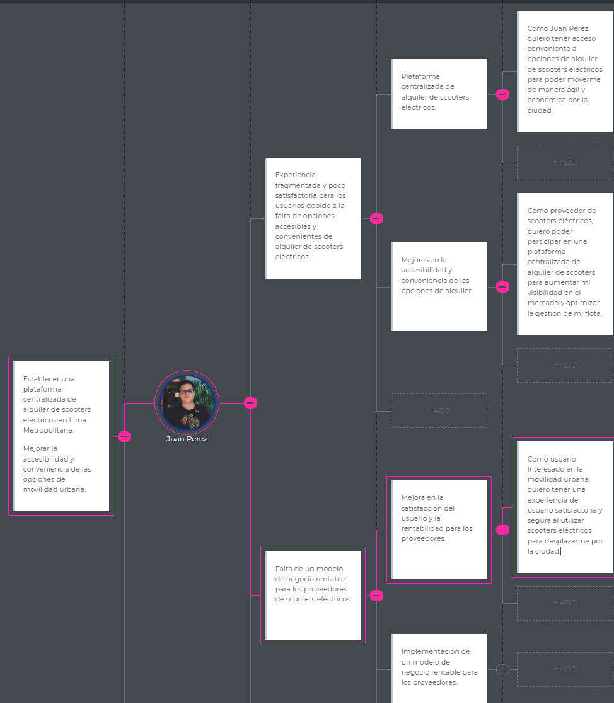
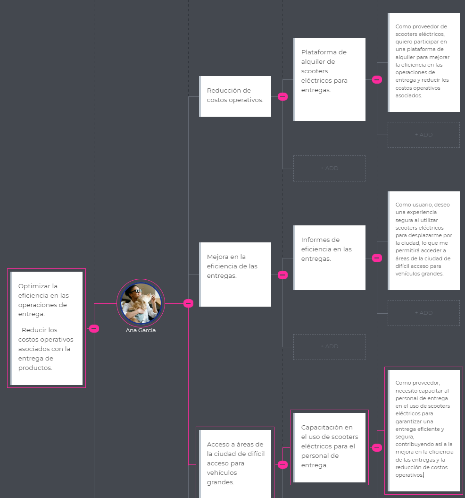

## 3.4. Product Backlog

| # Orden | User Story Id | Titulo                       | Desripcion                                                                                                                 | Story Points (1/2/3/4/5/8) |
|---------|---------------|------------------------------|----------------------------------------------------------------------------------------------------------------------------|----------------------------|
| 1       | US01          | Registro de usuario          | Como usuario nuevo,   deseo poder registrarme en la plataforma   para acceder al servicio de alquiler de scooters. |                            |
| 2       | US02          | Inicio de sesion             | Como usuario registrado,    deseo iniciar sesion en la plataforma   para acceder a mis datos y reservas            |                            |
| 3       | US03          | Buscar Scooters disponibles  | Como usuario,   deseo buscar scooters disponibles   para alquilar                                                  |                            |
|         |               |                              |                                                                                                                            |                            |

# Capítulo IV: Product Design
## 4.1. Style Guidelines
En esta sección, vamos a exponer el plan que hemos desarrollado para el diseño, los estilos y la apariencia de nuestra página web y las páginas de nuestra aplicación, con el fin de asegurar que nuestros usuarios disfruten de una interfaz que sea fácil de usar y amigable. Para alcanzar este objetivo, hemos decidido utilizar elementos visuales que sean tanto claros como estéticamente agradables, al mismo tiempo que hemos establecido ciertas restricciones para evitar la inclusión de elementos gráficos poco atractivos.
### 4.1.1. General Style Guidelines

>**Branding**

Para el desarrollo de nuestro branding realizamos un logotipo distintivo y memorable que facilita la comprensión de lo que nuestra plataforma ofrece a nuestros usuarios.

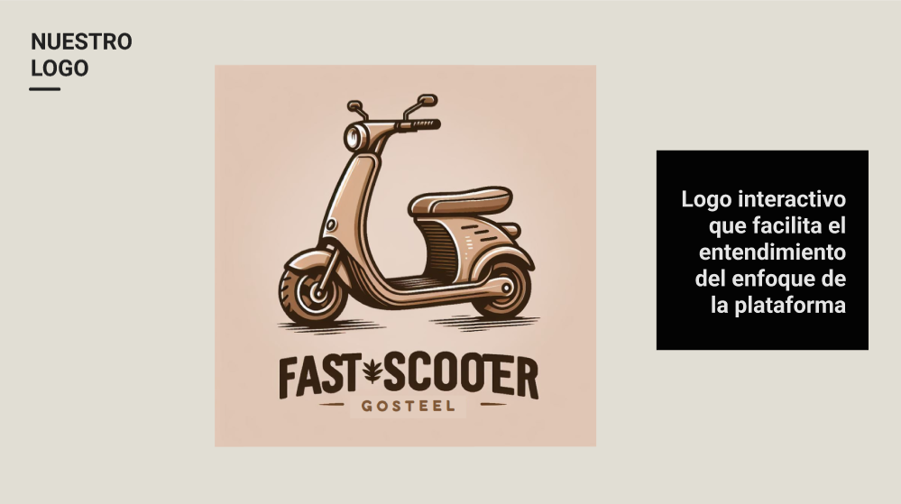

La paleta de colores que implementamos para el desarrollo de nuestro logo es el siguiente:

>**Colores**

Al dar la alusión de la capacidad para transmitir mensajes y emociones, así como en la atracción visual y la usabilidad del producto final. Decidimos hacer uso de colores dentro de las directrices de estilo neutro. Ya que, observamos que son fundamentales para crear diseños atractivos, legibles, accesibles y coherentes que comunican eficazmente el mensaje deseado y mejoran la experiencia de nuestros usuarios.

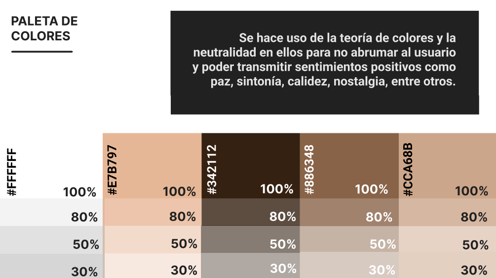

>**Tipografía**

Las directrices de estilo, que incluyen pautas para la tipografía, son esenciales para garantizar la coherencia y legibilidad del contenido. Por lo que, además de la elección, decidimos establecer reglas sobre el tamaño, el estilo y el espaciado de la fuente ayuda a mantener la coherencia visual y a garantizar una lectura cómoda.

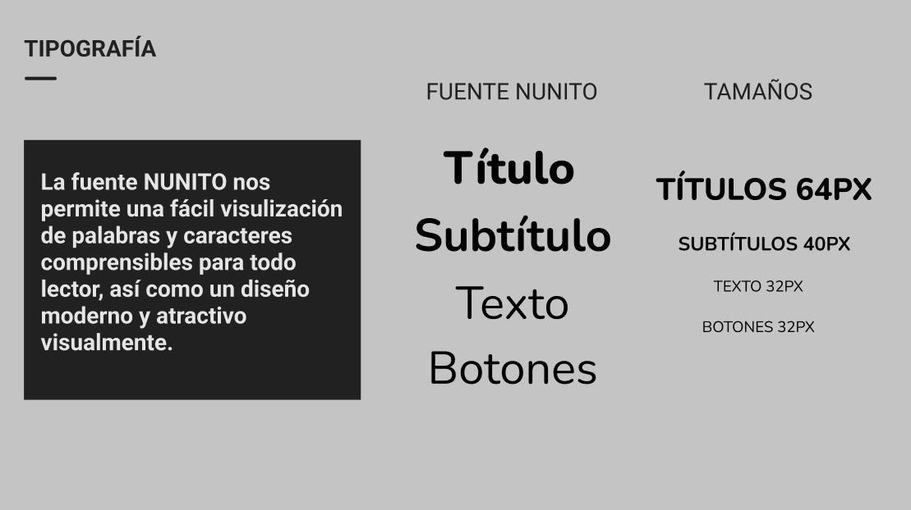

La elección de la *NUNITO* es porque transmite y da el toque amigable pero profesional a los usuarios que visitan nuestra plataforma. Nunito es una tipografía contemporánea que funciona bien en interfaces de usuario. Sus formas redondeadas y proporciones equilibradas la hacen especialmente adecuada para aplicaciones web con un estilo moderno.

-   **Títulos**: Los títulos son de estilo "Bold" y de tamaño 64px
-   **Subtítulos**: Los subtítulos sin de estilo "Semibold" y de tamaño 40px
- **Texto y botones**: En ambos casos se hace uso del estilo "Light" y de tamaño 32px
- **Spacing**: Implementamos un espacio apropiado entre los elementos con el fin de mejorar la legibilidad y facilitar la navegación en el sitio web. Garantizamos que los componentes de la página cuenten con el espacio adecuado alrededor de ellos para evitar una sensación de congestión y promover una organización visual mejorada.
    - Entre un *título* y un *texto* del **landing page** habrá una separación de 8 px.
    - Entre un *subtítulo* y el *párrafo* del **landing page** habrá una separación de 31 px.

>**Tono de comunicacion y lenguaje aplicado**

La elección del tono de comunicación es un componente fundamental de los estilos que estamos planificando integrar en las páginas. 

Al analizar el tono de comunicación, hemos determinando que el contenido será entre el límite de lo **formal e informal**. 

Teniendo como predominio lo **amigable** en el aspecto de nuestra aplicación e instruyendo lo **técnico** solo en el reporte oficial para problemas/soporte técnico. 

Además,las directrices de estilo guían la selección del lenguaje utilizado, lo que incluye en la elección de palabras coloquiales y técnicas para darle un nivel de complejidad del texto que sea entendible para todo tipo de usuario y exista la capacidad de conectar con la audiencia.         

### 4.1.2. Web Style Guidelines

>**Colores**

Los colores empleados en el sitio web de nuestra aplicación están en línea con las directrices generales de diseño. Estas adaptaciones se fundamentan no solo en el nuevo formato y estilo visual, sino también en la sección o página específica que el usuario esté explorando en la aplicación. Para unificar estas variaciones, hemos identificado diversas secciones donde los colores y niveles de transparencia se ajustan según el diseño:

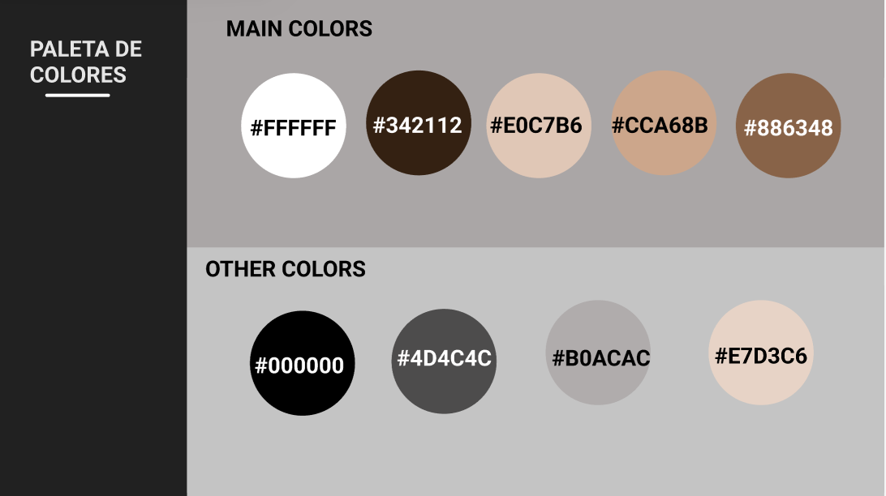

>**Fondos**

 Con el objetivo de garantizar una estética clásica que se adecue a los variados fondos degradados presentes en nuestras aplicaciones, hemos optado por una paleta de colores compuesta por tonos blancos, cafés y una gama de grises.

Esta decisión fomenta una mayor flexibilidad visual al mismo tiempo que mantiene la sofisticación y la facilidad de lectura del contenido, sin importar la combinación de colores específica que se presente en la pantalla. Esto garantiza una estética armoniosa en una amplia gama de situaciones. Además, los tonos de gris proporcionan un contraste suave y equilibrado, lo que asegura una lectura óptima del contenido en cualquier entorno, y añade una sensación de atemporalidad al diseño con los tonos de café sugeridos.

>**Tipografia** 

La tipografía Nunito presenta una apariencia moderna y refinada, perfecta para títulos y encabezados que busquen un aspecto sofisticado y legible. Su peso ligero ofrece una delicada y atractiva estética, mientras que su tamaño generoso asegura una excelente legibilidad, especialmente en dispositivos con pantallas de alta resolución. 

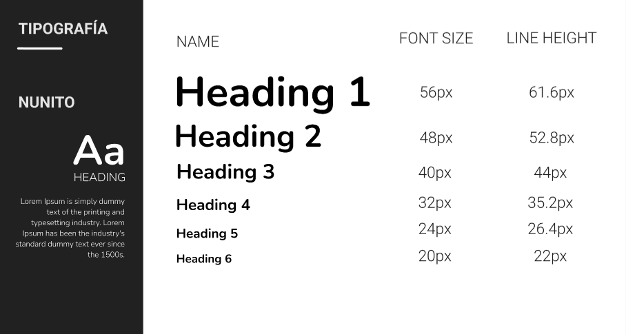

Esta combinación de tamaño y estilo es óptima para generar un impacto visual notable, al mismo tiempo que conserva una sensación de sutileza y claridad en el diseño.

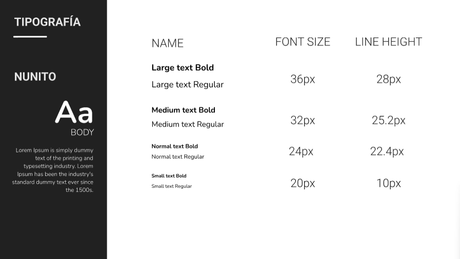

## 4.2. Information Architecture
Como equipo decidimos que el diseño de la aplicacion se organizara con una paleta de colores llamativos y de acuerdo con la temática de nuestro trabajo. La principal característica que decidimos llevar a cabo es en relación a la experiencia de los usuarios, queremos que los estudiantes tengan un contenido accesible y asegurado para que puedan resolver cualquiera de sus dudas.
### 4.2.1. Organization Systems
En el presente punto se indicará los grupos de información en los cuales se aplicarán los tipos de estructuración visual, además, se indicará para qué segmento objetivo está diseñado y que tipo de categorización se utilizará

**Segmento Objetivo: Usuario que quieren alquilar un scooter**

**Jerárquica:**

- Ubicaciones de Alquiler: Organización por ubicaciones geográficas donde se pueden encontrar scooters disponibles para alquilar.
- Categorías de Scooters: Clasificación de scooters según su tipo (por ejemplo, eléctricos, de gasolina), tamaño o capacidad.
- Precios y Tarifas: Agrupación de scooters según sus tarifas de alquiler, como por hora, por día o por semana.

**Secuencial:**

- Proceso de Reserva: Guiar al usuario a través de los pasos necesarios para alquilar un scooter, desde la búsqueda y selección hasta el pago y confirmación de la reserva.

**Segmento: Empresas de delivery**

**Jerárquica:**

- Marcas y Modelos: Organización por marcas y modelos de scooters disponibles en el mercado, permitiendo a las empresas comparar las opciones disponibles.
- Especificaciones Técnicas: Clasificación de scooters según sus especificaciones técnicas, como potencia del motor, autonomía y capacidad de carga.
- Servicios de Mantenimiento: Agrupación de scooters según los servicios de mantenimiento ofrecidos por los proveedores, como garantías y planes de servicio posventa.

**Secuencial:**

- Proceso de Adquisición: Guiar a las empresas a través de los pasos necesarios para adquirir scooters, desde la selección y configuración hasta el proceso de compra y entrega.

### 4.2.2. Labeling Systems
A continuación, se presenta el sistema de etiquetado que proporcionará una descripción breve y clara de las funcionalidades ofrecidas por el servicio de alquiler de scooters, dirigido a los segmentos de personas que transitan Lima Metropolitana y empresas de delivery.

### Encabezados para Personas que Transitan Lima Metropolitana:

1. **Inicio/Home:**
   - Página preseleccionada por defecto que muestra scooters disponibles para alquilar en Lima Metropolitana.
   - Breve descripción del servicio y su objetivo principal para los residentes y visitantes de la ciudad.

2. **Registro/Login:**
   - Sección donde los usuarios pueden crear una cuenta o iniciar sesión.
   - Formulario para ingresar datos de registro o inicio de sesión, destacando la conveniencia para quienes utilizan el servicio con frecuencia.

3. **Reservar Scooter:**
   - Página para seleccionar y reservar un scooter específico en Lima Metropolitana.
   - Formulario para elegir el scooter, fecha y hora de reserva, con opciones de búsqueda por ubicación.

4. **Historial de Reservas:**
   - Sección donde los usuarios pueden ver sus reservas anteriores en Lima Metropolitana.
   - Detalles de cada reserva, incluyendo fecha, hora y scooter reservado, destacando la conveniencia para quienes realizan viajes frecuentes.

5. **Perfil de Usuario:**
   - Página para ver y editar la información del perfil del usuario.
   - Visualización de datos personales y preferencias de cuenta, con la posibilidad de agregar ubicaciones frecuentes en Lima Metropolitana.

### Encabezados para Empresas de Delivery:

1. **Inicio/Home:**
   - Página preseleccionada por defecto con scooters disponibles y opciones específicas para empresas de delivery.
   - Breve descripción del servicio y su utilidad para empresas que necesitan realizar entregas rápidas en Lima Metropolitana.

2. **Registro/Login:**
   - Sección donde las empresas de delivery pueden crear una cuenta o iniciar sesión.
   - Formulario para ingresar datos de registro o inicio de sesión, destacando la eficiencia y rapidez en las entregas.

3. **Gestión de Flota:**
   - Página para administrar la flota de scooters utilizada por la empresa de delivery.
   - Funcionalidades para agregar, asignar y rastrear scooters, así como gestionar mantenimiento y reparaciones.

4. **Seguimiento de Pedidos:**
   - Sección donde las empresas pueden seguir el estado de los pedidos en curso en Lima Metropolitana.
   - Detalles de cada pedido, incluyendo hora de solicitud, recogida y entrega, con actualizaciones en tiempo real.

5. **Reporte de Problemas:**
   - Página para recibir y gestionar informes de problemas con scooters utilizados por la empresa de delivery.
   - Registro de problemas reportados y acciones tomadas para solucionarlos, priorizando la continuidad en las entregas.

### 4.2.3. SEO Tags and Meta Tags

### Para el sitio web estático:

**Título (Title):**
- GoSteel - Servicios de Alquiler de Scooters

**Descripción (Description):**
- ¡Alquila scooters fácilmente en Lima Metropolitana con GoSteel! Descubre una forma rápida y conveniente de moverte por la ciudad.

**Palabras Clave (Keywords):**
- scooter rental, scooter hire, Lima scooter rental, urban mobility

**Autores (Authors):**
- Equipo de Desarrollo GoSteel

### Para la aplicación web:

**Título (Title):**
- GoSteel - Plataforma de Alquiler de Scooters

**Descripción (Description):**
- ¡Alquila scooters fácilmente en Lima Metropolitana con la plataforma GoSteel! Descubre una forma rápida y conveniente de moverte por la ciudad.

**Palabras Clave (Keywords):**
- scooter rental, scooter hire, Lima scooter rental, urban mobility, scooter reservation

**Autores (Authors):**
- Equipo de Desarrollo GoSteel

### 4.2.4. Searching Systems
En esta sección se presentarán los sistemas de búsqueda que se implementarán en la aplicación. Al hacer uso de esos sistemas, los usuarios podrán encontrar la información que requieran.

**En la aplicación web:**

**Segmento: Personas que transitan Lima Metropolitana**

- Buscar Scooters: Esta sección le permitirá al usuario buscar scooters mediante el nombre del modelo o marca. Esta sección también cuenta con un filtro que distingue marcas y precio de alquiler.
- Reservas realizadas: Esta sección le permitirá al usuario buscar dentro de sus scooters reservados mediante el nombre del modelo o de la marca.
- Scooters Favoritos: Esta sección le permitirá al usuario buscar dentro de sus scooters favoritos mediante el nombre del modelo o de la marca.

**Segmento: Empresas delivery**

- Buscar Scooters: Esta sección le permitirá al usuario buscar los scooters disponibles para su empresa.
- Buscar Scooters dentro de flota: Esta sección le permitirá al usuario buscar scooters mediante el nombre del modelo o marca, dentro de los que se encuentran en su flota.

### 4.2.5. Navigation Systems
A continuación, el equipo mostrará los sistemas de navegación con los que contará Ayni para permitir a los usuarios navegar de manera rápida y segura a cualquier bloque de información.

En el Landing Page, se cuenta con encabezados que representan a las diversas secciones que estarán presentes. Estas estarán ubicadas en la parte superior de la página como menú horizontal siempre presente a la hora de bajar y subir con el ratón. Para que el usuario no tenga que realizar una traslación de manera manual por toda la página para llegar a una sección, se podrá usar estos encabezados para ubicarse inmediatamente en el sector que se desee. Obviamente, el visitante tiene que haber leído el título del encabezado para asegurarse de que se ubicará en la zona adecuada. Gracias a esto, se genera una traslación fácil e intuitiva.

En el caso de la aplicación web, se presenta un proceso similar para el menú principal, se utilizarán diversas opciones que presenta para trasladarse a otra página del sitio web. Estas opciones variarán de acuerdo al segmento objetivo al que pertenezca el usuario. Del mismo modo, se utilizan listados para los grupos de elementos, Dentro de estas listas podrán aplicar filtros que permitan a los usuarios navegar entre esas opciones.

## 4.3. Landing Page UI Design
En esta sección, presentaremos el proceso visual de desarrollo del Landing Page. Para ello, utilizaremos la herramienta de diseño web Figma, destacada por su amplia gama de funciones y plugins que facilitan la creación del prototipo. Además, pondremos en evidencia el uso de las pautas de estilo (Style Guidelines) y la arquitectura de la información (Information Architecture) establecidas en los al inicio de este capítulo.

Para mayor visualización: [Landing Page](https://www.figma.com/file/tuAbwsUKZRYtAbqHKbDQEM/Untitled?type=design&node-id=0%3A1&mode=design&t=MIUAZs4lJc8338Gn-1)

### 4.3.1. Landing Page Wireframe

>**Header**

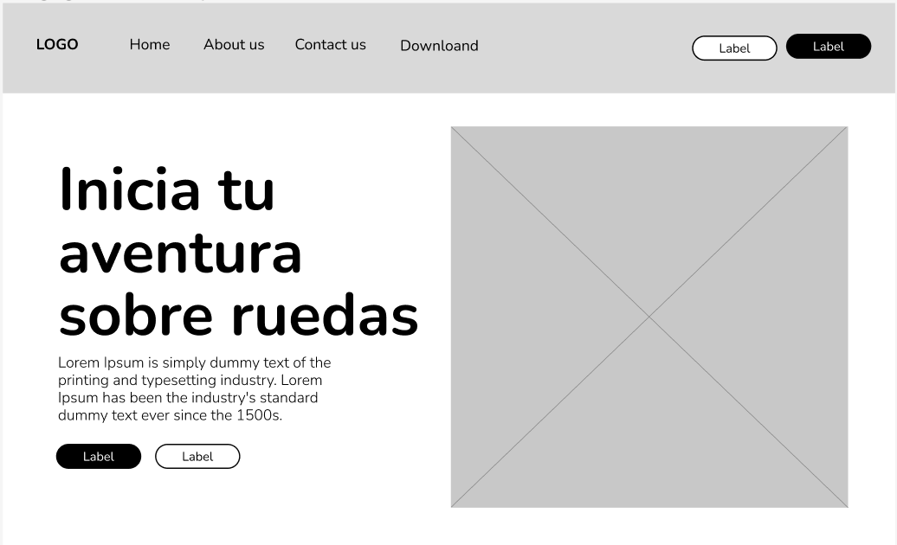

>**Body**

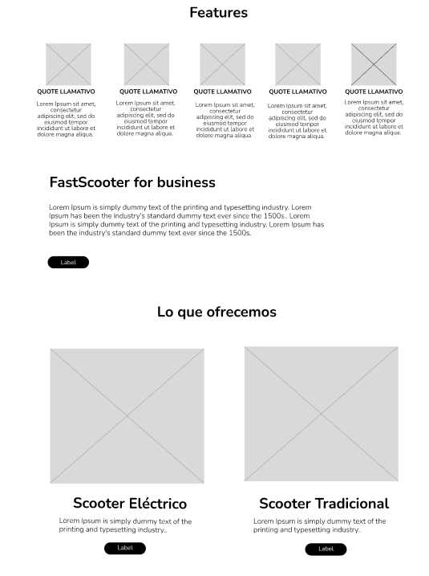
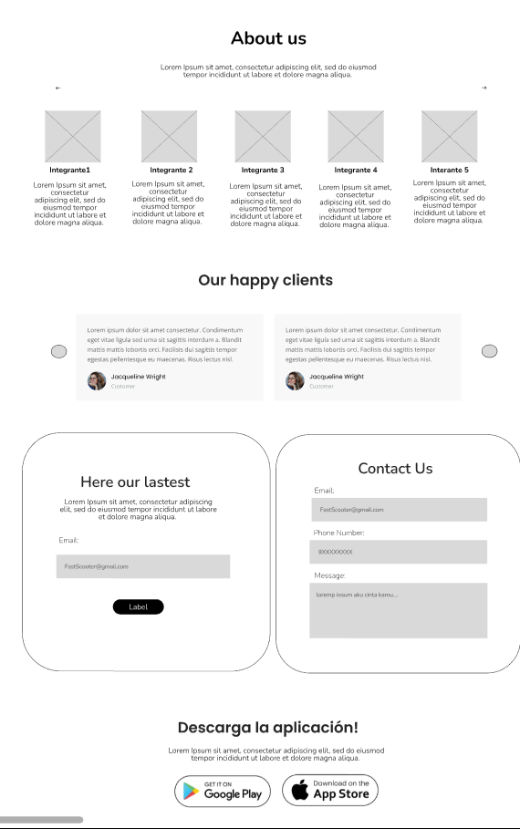

>**Footer**

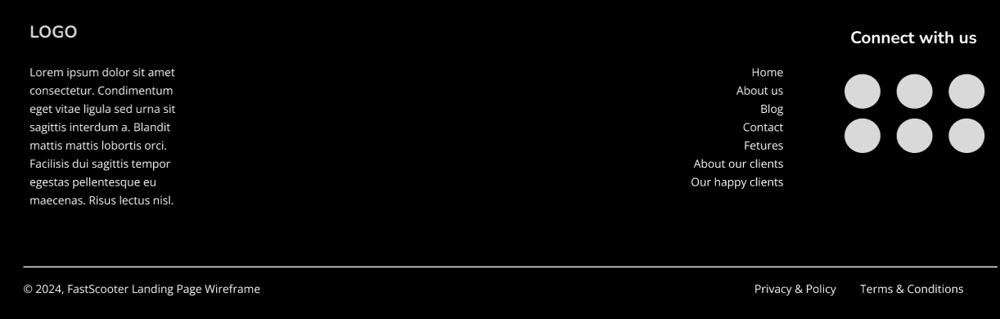

### 4.3.2. Landing Page Mock-up
Trabajando con los wireframes anteriormente mostrados, luego se aplicó los Style Guidelines para el uso de los colores. Como se aprecia, estos tienen un contraste llamativo en cada sección de la landing page.

>**Header**

En la parte de Header tenemos la frase: *"Inicia tu aventura sobre ruedas"* para llamar la atención de los usuarios que visiten nuestro landing page y también se hace visualización de los botones *call-to-action* tanto para iniciar sesión como descargar la aplicación.

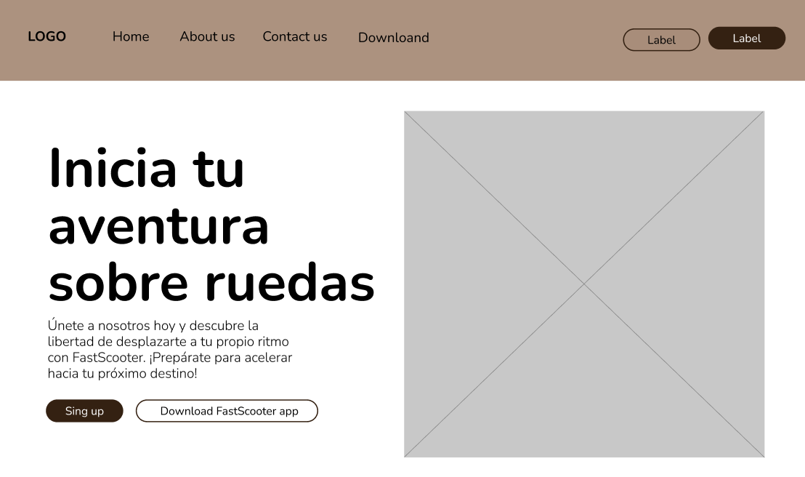

>**Body**

- **Features:** Explicación de las característica que nuestra aplicación ofrece 

   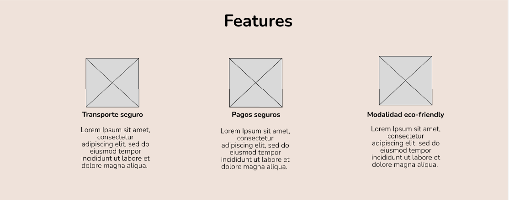

- Segundo **call-to-action**, enfocado a nuestro segundo segmento objetivo, empresario.

    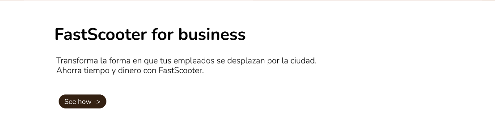

- Los tipos de scooters que ofrecemos

    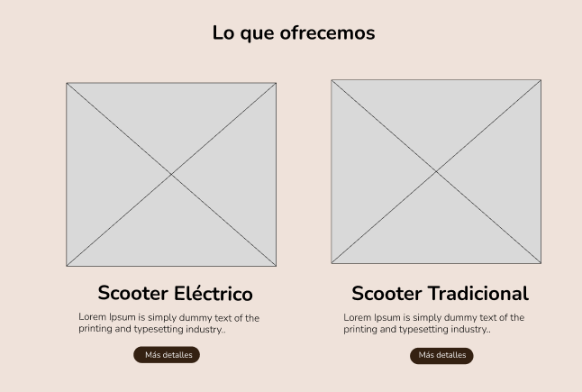

- Descripción de nuetsra empresa emergente, *startup*
    

- Reseñas de nuestros clientes
    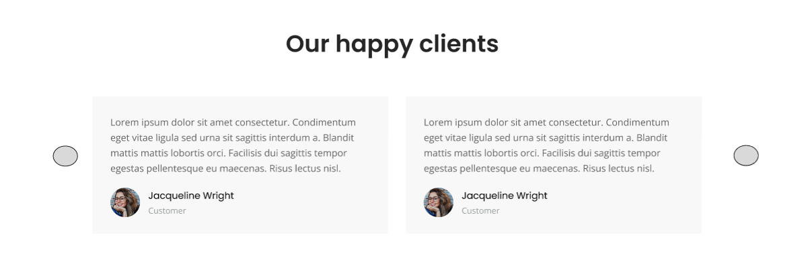

- Formulario para recibir notificaciones y/o describir dudas.
    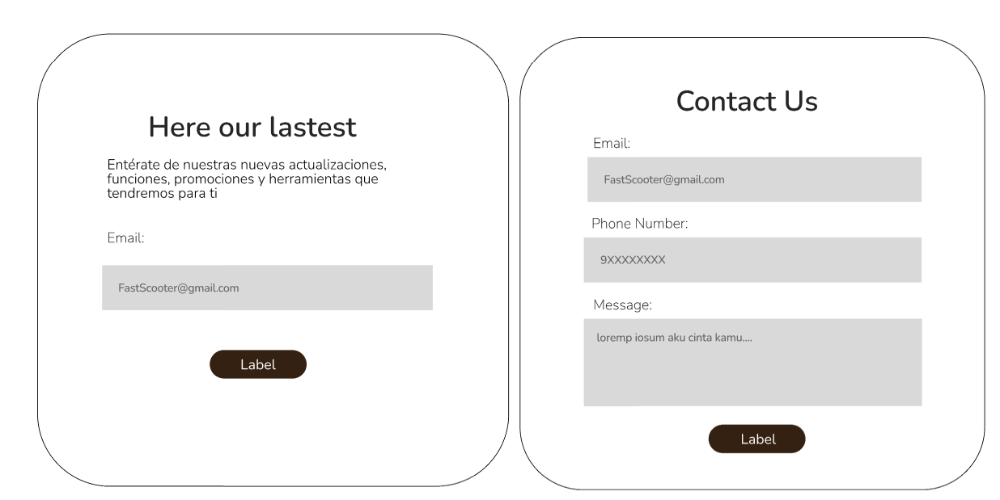

- *Call-to-action* para descargar la aplicación
    

>**Footer**

Descripción de neustro *startup*, demostración de nuestros links dentro de nuestro landing, la presentación de nuestras redes, políticas de privacidad, términos y condiciones.

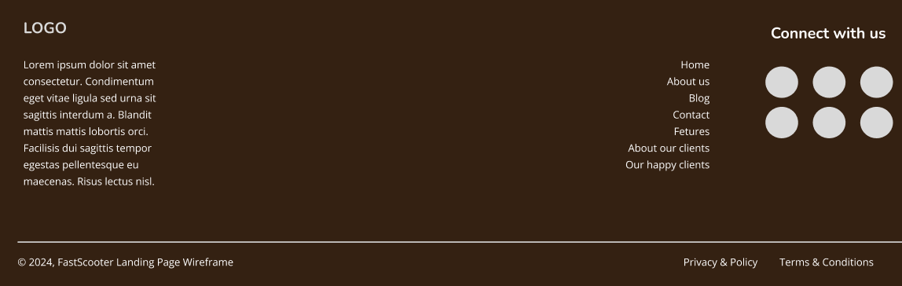

## 4.4. Web Applications UX/UI Design
### 4.4.1. Web Applications Wireframes

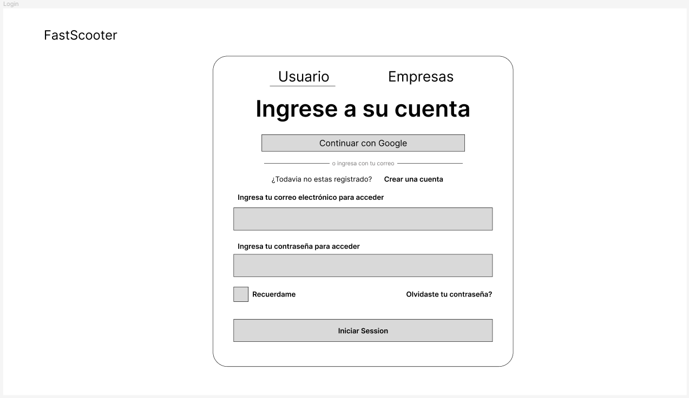
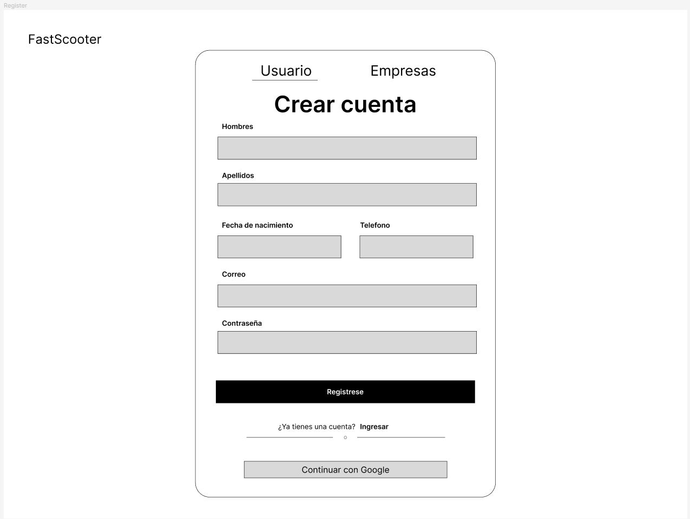
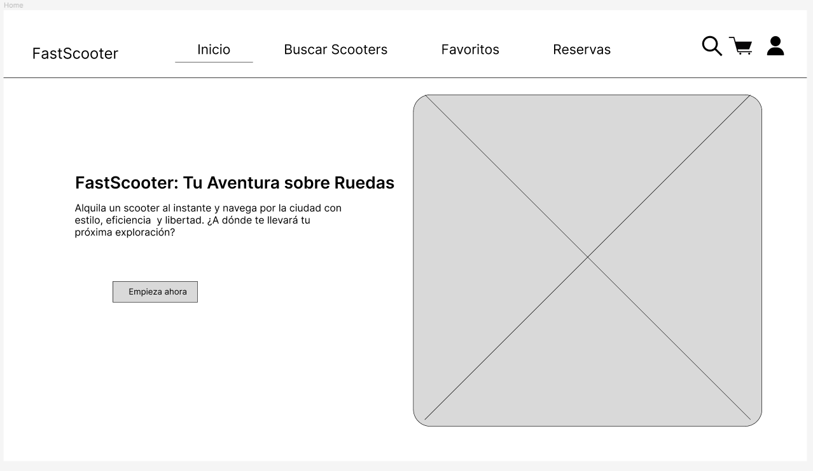
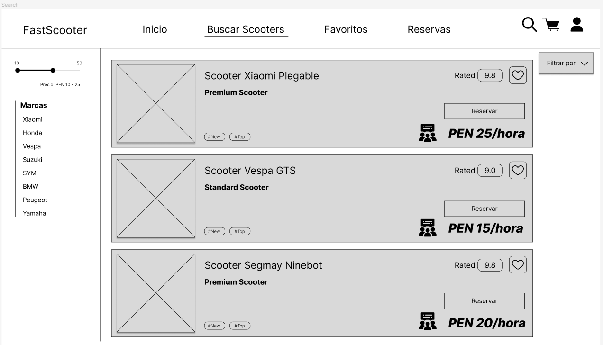
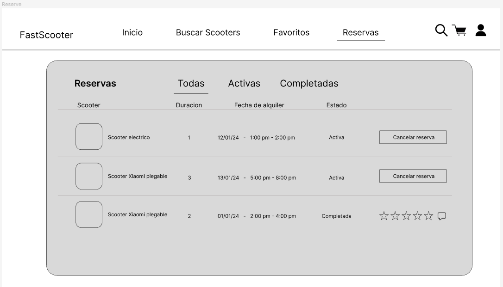
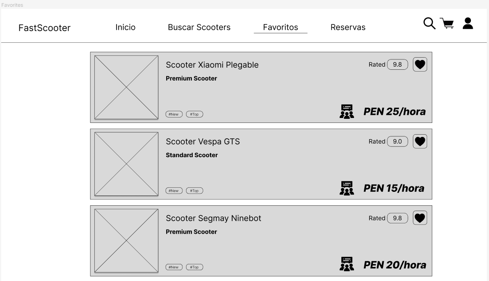
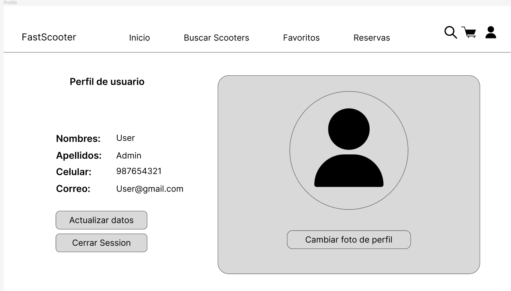

### 4.4.2. Web Applications Wireflow Diagrams
En esta sección, se presentan los wireflows de la aplicación guiándose de las historias de usuario.

#### User Persona Empresa de Delivery

___

**Usar Goal: Como usuario empresa quiero crearme una cuenta para poder acceder a la aplicación.**

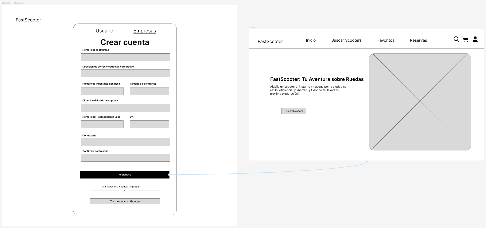

#### User Persona usuario

___

**Usar Goal: Como usuario quiero iniciar sesión con mi correo para ingresar a la plataforma**

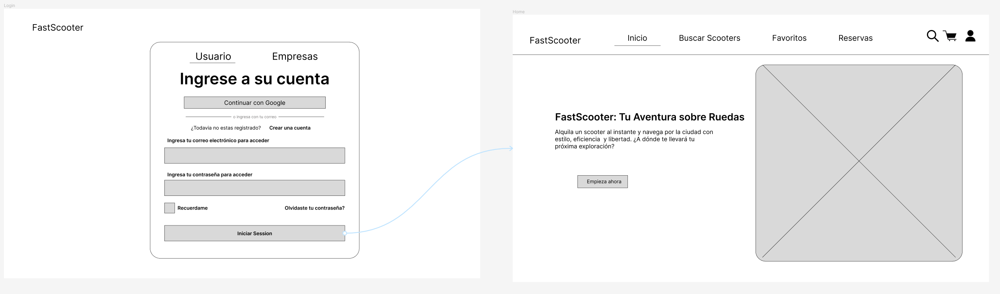

**Usar Goal: Como usuario quiero poder reservar un scooter específico con anticipación para asegurarme de que esté disponible cuando llegue a la estación de scooters**

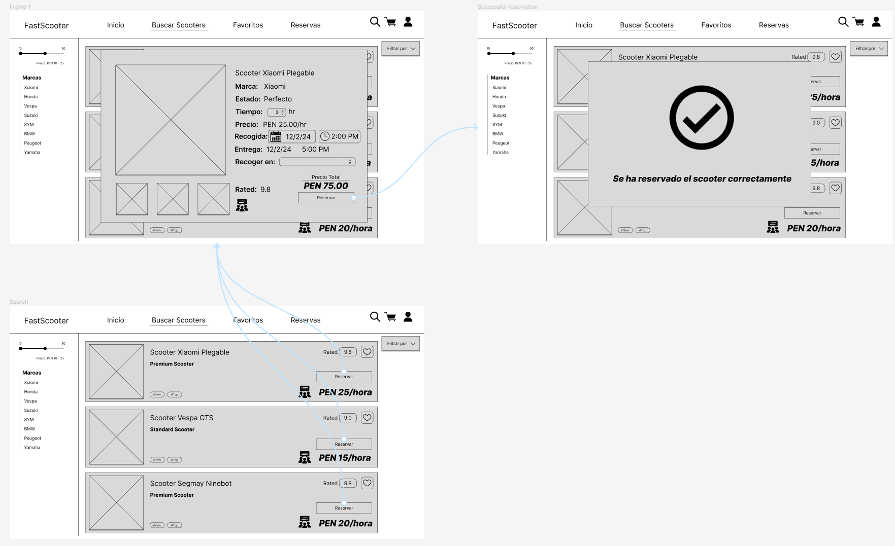

**Usar Goal: Como usuario de la aplicación quiero poder cancelar una reserva para no incurrir en gastos por un servicio que no voy a utilizar**

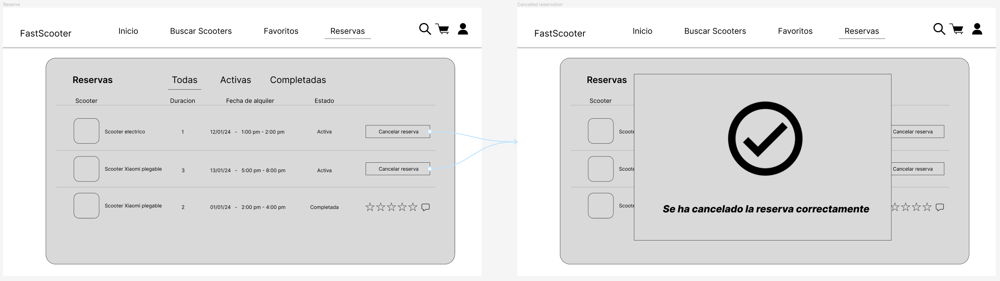

Enlace de [Wireflow Diagrams en Figma](https://www.figma.com/file/SOKyS4fEM5Vpngj85Rx08v/Untitled?type=design&node-id=0%3A1&mode=design&t=enyuXClZrXBI99Vp-1) para una mejor observación.

### 4.4.3. Web Applications Mock-ups
En esta sección, se presenta el diseño viusal y de interacción en formato de mockups del producto solución.

Pantallas relacionadas con el inicio de sesiòn:

  

Pantallas relacionadas con la creacion de cuenta:

  

Pantallas relacionas con el Inicio:

 

Pantallas Relacionadas con la Busqueda de Scooters:

 

Pantallas relacionada con la gestion de reservas:

 

Pantallas relacionadas con el Perfil de Usuario

 

Pantallas relacionadas con Generar Una Nueva Reserva

 

### 4.4.4. Web Applications User Flow Diagrams 
En esta sección, se presentaran los User Flows, donde se mostrarán las rutas Happy y Unhappy que los usuarios pueden tener al momento de usar la aplicación web. Cabe resaltar que los Happy Paths están represetnadas con flechas en color verde y los Unhappy con flechas de color rojo.

[Link LucidChart](https://www.figma.com/file/DCoXljg9CCi31HLqP1Zi8G/Untitled?type=design&node-id=0%3A1&mode=design&t=lVsnLpJUdo6Vk466-1)

**User Goal:** Reserva de scooters

**Task Flow:**
- El usuario ingresa a la sección "buscar scooters".
- El usuario puede observar todos los scooters disponibles.
- Al presionar en un scooter se ven sus características más relevantes.
- Si se presiona "Reservar", entonces se reservará el scooter seleccionado y se mostrará una pantalla que diga "Reserva exitosa". (Happy Path)
- Si se cierra la ventana de reserva o se sale de ahi, se mostrará un cuadro que diga "Reserva cancelada". (Unhappy Path)

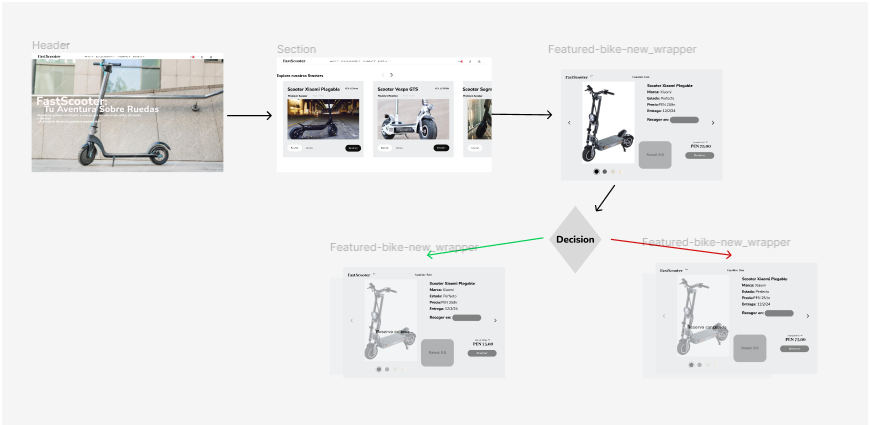

**User Goal:** Edición de perfil

**Task Flow:**
- El usuario ingresa a la sección "perfil".
- El usuario puede observar todos los datos de su perfil y modificarlos.
- Al presionar el botón de "Confirmar datos", se mostrará una ventana diciendo "Perfil modificado". (Happy Path)
- Si se sale de la sección se devolverá al apartado inicio. (Unhappy Path)

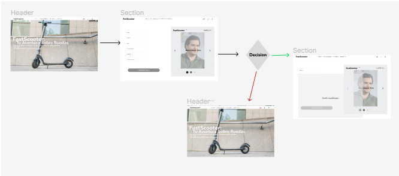

**User Goal:** Registro de usuario

**Task Flow:**
- El usuario ingresa a la sección "registro".
- El usuario puede escoger que tipo de usuario es: "Usuario" o "Empresa".
- El usuario introducirá los campos necesarios para crear su cuenta.
- Si se presiona "Crear cuenta" y todos los datos son válidos se mostrará "Cuenta creada". (Happy Path)
- Si se cierra la ventana o se sale de esta se volverá a la sección "Inicio". (Unhappy Path)

## 4.5. Web Applications Prototyping
En esta sección, se pueden evidenciar los principios de arquitectura de información, esto hace que la aplicación se vea lo más eficiente posible.

**Principio de elección:**
Procuramos que la aplicación web posea una cantidad de secciones a todo momento, por lo que se cuenta con la barra superior siempre en la aplicación con 4 secciones, los cuales podrá acceder a las funcionalidades rapidamente desde cualquier pantalla.

**Principio de divulgación:**
La información presentada se separa por partes, de tal manera que el usuario encuentre lo que desee.
 
 
 
 

 
 

 
 
 

 
 
 

## 4.6. Domain-Driven Software Architecture
### 4.6.1. Software Architecture Context Diagram
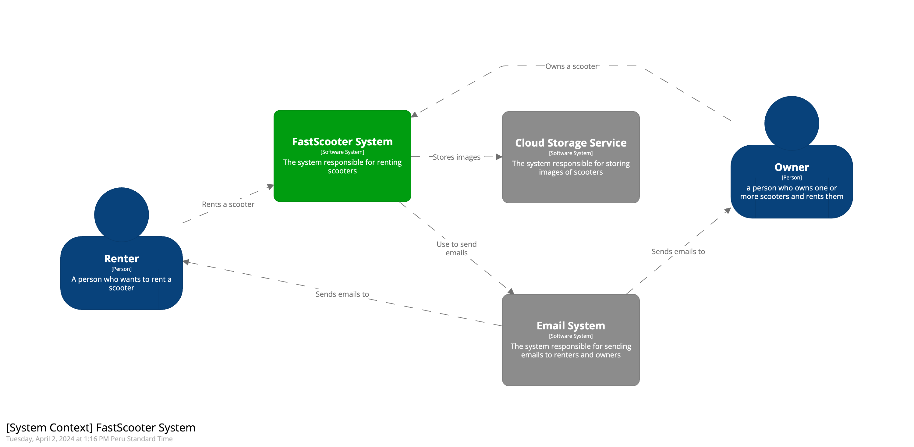

### 4.6.2. Software Architecture Container Diagrams
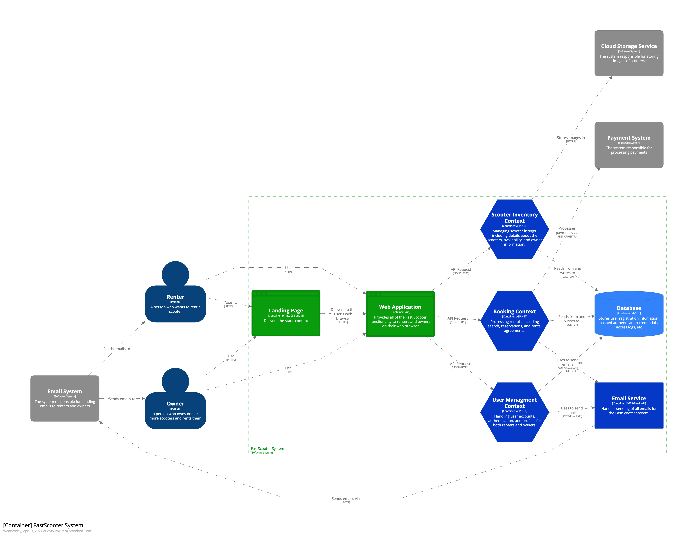

### 4.6.3. Software Architecture Components Diagrams
#### User Managment Context
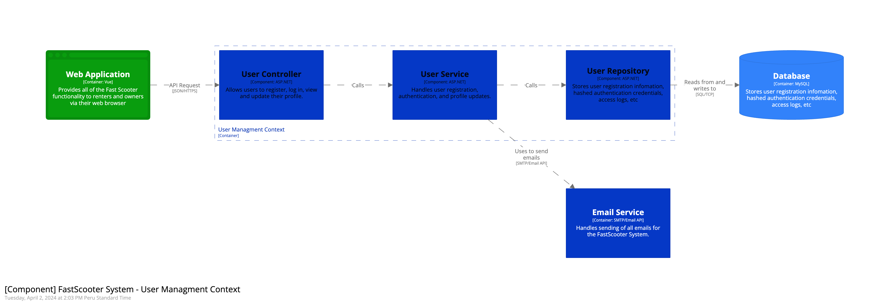
#### Booking Context
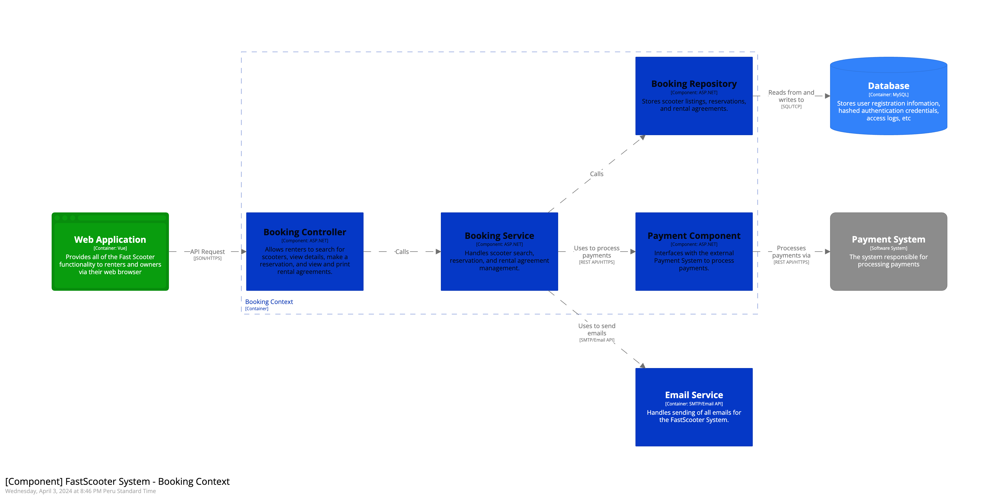
#### Scooter Inventory Context

## 4.7. Software Object-Oriented Design
En esta sección, se utilizará el enfoque de diseño orientado a objetos para desarrollar la aplicación web. Asimismo, se aplicarán los principios y conceptos fundamentales de la programación orientada a objetos.

### 4.7.1. Class Diagrams
En esta sección, se exhibirán los diagramas de clases que ilustran las relaciones entre las clases en el contexto del diseño orientado a objetos.

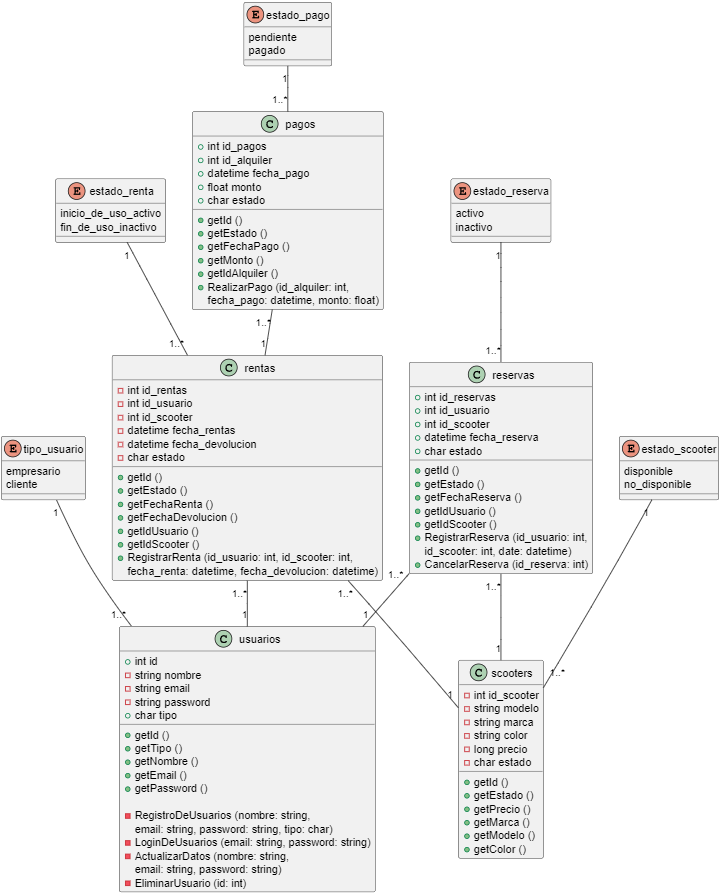

### 4.7.2. Class Dictionary

El diagrama de clases se desarrolló en visual studio code con el uso de la extensión y documentación de plantUML. Aquí se creará un diccionario detallado que describe cada una de las clases identificadas en los diagramas.

- **Usuarios:** En esta clase se realiza el registro de todos los usuarios, considerando todos sus atributos y el tipo de usuario. Además, de las funciones de inicio de sesión, actualización y aliminación de cuentas.

- **Scooters:** En esta clase se le permite al usuario la visualización de características de cada uno de nuestros scooters disponibles en nuestra plataforma.

- **Reservas:** La principal acción de aquí es la realización de reserva considerando la clase scooter en el proceso. Asimismo, también se considera la cancelación de reserva.

- **Rentas:** En esta clase el usuario activa el inicio del uso del scooter comenzando así el tiempo de su renta.

- **Pagos:** En esta clase, se realizan pagos al terminar la reserva y comenzando la renta.

- **Enum:** Gracias a los enum podemos declarar estados de cada proceso:
    - tipo_usuario. Elección entre empresarios y ciudadanos.
    - estado_scooter. Muestra si el scooter está disponible o no.
    - estado_reserva. El estado de una reserva cambia cuando el usuario realiza una reserva y cuando la cancela.
    - estado_renta. Comienzo o fin de uso del scooter.
    - estado_pago. El pago realizado o pendiente. 

## 4.8. Database Design
En esta sección, se definirán las tablas y relaciones necesarias para almacenar y gestionar los datos de manera eficiente.
### 4.8.1. Database Diagram
En esta sección, se presentará el diagrama de la base de datos, que muestra la estructura y las relaciones entre las tablas.

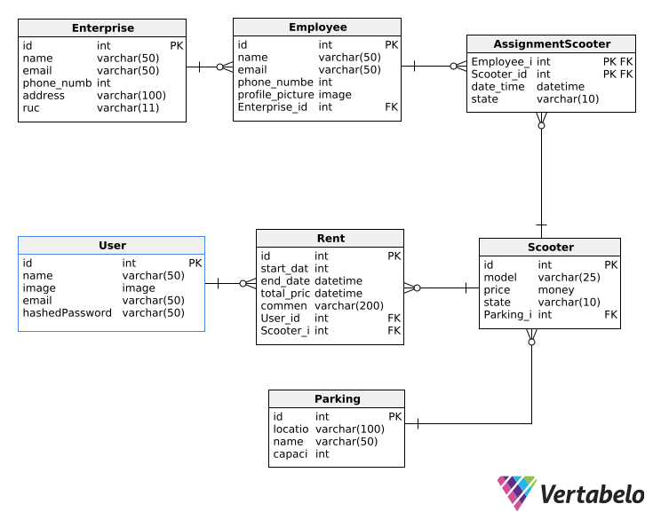

[Link Database Diagram](https://my.vertabelo.com/public-model-view/BuTgCOFwRnLqR0QIhemQ3fQ54SAz2TZRgFV2K34qNZ6wFwXWb96nUAjoeDvpxqME?x=3793&y=4054&zoom=0.6719)

# Capítulo V: Product Implementation, Validation & Deployment
## 5.1. Software Configuration Management
### 5.1.1. Software Development Environment Configuration
Utilizaremos principalmente como IDEs: Visual Studio Code o WebStorm, cada una con su configuración debida para no causar conflictos con carpetas personalizadas de cada IDE. Más adelante se hará uso de Rider para la implementación de las APIs.

Como herramientas de desarrollo se hará uso de la última versión disponible de Node.js. Para el frontend, se usará el framework web Vue versión 3. El cual se instalará mediante el manejador de paquetes. Como framework de diseño se usará PrimeVue. Finalmente, para el backend, se utilizará el framework ASP.NET con el lenguaje de programación de C#.

Como herramientas SaSS, se usará GitHub como herramienta para colaboración de código. También usaremos Trello para la elaboración de los Product Backlog. Vertabelo, para la elaboración del diagrama de base de datos. LucidChart, para la elaboración del diagrama de clases y diagramas adicionales

Para el desarrollo del landing page, se decidió con el equipo usar HTML, CSS y JS. Para llevarlo a cabo se eligieron diversas herramientas tecnológicas de las cuales el equipo ya está acostumbrado y tienen un cierto dominio. Estas herramientos son las siguientes:

- Visual Studio Code: Es un editor de código gratuito, moderno y potente gracias a que cuenta con varias funciones y extensiones para trabajar con cualquier lenguaje de programación. Además es bastante conocida por todos los integrantes del equipo y debido a ello se decidió trabajar con Visual Studio Code. Para la instalación del programa, se puede  conseguir desde su página web oficial: una vez descargado se puede proceder con la instalación de forma rápida y fácil.

- Git y Github: Se usaron estas herramientas por la razón de que hoy en día es un estándar usar Git para el control de versiones de software y se eligió GitHub por ser la plataforma más popular y fácil de usar para crear y manejar repositorios, tener funciones para ver cambios, commits, pull request, entre otros. El enlace de descarga del instalador de GitHub Desktop es 

- Live Server: Finalmente, para acelerar el desarrollo del landing page, se usó esta extensión que sirve para visualizar los cambios inmediatamente después de alguna modificación en el código así se evita estar recargando la página, lo cual es un ahorro de tiempo y comodidad al desarrollar.

- Discord: Aunque originalmente se diseñó como una plataforma de comunicación para gamers, Discord también se utiliza para diseñar y crear comunidades en línea y mejorar la experiencia de usuario a través de la comunicación y colaboración en grupos.

- WhatsApp: WhatsApp es una aplicación de mensajería instantánea que se utiliza para la comunicación en tiempo real. Aunque no es una herramienta de gestión de proyectos, se puede usar para mantenerse en contacto con miembros del equipo y colaborar en cierta medida.

**Requirements Management:**

- Miro: Miro es una plataforma de pizarra en línea que se utiliza para colaborar en la ideación, planificación y diseño de proyectos. Es especialmente útil para la colaboración visual, como la creación de mapas mentales, diagramas y prototipos.

- Google Docs: Google Docs es una suite de aplicaciones de procesamiento de texto, hojas de cálculo y presentaciones en línea. Aunque no es específicamente una herramienta de gestión de requisitos, se puede utilizar para documentar y colaborar en la definición y seguimiento de requisitos de proyectos.

**Product UX/UI Design:**

- Figma: Figma es una herramienta de diseño de interfaz de usuario (UI) y experiencia de usuario (UX) basada en la nube. Se utiliza para crear prototipos interactivos, diseños de aplicaciones y colaboración en tiempo real en proyectos de diseño.

- UXPressia: UXPressia es una herramienta especializada en la creación de mapas de experiencia de usuario, perfiles de clientes y otros elementos relacionados con el diseño de UX. Ayuda a visualizar y comprender la experiencia del usuario en un producto o servicio.
  
- LucidChart: es una herramienta para crear diagramas de clases, flujo y entre otros, de manera facil e intuitiva. Nos va a servir para hacer los user flows y el diagrama de clases para el proyecto.

**Software Development:**

- Visual Studio Code: Visual Studio Code es un editor de código fuente altamente configurable y ampliable. Se utiliza principalmente para la codificación, depuración y desarrollo de software en varios lenguajes de programación.

- Git: Git es un sistema de control de versiones distribuido. Es una tecnología esencial para el desarrollo de software y se usa para rastrear cambios en el código fuente y facilitar la colaboración entre programadores.

**Software Documentation:**

- GitHub: GitHub es una plataforma de desarrollo colaborativo que utiliza el sistema de control de versiones Git. Se utiliza para alojar, revisar y colaborar en proyectos de desarrollo de software, lo que facilita la colaboración entre desarrolladores.

**Software Testing:**

- Lenguaje Gherkin: El lenguaje Gherkin es un lenguaje de dominio específico utilizado para escribir pruebas de aceptación en un formato legible por humanos. Se utiliza junto con herramientas de prueba de comportamiento, como Cucumber, para automatizar pruebas funcionales.

### 5.1.2. Source Code Management
Como mencionamos anteriormente, se utilizará GitHub para llevar un control de las versiones de desarrollo y poder trabajar de forma colaborativa. Para ello, se creó una Github Organizacion: [Apps Web SI730](https://github.com/upc-2023-GreatMinds-SW51-Web) 

[Repositorio Informe: goSteel-informe](https://github.com/Apps-Web-SI730/goSteel-informe)

[Repositorio Landing Page: goSteel-LandingPage](https://github.com/Apps-Web-SI730/goSteel-LandingPage)

[Repositorio pruebas de aceptacion: ]()

[Repositorio Frontend: ]()

[Repositorio Backend: ]()

### 5.1.3. Source Code Style Guide & Conventions
A continuación, se darán a conocer las convenciones, formatos, estilos y entre otras propiedades de los lenguajes trabajados en la presente solución las cuales son: HTML, CSS y JavaScript:

- HTML: Se hará uso de la guía “HTML Style Guide and Coding” de la página W3Schools, la cual menciona las convenciones y estándares de este lenguaje de etiquetas. Hemos considerado las siguientes como las más importantes:

- Declarar siempre el tipo documento: Es decir, colocar siempre la etiqueta en la primera línea del código.

- Utilizar el nombre de las etiquetas y sus atributos en minúscula: Por un tema de estética y orden del código para que este se vea más limpio y sea más fácil de escribir.

- Cerrar todas las etiquetas: Esto evita futuros problemas o errores de sintaxis.

- Siempre coloca comillas para los valores de los atributos de las etiquetas: De esta forma los valores son más fáciles de leer y se deben utilizar obligatoriamente si este contiene espacios.

- Especificar siempre los atributos alt, width y height para las imágenes: Es importante en caso de que la imagen no se pueda mostrar por algún motivo y también ayuda con el tema de la accesibilidad de los usuarios.

- No omitir la etiqueta ni los metadatos: Estas etiquetas son importantes para la optimización de motores de búsqueda (SEO).

CSS: Se siguió la guía “Google HTML/CSS Style Guide” donde se indican las convenciones, reglas y buenas prácticas para este lenguaje. Hemos considerado las siguientes recomendaciones como las más destacadas:

- Nombre de clases: Se recomienda usar nombres generales para las clases, no deben ser específicas por la razón de que deben comportarse como padres.

- Usar nombres de clase cortos: Se recomienda utilizar nombres de clase que sean cortos y descriptivos, para transmitir la idea de lo que representa de manera concisa.

- Usar delimitadores de nombres de clase adecuados: Se debe de separar las palabras en los nombres de clase con solo guiones.

- Evitar los selectores de ID: No se recomienda implementar este tipo de selectores, por la razón de que estos deben ser únicos en toda la página y en proyectos grandes que tengan muchos componentes es difícil de garantizar esa unicidad, es preferible usar selectores de clase.

- Usar propiedades abreviadas: Es muy recomendable usar propiedades que soporten ser declarados de forma abreviada (por ejemplo, la propiedad padding, margin, border, etc.) por la razón de que reduce de forma significativa la cantidad de líneas de código, y es más legible para el programador o diseñador.

- JavaScript: Se consideró importante seguir una guía de buenas prácticas para un mejor desarrollo del código, para este caso se eligió la guía de la wiki “JavaScript best practices“ del World Wide Web (W3C). Lo cual se destaca lo siguiente:

- Usar nombres cortos y fáciles de leer: Es recomendable nombrar adecuadamente las variables, clases, funciones y otros elementos para que sea más sencillo de leer y comprender.

- Evitar el uso de variables globales (keyword “var”): No se recomienda el uso de este tipo de variables en un proyecto, porque pueden generar muchos errores a medida que el proyecto crece y estas pueden sobrescribirse fácilmente afectando el valor y se pueden declarar otros elementos como funciones con el mismo nombre de la variable y generar errores.

- Comentar y documentar lo necesario: Se recomienda comentar líneas de código que son complejos de entender a simple vista explicando o dejando mensajes para que otros programadores lo entiendan.

- Usar notaciones sencillas de entender: Javascript cuenta con diversas notaciones y operadores para crear o modificar ciertas estructuras de datos como objetos, arrays, selectivas, etc.

Gherkin: Se consideró conveniente usar la guía y convenciones que se mencionan en “Gherkin Conventions for Readable Specifications” para una correcta realización de las pruebas. A continuación, se mencionan los puntos que consideramos más importantes para nuestro trabajo:

- Los bloques “Give-When-Then” deben ser diferenciados: Se recomienda usar una correcta indentación de esos bloques para identificar mejor las secciones de la prueba y también añadiendo la keyword “And” para añadir otra línea en los pasos y otro bloque.

- Usar tablas para los pasos: Si uno de los pasos requiere de más información es recomendable usar tablas para organizar dicha información y tenga un aspecto más ordenado.

- Usar comillas simples para los parámetros: Se recomienda esta práctica para una mejor legibilidad de los parámetros en un paso y tener una sintaxis más simple.

- Separar los escenarios con comentarios: Si se da el caso de tener muchos escenarios en una prueba, es usar los comentarios como separadores para que visualmente sea más organizado, fácil de leer y distinguir mejor.

En resumen, las convenciones o estilos de programación, se seguirá la guía de estilos de Google para programar en HTML (Google HTML), CSS (CSS Style Guide) y JavaScript (JS) en el caso de la landing page. En el caso de la implementación del frontend, se utilizará Vue 3 utilizando HTML5, CSS3 y JavaScript para aspectos estáticos de templates y JavaScript como lenguaje de programación.

Para el almacenamiento y control de versiones de código se utilizará GIT gestionado desde 
GitHub aplicando GitFlow Workflow, Conventional Commits y Semantic Versioning. Además, todos los hotfixes se realizan en ella, para así poder tener los arreglos desplegados de forma automática. 

 

El lenguaje de diseño de Landing Page y Web Applications estará basado en Material Design. Como biblioteca de componentes de UI se utilizará PrimeVue.

Para el desarrollo de Web Services, se realizará bajo RESTful API architectural style y se hará uso de ASP.NET, utilizando C# como lenguaje de Programación.

### 5.1.4. Software Deployment Configuration
Para el despliegue del Landing Page se utilizará Github Pages, para el Frontend de la aplicación se usará _____. Finalmente, para el despliegue del RESTful API, se usará _____.

## 5.2. Landing Page, Services & Applications Implementation
### 5.2.1. Sprint 1
#### 5.2.1.1. Sprint Planning 1
| Sprint # | 1 | 
| - | - | 
| **Sprint Planning Background** | - |
| Date | 2024 - 04 - 03  |
| Time | 22:00 |
| Location | Virtual via Discord |
| Prepared By | Apellido Apellido, Nombre Nombre |
| Attendees (to planning meeting) | Apellido Apellido, Nombre Nombre / Apellido Apellido, Nombre Nombre / Apellido Apellido, Nombre Nombre / Apellido Apellido, Nombre Nombre / Apellido Apellido, Nombre Nombre |
| Sprint 1 - Review Summary | No aplica (Es el primer Sprint) |
| Sprint 1 - Retrospective Summary  | No aplica (Es el primer Sprint) |
| **Sprint Goal & User Stories** | - |
| Sprint 1 Goal| El objetivo del presente Sprint es en desarrollar la Landing Page usando los wireframes y mockups diseñados previamente |
| Sprint 1 - Velocity | El equipo puede aceptar 20 Story Points|
| Sprint 1 - Story Points | La suma de los Story Points de los User Sotires que se atenderá es 18|

#### 5.2.1.2. Sprint Backlog 1
Implementación del Landing Page acorde con las User Stories.

#### 5.2.1.3. Development Evidence for Sprint Review
| Repository | Branch | Commit Id | Commit Message | Commit Message Body | Commited on (Date) |
| - | - | - | - | - | - |
| goSteel-LandingPage | develop | d172a5f | feature: Creación de Landing  | - | 01/04/2024 |
| goSteel-LandingPage | develop | a43f17b | feature: Header Section | - | 02/04/2024 |
| goSteel-LandingPage | develop | ef25af3 | feature: Various Sections  | - | 03/04/2024 |
| goSteel-LandingPage | develop | 0d11262 | feature: Assets  | - | 04/04/2024 |
| goSteel-LandingPage | develop | 73f3545 | feature: Footer Section | - | 05/04/2024 |

#### 5.2.1.4. Testing Suite Evidence for Sprint Review
Esta sección no fue posible integrar en la presente entrega debido a que el código realizado fue para el desarrollo de la landing page.

#### 5.2.1.5. Execution Evidence for Sprint Review
En este apartado se hace presenta la implementación/despliegue de la landing page del producto solución goSteel.

[Link del video]() 

#### 5.2.1.6. Services Documentation Evidence for Sprint Review
No se utilizó ningún servicio adicional, pues este primer Sprint solo consta de la implementación del landing page.

#### 5.2.1.7. Software Deployment Evidence for Sprint Review
Como se mencionó, se utilizó Github Pages para el despliegue automático del landing page con todos los cambios realizados por el equipo. Github Pages se integra con nuestra organización en GitHub y luego con el repositorio, siendo la rama main la que utilizamos para el despliegue.
[Enlance al Landing Page]()

#### 5.2.1.8. Team Collaboration Insights during Sprint
Las actividades para el presente Sprint se repartieron en base a las secciones de la landing page que se plantearon como equipo previamente, para ello, se realizaron primero los styles en un archivo aparte .css y luego entre todo el equipo se desarrolló el index.html. De esta manera, el desarrollo de la landing page fue organizada y eficiente. A continuación, se mostrarán las evidencias de los commits:

# Conclusiones
### Conclusiones y recomendaciones
### Video About-the-Team

---
# Bibliografía

   Ecobnb. (2022). *Todo lo que tienes que saber sobre los medios de transporte sostenibles en el turismo.* Recuperado de **[Ecobnb](https://es.ecobnb.com/blog/2022/09/medios-transporte-sostenibles-turismo/)** [Consulta: 28 de marzo del 2024]

   RPP. (2020). *¿La cantidad de autos es el problema en el tráfico de Lima?* Recuperado de **[RPP](https://rpp.pe/lima/actualidad/la-cantidad-de-autos-es-el-problema-en-el-trafico-de-lima-noticia-1248078?ref=rpp)** [Consulta: 28 de marzo del 2024]

   Stakeholders. (2021). *Delivery cero emisiones: Tottus realiza sus repartos a domicilio con vehículos sostenibles.* Recuperado de **[Stakeholders](https://stakeholders.com.pe/medio-ambiente/delivery-cero-emisiones-tottus-realiza-sus-repartos-a-domicilio-con-vehiculos-sostenibles/)** [Consulta: 28 de marzo del 2024]

---
# Anexos
