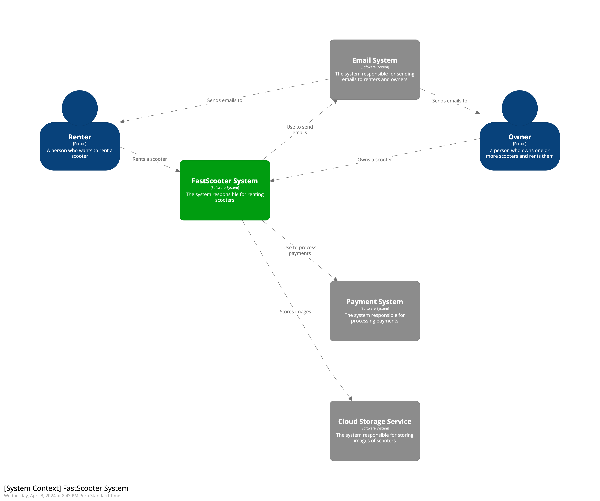

### **Universidad Peruana de Ciencias Aplicadas**

**Carrera**  Ingeniería de Software

**Ciclo**  2024-01

**Curso**   Aplicaciones Web

**Sección**   WX52

**Profesor**   Naldo Reupo-Musayon Gastulo

#### **Informe del Trabajo Final**

**Startup**  GoSteel

**Producto**   FastScooter

**Integrantes**
<table border="1" style="text-align: left;">
	<tbody>
        <tr>
            <td style="text-align:center;">
            <strong>Alumno</strong>
            </td>
            <td style="text-align:center;">
            <strong>Código</strong>
            </td>
        </tr>
		<tr>
			<td>Hidalgo Bustamante Josue Omar</td>
            <td>u202119880</td>
		</tr>
        <tr>
            <td>Barrial Marin, Sharon Antuanet Ivet</td>
            <td>U202114900</td>
        </tr>
        <tr>
            <td>Minaya Mundines, Pietro Minayat</td>
            <td>U201718387</td>
        </tr>
	 <tr>
            <td>Adrianzén Flores, Carlos Arturo</td>
            <td>U201718387</td>
        </tr>	
        <tr>
            <td>Huachaca Advincula, Scott Jacobo</td>
            <td>U201914294</td>
        </tr>
        <tr>
            <td>Apellido Apellido, Nombre Nombre</td>
            <td>uxxxxxxxxx</td>
        </tr>
	</tbody>
</table>

Junio del 2024

---
# Registro de Versiones del Informe

---
# Project Report Collaboration Insights

---
# Student Outcome
El curso contribuye al cumplimiento del Student Outcome ABET: **ABET – EAC - Student Outcome 5**   Criterio: *La capacidad de funcionar efectivamente en un equipo cuyos miembros juntos proporcionan liderazgo, crean un entorno de colaboración e inclusivo, establecen objetivos, planifican tareas y cumplen objetivos.*

En el siguiente cuadro se describe las acciones realizadas y enunciados de conclusiones por parte del grupo, que permiten sustentar el haber alcanzado el logro del ABET – EAC - Student Outcome 5.

| Criterio específico | Acciones realizadas | Conclusiones |
| - | - | - |
| Participa en equipos multidisciplinarios con eficacia, eficiencia y objetividad, en el marco de un proyecto en soluciones de ingeniería de software. | **Apellido Apellido Nombre Nombre**   ***TB1:*** Morbi vel tortor id eros dictum venenatis id ut dui.Mauris quis tellus sed nunc hendrerit vehicula ac id mauris.   ***TP:*** Morbi vel tortor id eros dictum venenatis id ut dui.Mauris quis tellus sed nunc hendrerit vehicula ac id mauris.   ***TB2:*** Morbi vel tortor id eros dictum venenatis id ut dui.Mauris quis tellus sed nunc hendrerit vehicula ac id mauris.   ***TF:*** Morbi vel tortor id eros dictum venenatis id ut dui.Mauris quis tellus sed nunc hendrerit vehicula ac id mauris.    **Apellido Apellido Nombre Nombre**   ***TB1:*** Morbi vel tortor id eros dictum venenatis id ut dui.Mauris quis tellus sed nunc hendrerit vehicula ac id mauris.   ***TP:*** Morbi vel tortor id eros dictum venenatis id ut dui.Mauris quis tellus sed nunc hendrerit vehicula ac id mauris.   ***TB2:*** Morbi vel tortor id eros dictum venenatis id ut dui.Mauris quis tellus sed nunc hendrerit vehicula ac id mauris.   ***TF:*** Morbi vel tortor id eros dictum venenatis id ut dui.Mauris quis tellus sed nunc hendrerit vehicula ac id mauris.    | ***TB1:*** Fusce cursus dolor et nulla suscipit, sit amet ullamcorper nibh vestibulum.    ***TP:*** Fusce cursus dolor et nulla suscipit, sit amet ullamcorper nibh vestibulum.    ***TB2:*** Fusce cursus dolor et nulla suscipit, sit amet ullamcorper nibh vestibulum.    ***TF:*** Fusce cursus dolor et nulla suscipit, sit amet ullamcorper nibh vestibulum. | 
| Conoce al menos un sector empresarial o dominio de aplicación de soluciones de software. | ***Apellido Apellido Nombre Nombre***   ***TB1:*** Cras sed diam suscipit, malesuada ex rutrum, fringilla orci. Vestibulum in nunc quis elit suscipit sollicitudin.   ***TP:*** Cras sed diam suscipit, malesuada ex rutrum, fringilla orci. Vestibulum in nunc quis elit suscipit sollicitudin.   ***TB2:*** Cras sed diam suscipit, malesuada ex rutrum, fringilla orci. Vestibulum in nunc quis elit suscipit sollicitudin.   ***TF:*** Cras sed diam suscipit, malesuada ex rutrum, fringilla orci. Vestibulum in nunc quis elit suscipit sollicitudin.    ***Apellido Apellido Nombre Nombre***   ***TB1:*** Cras sed diam suscipit, malesuada ex rutrum, fringilla orci. Vestibulum in nunc quis elit suscipit sollicitudin.   ***TP:*** Cras sed diam suscipit, malesuada ex rutrum, fringilla orci. Vestibulum in nunc quis elit suscipit sollicitudin.   ***TB2:*** Cras sed diam suscipit, malesuada ex rutrum, fringilla orci. Vestibulum in nunc quis elit suscipit sollicitudin.   ***TF:*** Cras sed diam suscipit, malesuada ex rutrum, fringilla orci. Vestibulum in nunc quis elit suscipit sollicitudin. | ***TB1:*** FEtiam imperdiet quam condimentum velit tempor porttitor.    ***TP:*** FEtiam imperdiet quam condimentum velit tempor porttitor.    ***TB2:*** FEtiam imperdiet quam condimentum velit tempor porttitor.    ***TF:*** FEtiam imperdiet quam condimentum velit tempor porttitor. |

---
# Contenido 
## Tabla de contenidos

### [Capítulo I: Introducción]()
- [1.1. Startup Profile]()
    - [1.1.1 Descripción de la Startup]()
    - [1.1.2 Perfiles de integrantes del equipo]()
- [1.2 Solution Profile]()
    - [1.2.1 Antecedentes y problemática]()
    - [1.2.2 Lean UX Process]()
        - [1.2.2.1. Lean UX Problem Statements]()
        - [1.2.2.2. Lean UX Assumptions]()
        - [1.2.2.3. Lean UX Hypothesis Statements]()
        - [1.2.2.4. Lean UX Canvas]()
- [1.3. Segmentos objetivo]()

### [Capítulo II: Requirements Elicitation & Analysis]()
- [2.1. Competidores]()
    - [2.1.1. Análisis competitivo]()
    - [2.1.2. Estrategias y tácticas frente a competidores]()
- [2.2. Entrevistas]()
    - [2.2.1. Diseño de entrevistas]()
    - [2.2.2. Registro de entrevistas]()
    - [2.2.3. Análisis de entrevistas]()
- [2.3. Needfinding]()
    - [2.3.1. User Personas]()
    - [2.3.2. User Task Matrix]()
    - [2.3.3. User Journey Mapping]()
    - [2.3.4. Empathy Mapping]()
    - [2.3.5. As-is Scenario Mapping]()
- [2.4. Ubiquitous Language]()

### [Capítulo III: Requirements Specification]()
- [3.1. To-Be Scenario Mapping]()
- [3.2. User Stories]()
- [3.3. Impact Mapping]()
- [3.4. Product Backlog]()

### [Capítulo IV: Product Design]()
- [4.1. Style Guidelines]()
    - [4.1.1. General Style Guidelines]()
    - [4.1.2. Web Style Guidelines]()
- [4.2. Information Architecture]()  
    - [4.2.1. Organization Systems]()
    - [4.2.2. Labeling Systems]()
    - [4.2.3. SEO Tags and Meta Tags]()
    - [4.2.4. Searching Systems]()
    - [4.2.5. Navigation Systems]()
- [4.3. Landing Page UI Design]()
    - [4.3.1. Landing Page Wireframe]()
    - [4.3.2. Landing Page Mock-up]()
- [4.4. Web Applications UX/UI Design]()
    - [4.4.1. Web Applications Wireframes]()
    - [4.4.2. Web Applications Wireflow Diagrams]()
    - [4.4.3. Web Applications Mock-ups]()
    - [4.4.4. Web Applications User Flow Diagrams]()
- [4.5. Web Applications Prototyping]()
- [4.6. Domain-Driven Software Architecture]()
    - [4.6.1. Software Architecture Context Diagram]()
    - [4.6.2. Software Architecture Container Diagrams]()
    - [4.6.3. Software Architecture Components Diagrams]()
- [4.7. Software Object-Oriented Design]()
    - [4.7.1. Class Diagrams]()
    - [4.7.2. Class Dictionary]()
- [4.8. Database Design]()
    - [4.8.1. Database Diagram]()

### [Capítulo V: Product Implementation, Validation & Deployment]()
- [5.1. Software Configuration Management]()
    - [5.1.1. Software Development Environment Configuration]()
    - [5.1.2. Source Code Management]()
    - [5.1.3. Source Code Style Guide & Conventions]()
    - [5.1.4. Software Deployment Configuration]()
- [5.2. Landing Page, Services & Applications Implementation]()
    - [5.2.1. Sprint 1]()
        - [5.2.1.1. Sprint Planning 1]()
        - [5.2.1.2. Sprint Backlog 1]()
        - [5.2.1.3. Development Evidence for Sprint Review]()
        - [5.2.1.4. Testing Suite Evidence for Sprint Review]()
        - [5.2.1.5. Execution Evidence for Sprint Review]()
        - [5.2.1.6. Services Documentation Evidence for Sprint Review]()
        - [5.2.1.7. Software Deployment Evidence for Sprint Review]()
        - [5.2.1.8. Team Collaboration Insights during Sprint]()
    - [5.2.2. Sprint 2]()
        - [5.2.2.1. Sprint Planning 2]()
        - [5.2.2.2. Sprint Backlog 2]()
        - [5.2.2.3. Development Evidence for Sprint Review]()
        - [5.2.2.4. Testing Suite Evidence for Sprint Review]()
        - [5.2.2.5. Execution Evidence for Sprint Review]()
        - [5.2.2.6. Services Documentation Evidence for Sprint Review]()
        - [5.2.2.7. Software Deployment Evidence for Sprint Review]()
        - [5.2.2.8. Team Collaboration Insights during Sprint]()
    - [5.2.3. Sprint 3]()
        - [5.2.3.1. Sprint Planning 3]()
        - [5.2.3.2. Sprint Backlog 3]()
        - [5.2.3.3. Development Evidence for Sprint Review]()
        - [5.2.3.4. Testing Suite Evidence for Sprint Review]()
        - [5.2.3.5. Execution Evidence for Sprint Review]()
        - [5.2.3.6. Services Documentation Evidence for Sprint Review]()
        - [5.2.3.7. Software Deployment Evidence for Sprint Review]()
        - [5.2.3.8. Team Collaboration Insights during Sprint]()
    - [5.2.4. Sprint 4]()
        - [5.2.4.1. Sprint Planning 4]()
        - [5.2.4.2. Sprint Backlog 4]()
        - [5.2.4.3. Development Evidence for Sprint Review]()
        - [5.2.4.4. Testing Suite Evidence for Sprint Review]()
        - [5.2.4.5. Execution Evidence for Sprint Review]()
        - [5.2.4.6. Services Documentation Evidence for Sprint Review]()
        - [5.2.4.7. Software Deployment Evidence for Sprint Review]()
        - [5.2.4.8. Team Collaboration Insights during Sprint]()
- [5.3. Validation Interviews]()
    - [5.3.1. Diseño de Entrevistas]()
    - [5.3.2. Registro de Entrevistas]()
    - [5.3.3. Evaluaciones según heurísticas]()
- [5.4. Video About-the-Product]()

---
# Capítulo I: Introducción
## 1.1. Startup Profile
### 1.1.1 Descripción de la Startup

GoSteel: Simplificando la movilidad urbana con FastScooter

<ins>**Misión:**</ins>
En GoSteel, nuestra misión es proporcionar soluciones de movilidad eficientes y sostenibles para empresas de todos los tamaños. Nos comprometemos a ofrecer un servicio de renta de scooters eléctricos empresariales, FastScooter, que permita a nuestros clientes optimizar sus desplazamientos, reducir costos operativos y contribuir positivamente al medio ambiente.

<ins>**Visión:**</ins>
Nuestra visión en GoSteel es liderar la transformación del transporte urbano, ofreciendo una alternativa innovadora y ecoamigable a los métodos de movilidad tradicionales. Nos esforzamos por convertirnos en socios estratégicos de los transeuntes, brindándoles soluciones de movilidad flexibles y personalizadas que impulsen su crecimiento, eficiencia y sostenibilidad a largo plazo.

<ins>**Valores:**</ins>
1. **Sostenibilidad Ambiental:** Nos comprometemos a promover prácticas de movilidad sostenibles y respetuosas con el medio ambiente, contribuyendo activamente a la reducción de emisiones de carbono y la preservación de recursos naturales.
2. **Innovación Tecnológica:** Buscamos constantemente innovar y mejorar nuestros servicios, aprovechando tecnologías avanzadas para ofrecer una experiencia de movilidad eficiente, segura y conveniente.
3. **Excelencia en el Servicio al Cliente: ** Priorizamos la satisfacción y el éxito de nuestros clientes, brindándoles un servicio de alta calidad, atención personalizada y soluciones adaptadas a sus necesidades específicas.
4. **Transparencia y Confianza:** Actuamos con integridad y transparencia en todas nuestras operaciones, estableciendo relaciones de confianza y colaboración tanto con nuestros clientes como con nuestros colaboradores y socios comerciales.
5. **Responsabilidad Social Corporativa:** Nos comprometemos a ser agentes de cambio positivo en nuestras comunidades, apoyando iniciativas sociales y ambientales que contribuyan al bienestar y desarrollo sostenible de la sociedad en su conjunto.

Con FastScooter, en GoSteel estamos comprometidos a proporcionar a las transeuntes una solución de movilidad ágil, eficiente y ecológica que les permita optimizar sus rutas y promover un futuro más sostenible para todos.

### 1.1.2 Perfiles de integrantes del equipo

Nombre completo: Sharon Antuanet Ivet Barrial Marin 

Código de estudiante: U202114900

Carrera: Ingeniería de Software

Acerca de mí: Soy una estudiante que se caracteriza por poseer cualidades como la perseverencia, el compañerismo y la comunicación interpersonal. Además de tener conocimientos en diversos lenguajes de programación (Python, C++, C#...), también tengo habilidades en la edición de fotos y videos, y en el enfoque al marketing digital. Espero que estas pocas cualidades sirvan como aporte al proyecto durante el presente ciclo y curso.

Nombre completo: Pietro Gerardo Minaya Mundines 

Código de estudiante: U201718387

Carrera: Ingeniería de Software

Acerca de mí: Soy un apasionado por la tecnologia y me apasiona el Ajedrez.

Nombre completo: Carlos Arturo Adrianzén Flores

Código de estudiante: U202215705

Carrera: Ingeniería de Software

Acerca de mí: Soy estudiante de la UPC, curso el 5to ciclo. Me gusta jugar fútbol y tocar guitarra. Respecto al trabajo en equipo espero poder ayudar con todas mis capacidades. Me considero optimista y alegre.

Nombre completo: Scott Jacobo Huachaca Advincula

Código de estudiante: U201914294

Carrera: Ingeniería de Software

Acerca de mí: Soy estudiante de la UPC, la razon por la que elegi la carrera es porque combina las cosas que me gustan como la tecnologia y la creacion de aplicaciones. Ademas siempre me ha intrigado como funcionan las aplicaciones que utilizamos a diario, como las redes sociales o aplicaciones de productividad.

Nombre completo: Josue Hidalgo Bustamante 

Código de estudiante: U202119880

Carrera: Ingeniería de Software

Acerca de mí: Soy estudiante de la UPC,me gusta mucho la tecnologia y los videojuegos

## 1.2 Solution Profile
### 1.2.1 Antecedentes y problemática

En entornos urbanos el tráfico y la contaminación representan desafíos importantes, con congestiones viales que aumentan el estrés y emiten gases nocivos, afectando la salud pública y el medio ambiente. Frente a esto *GoStell* identficó que se necesitan soluciones sostenibles, como el transporte público y medios de movilidad alternativos, junto con políticas urbanas que reduzcan el tráfico y las emisiones.

**What?**

La renta de scooters es un proceso donde las personas dentro de Lima Metropolitana adquieren una alternativa de transportes frente a la problemática del congestionamiento vehicular y la conciencia ambiental. La contribución al medio ambiente se refiere a la idea de que esta práctica puede tener un impacto positivo en el entorno, al reducir el uso de automóviles que emiten gases como el dióxido de carbono provocando polución.

**Who?**

Nuestro enfoque principal son las personas que transitan dentro de Lima Metropolitana. Esto puede incluir:
- Residentes locales que quieren un transporte para uso diaro.
- Turistas extranjeros y locales, para realizar turismo por las calles o incentivar diferentes actividades.
- Personas dueñas de empresas delivery o que ofrecen este tipo de servicio para la entrega de sus productos.

**When?**

La renta de scooters solo estará disponible durante la duración de 15 horas, desde las 7 de la mañana hasta las 10 de la noche, considerando el timing de personas que mayormente transitan por esas zonas. 

**Where?**

La renta de scooters estará premitida dentro de toda la zona de Lima Metropolitana, cada vez que un usuario inicie sesión en nuestra aplicación  y alquile un scooter.

**Why?**

- **Antecedentes:** El uso de automóviles que emiten gas de carbono es conocido por su impacto ambiental negativo debido a la producción masiva de sus componentes en fábricas y al uso cotidiano como transporte.

- **Problemática:** La renta de scooters busca abordar la problemática de la carencia de transportes ágiles y eco-friendly, reduciendo el uso de trasnportes que tanto en su producción como en su uso final, generan mucho impacto negativo en nuestro medio ambiente

**How?**

Las personas que se registran a nuestra aplicación pueden acceder a la función de aquilar los scooters de nuestros provedores.

**How Much?**

El impacto en la contribución al medio ambiente puede variar, pero el potencial para reducir la producción y la polución que generan los automóviles al emitir gases de dióxido de carbono.

### 1.2.2 Lean UX Process
#### 1.2.2.1. Lean UX Problem Statements
Para los usuarios interesados en la movilidad urbana ágil y económica, la falta de opciones accesibles y convenientes para el alquiler de scooters representa un obstáculo significativo. Actualmente, las alternativas disponibles carecen de una plataforma centralizada que facilite el contacto entre los usuarios y los proveedores, lo que conduce a una experiencia fragmentada y poco satisfactoria. Además, la ausencia de un modelo de negocio rentable para ambas partes impide el desarrollo de un ecosistema de alquiler de scooters sostenible y efectivo. Esta falta de solución integral obstaculiza tanto a los usuarios que buscan una alternativa de movilidad eficiente como a empresas de delivery que buscan una opcion de transporte para sus empleados que sea tanto económica como sostenible.

Usuarios interesados en movilidad urbana ágil y económica:

* Problema: Carencia de opciones accesibles y convenientes para el alquiler de scooters
* Causa: Falta de una plataforma para facilitar el contacto entre usuario y proveedores
* Efecto: Experiencia de usuario fragmentada y poco satisfactoria

Empresas de delivery buscando opciones de transporte Económicas y sostenibles:

* Problema: Dificultad para encontrar soluciones de transporte adecuadas para empleados
* Causa: Ausencia de un modelo de negocio rentable que beneficie tanto a proveedores como a empresas
* Efecto: Limitaciones para desarrollar un sistema de entrega eficiente y sostenible

Desarrollo de un ecosistema sostenible de alquiler de scooters:

* Problema: Falta de un ecosistema de alquiler de scooters sostenible y efectivo
* Causa: Inexistencia de soluciones integrales que atiendan tanto a usuarios individuales como a empresas
* Efecto: Limitaciones para desarrollar un sistema de entrega eficiente y sostenible

Impacto de la contaminación en la salud y economia:

* Problema: La contaminación del aire en las ciudades afecta la salud y economia
* Causa: Emisiones de CO2 del transporte urbano y congestion vehicular
* Efecto: Mas de 1600 muertes anuales atribuidas al aire contaminado en Lima, ademas de impactos economicos negativos.

#### 1.2.2.2. Lean UX Assumptions
* Los usuarios prefieren opciones de movilidad ágil y económica para desplazarse
* Los usuarios buscan opciones de movilidad que no solo sean ágiles y económicas, sino también seguras y confiables.
* Los proveedores de scooters están dispuestos a participar en una plataforma centralizada de alquiler de scooters.
* Los usuarios están dispuestos a utilizar una aplicación web para gestionar el alquiler de scooters debido a su conveniencia y accesibilidad.
* Existe una preocupación creciente por la congestión del tráfico y la contaminación en áreas urbanas, lo que aumenta la demanda de opciones de movilidad sostenible como el alquiler de scooters.
* La transparencia en cuanto a precios y políticas de uso contribuirá a generar confianza y lealtad entre los usuarios de la aplicación de alquiler de scooters.
* Los usuarios valoran la flexibilidad en el modelo de alquiler, preferiendo opciones que se adapten a diferentes necesidades, como tarifas por minuto, planes de suscripción o paquetes de uso diario/semanal

#### 1.2.2.3. Lean UX Hypothesis Statements
- Creemos que los usuarios de servicios de movilidad urbana prefieren opciones ágiles y económicas debido a la conveniencia y flexibilidad que ofrecen en comparación con métodos de transporte tradicionales como automóviles o taxis.
- Creemos que los usuarios valoran la seguridad y confiabilidad al elegir opciones de movilidad, lo que incluye la percepción de riesgo al usar scooters eléctricos en áreas urbanas.
- Creemos que los proveedores de scooters eléctricos están dispuestos a participar en una plataforma de alquiler de scooters si les brinda beneficios como una mayor visibilidad en el mercado y una gestión simplificada de su flota.
- Creemos que la transparencia en cuanto a precios y políticas de uso contribuirá a generar confianza y lealtad entre los usuarios de la aplicación.
- Creemos que los usuarios valoran la flexibilidad en el modelo de alquiler, prefiriendo opciones que se adapten a diferentes necesidades, como tarifas por minutoi, planes de suscripción o paquetes de uso semanal.
- Creemos que existe una creciente preocupación por la congestión del tráfico y la contaminación en áreas urbanas, lo que aumenta la demanda de opciones de movilidad sostenibles.
- Creemos que los usuarios están dispuestos a utilizar una aplicación web para gestionar el alquiler de scooters debido a su conveniencia y accesibilidad, siempre y cuando la plataforma ofrezca una experiencia de usuario intuitiva y segura.

#### 1.2.2.4. Lean UX Canvas
 
 
## 1.3. Segmentos objetivo

Para el desarrollo de FastScooter tenemos como enfoque dos segmentos objetivos:

>**Personas que transitan Lima Metropolitana**

Aunque *FastScooter* está disponible a todo público bajo su propia responsalidad, nuestro enfoque primordial son las personas que se movilizan por Lima Metropolitana de 18 a 30 años de edad, cuando cumplen la mayoría de edad y en general tienden a movilizarse por sí solos. En este tipo de casos, los scooters son una solución viable de **transporte alternativo** en las áreas urbanas, donde abunda los problemas de congestión de tráfico y estacionamiento limitado. El alquiler de scooters ofrece una solución de movilidad alternativa que es más rápida y flexible que el transporte público y más económica que el uso de un automóvil o taxi.

Además, al ser un servicio *eco-friendly*, aporta al **cuidado de nuestro medio ambiente**, debido a que reduce las emisiones de carbono y la creciete polución que crean los vehículos de combustión interna en la actualidad. Asimismo, y debido a la creciente toma de conciencia ambiental en los últimos años, ha hecho que muchas personas hagan uso de scooters eléctricos, fomentando un estilo de vida más respetuoso con el medio ambiente.

Por otro lado, según RPP (2020), la mayoría de los ciudadanos no poseen un vehículo propio y en comparación con otros países de Latianoamérica, Perú cuenta con una cantidad de autos menor al promedio. El alquiler de scooters es una opción conveniente y flexible para desplazarse por la ciudad. Pueden usar los scooters para viajes cortos o esporádicos sin la necesidad de comprometerse con la propiedad y el mantenimiento de un vehículo.

Por último, la renta de scooters estimula el turismo en la **realización de actividades** recreativas entre Los residentes locales y turistas, desde paseos por el vecindario a visitas a parques locales o exploración de lugares de interés turístico dentro de la ciudad.

>**Empresas delivery**

Las empresas delivery o con servicio delivery en Lima metropolitana son un enfoque importante para nuestro producto, ya que *FastScooter* les da como beneficio la **eficiencia en la entrega**. Debido a que los scooters son vehículos pequeños y ágiles, consiguen acceder a áreas de la ciudad a las que los automóviles no pueden llegar fácilmente haciendo que las entregas sean más rápidas y cumplan con los plazos acordados sin que el tráfico congestionado de Lima Metropolitana sea un problema.

Asimismo, resuelve el problema de la **reducción de costos operativos**, puesto que al hacer uso de scooters en lugar de vehículos más grandes ocasionan que los costos operativos asociados con el mantenimiento y el combustible disminuya, lo que puede ser beneficioso para las empresas de entrega en términos de rentabilidad. A su vez, alquilar scooters en lugar de comprarlos puede proporcionar a las empresas de entrega la flexibilidad de aumentar o reducir su flota según la demanda, lo que les permite ajustarse a los cambios estacionales o a las fluctuaciones en la demanda del mercado.

Además de estas razones empresariales, también existe una mejora en la **sostenibilidad ambiental**. El uso de scooters eléctricos produce bajas emisiones de polución lo que ayuda a reducir la huella de carbono de las operaciones de entrega de la empresa y esto es un punto de venta importante para aquellas empresas que buscan mejorar su imagen y compromiso con el ambiente.

# Capítulo II: Requirements Elicitation & Analysis
## 2.1 Competidores

***Lime:*** Una de las empresas líderes en el alquiler de scooters eléctricos. Opera en varias ciudades de todo el mundo y se ha convertido en una opción popular para la movilidad urbana.

***Bird:*** Empresa importante en este sector. Ofrece scooters eléctricos para alquilar en áreas urbanas. Su presencia global y su enfoque en la sostenibilidad los hacen destacar.

***Voi:*** es otra empresa importante en este sector. Ofrece scooters eléctricos para alquilar en áreas urbanas. Su presencia global y su enfoque en la sostenibilidad los hacen destacar.

### 2.1.1 Análisis competitivo
<table border="1" style="text-align: center;">
	<tbody>
		<tr>
			<td colspan="6">Competitive Analysis Landscape</td>
		</tr>
		<tr>
			<td colspan="2">¿Por que llevar a cabo este análisis?</td>
			<td colspan="4">Llevar a cabo este análisis nos brindará información crítica que nos permitirá tomar decisiones más informadas y estratégicas para el desarrollo, comercialización y crecimiento de nuestra aplicación</td>
		</tr>
		<tr>
			<td colspan="2"></td>
			<td>GoSteel</td>
			<td>Lime</td>
			<td>Bird</td>
			<td>Voi</td>
		</tr>
		<tr>
			<td rowspan="2">Perfil</td>
			<td>Overview</td>
			<td>Aplicación web diseñada para el alquiler de scooters</td>
			<td>Aplicación web diseñada para la compra/alquiler de scooters</td>
			<td>Aplicación web diseñada para la compra/alquiler de scooters</td>
			<td>Aplicación web diseñada para la compra/alquiler de scooters</td>
		</tr>
		<tr>
			<td>Ventaja competitiva ¿Que valor ofrece a los clientes?</td>
			<td>Ser una plataforma que ofrece </td>
			<td>Ser una plataforma que facilita  </td>
			<td>Ser una plataforma que proporciona </td>
			<td>Ser una plataforma que administra </td>
		</tr>
		<tr>
			<td rowspan="2">Perfil de Marketing</td>
			<td>Mercado objetivo</td>
			<td>
                <ul>
                    <li>Segmento Objetivo 1</li>
                    <li>Segmento Objetivo 2</li>
                </ul>
            </td>
			<td>
                <ul>
                    <li>Segmento Objetivo 1</li>
                    <li>Segmento Objetivo 2</li>
                </ul>
            </td>
			<td>
                <ul>
                    <li>Segmento Objetivo 1</li>
                    <li>Segmento Objetivo 2</li>
                </ul>
            </td>
			<td>
                <ul>
                    <li>Segmento Objetivo 1</li>
                    <li>Segmento Objetivo 2</li>
                </ul>
            </td>
		</tr>
		<tr>
			<td>Estrategias de marketing</td>
			<td>
                <ul>
                    <li>Marketing de contenido</li>
                    <li>Página web</li>
                </ul>
            </td>
			<td>
                <ul>
                    <li>Marketing de contenido</li>
                    <li>Página web</li>
                </ul>
            </td>
			<td>
                <ul>
                    <li>Marketing de contenido</li>
                    <li>Página web</li>
                </ul>
            </td>
			<td>
                <ul>
                    <li>Marketing de contenido</li>
                    <li>Página web</li>
                </ul>
            </td>
		</tr>
		<tr>
			<td rowspan="3">Perfil de Producto</td>
			<td>Productos &amp; Servicios</td>
			<td>
                <ul>
                    <li>Aplicación web</li>
                </ul>
            </td>
			<td>
                <ul>
                    <li>Aplicación web</li>
                </ul>
            </td>
			<td>
                <ul>
                    <li>Aplicación web</li>
                </ul>
            </td>
			<td>
                <ul>
                    <li>Aplicación web</li>
                </ul>
            </td>
		</tr>
		<tr>
			<td>Precios &amp; Costos</td>
			<td>
                <ul>
                    <li>Plataforma de Pago</li>
                </ul>
            </td>
			<td>
                <ul>
                    <li>Plataforma de Pago</li>
                </ul>
            </td>
			<td>
                <ul>
                    <li>Plataforma de Pago</li>
                </ul>
            </td>
			<td>
                <ul>
                    <li>Plataforma de Pago</li>
                </ul>
            </td>
		</tr>
		<tr>
			<td>Canales de distribución (Web y/o Móvil)</td>
			<td>
                <ul>
                    <li>Aplicación web</li>
                </ul>
            </td>
			<td>
                <ul>
                    <li>Aplicación web</li>
                </ul>
            </td>
			<td>
                <ul>
                    <li>Aplicación web</li>
                </ul>
            </td>
			<td>
                <ul>
                    <li>Aplicación web</li>
                </ul>
            </td>
		</tr>
		<tr>
			<td rowspan="4">Análisis SWOT</td>
			<td>Fortalezas</td>
			<td>
                <ul>
                    <li></li>
                    <li>Actualizaciones continuas</li>
                </ul>
            </td>
			<td>
                <ul>
                    <li>Precios transparentes</li>
                    <li>Permite la comunicación entre interesados</li>
                </ul>
            </td>
			<td>
                <ul>
                    <li>Optimiza las rutas cada día siendo más eficiente</li>
                </ul>
            </td>
			<td>
                <ul>
                    <li>Brinda capacidad de administrar todos los aspectos del alquiler</li>
                </ul>
            </td>
		</tr>
		<tr>
			<td>Debilidades</td>
			<td>
                <ul>
                    <li>Carece de ciertas características específicas</li>
                </ul>
            </td>
			<td>
                <ul>
                    <li>Plataforma poco intuitiva</li>
                </ul>
            </td>
			<td>
                <ul>
                    <li>Precio de renta elevados</li>
                </ul>
            </td>
			<td>
                <ul>
                    <li>Tiene un costo muy alto para lo que ofrece</li>
                </ul>
            </td>
		</tr>
		<tr>
			<td>Oportunidades</td>
			<td>
                <ul>
                    <li>Expansión de la plataformaa mercados internacionales</li>
                </ul>
            </td>
			<td>
                <ul>
                    <li>Mejores condiciones de uso en la aplicación</li>
                </ul>
            </td>
			<td>
                <ul>
                    <li>Reputacion</li>
                    <li>Buen reconocimiento</li>
                </ul>
            </td>
			<td>
                <ul>
                    <li>Funciona correctamente para ayudar a los interesados</li>
                </ul>
            </td>
		</tr>
		<tr>
			<td>Amenazas</td>
			<td>
                <ul>
                    <li>Presencia de competidores estalecidos</li>
                </ul>
            </td>
			<td>
                <ul>
                    <li>App similar</li>
                </ul>
            </td>
			<td>
                <ul>
                    <li>App similar</li>
                </ul>
            </td>
			<td>
                <ul>
                    <li>App similar</li>
                </ul>
            </td>
		</tr>
	</tbody>
</table>

### 2.1.2. Estrategias y tácticas frente a competidores
- CALIDAD: Después de estudiar a nuestros competidores en el mercado de alquiler de scooters, hemos identificado que uno de los principales problemas que enfrentan es la falta de mantenimiento de sus aplicaciones web, lo que resulta en numerosas quejas por errores frecuentes y tiempos de carga prolongados. Para diferenciarnos y obtener una ventaja competitiva, nos enfocaremos en optimizar los tiempos de carga de nuestra aplicación web y garantizar una experiencia sin inconvenientes para el usuario, abordando temas de disponibilidad, funcionalidad y accesibilidad.
- MARKETING: Al analizar el caso de "Lime" en relación con la popularidad en el mercado de alquiler de scooters, hemos observado que uno de sus principales desafíos radica en su limitado alcance y la falta de estrategias de marketing digital efectivas. Su dependencia de un modelo de publicidad insuficiente ha obstaculizado su crecimiento y ha dificultado ofrecer una solución sostenible a largo plazo para sus problemas. Para evitar este obstáculo, nos centraremos en implementar estrategias de marketing digital sólidas que amplíen nuestro alcance y promuevan de manera efectiva nuestros servicios de alquiler de scooters en el mercado."

## 2.2. Entrevistas
### 2.2.1. Diseño de entrevistas

>**Segmento Objetivo 1: Personas que transitan Lima Metropolitana**

1. ¿Con qué frecuencia utilizas scooters como medio de transporte?
2. ¿Cuáles crees que son los principales beneficios de usar scooters en comparación con otros medios de transporte, como automóviles o bicicletas?
3. ¿Has experimentado algún desafío o limitación al usar scooters en tu distrito?
4. ¿Qué características valoras más al alquilar un scooter, como la comodidad, la velocidad o la autonomía de la batería?
5. ¿Has utilizado servicios de alquiler de scooters antes? Si es así, ¿cómo ha sido tu experiencia general?
6. ¿Hay aspectos específicos que hayas encontrado especialmente positivos o negativos al utilizar servicios de alquiler de scooters?
7. ¿Hay aspectos específicos que hayas encontrado especialmente positivos o negativos al utilizar servicios de alquiler de scooters?
8. ¿Qué características te gustaría ver en una aplicación de alquiler de scooters para que sea más fácil y conveniente para ti?
9. ¿Qué medidas de seguridad consideras importantes al alquilar y usar scooters, tanto para ti como para otros usuarios y peatones?
10. ¿Crees que seguirás utilizando scooters como medio de transporte en el futuro?

>**Segmento Objetivo 2: Empresas delivery**

1. Actualmente, ¿cuál es el medio de transporte que usted utiliza para realizar el servicio delivery?
2. ¿Cuáles son los principales desafíos que enfrentan al hacer las entregas?
3. ¿Qué le parece la idea de implementar scooters en su servicio de delivery?
4. ¿Qué características buscan en una plataforma web para gestionar el alquiler de scooters?
5. ¿Qué medidas tomarían para garantizar el mantenimiento adecuado de los scooters?
6. ¿Cómo manejarían el seguimiento de la ubicación de los scooters y su disponibilidad para los repartidores?
7. ¿Qué opciones de personalización necesitarían en la plataforma web para adaptarse a las necesidades específicas de su empresa?
8. ¿Qué integraciones con otras herramientas o sistemas consideran importantes para optimizar sus operaciones de entrega?
9. ¿Cuáles son los criterios clave que utilizan para evaluar el rendimiento de la plataforma web y cómo los aplican en su negocio?
10. Si yo le propongo una aplicación web con todas estas características y funciones usted la utilizaría?

### 2.2.2. Registro de entrevistas

Segmento Objetivo: Segemento Objetivo 1

Entrevistado: 1

Nombre y apellidos: Luis Carbajal

Edad: 20

Distrito: San Isidro

[URL: Entrevista](https://upcedupe-my.sharepoint.com/:v:/g/personal/ 201718387_upc_edu_pe/EcP3udKBWfNMoRhxyVpas0MBwYe2gqcMm4UizBRFioqaGg?nav=eyJyZWZlcnJhbEluZm8iOnsicmVmZXJyYWxBcHAiOiJPbmVEcml2ZUZvckJ1c2luZXNzIiwicmVmZXJyYWxBcHBQbGF0Zm9ybSI6IldlYiIsInJlZmVycmFsTW9kZSI6InZpZXciLCJyZWZlcnJhbFZpZXciOiJNeUZpbGVzTGlua0NvcHkifX0&e=MtI3Vr)

Resumen: El entrevistado utiliza scooters varias veces a la semana, especialmente para distancias cortas en áreas urbanas congestionadas, destacando su conveniencia y agilidad en comparación con otros medios de transporte. Sin embargo, señala desafíos como la disponibilidad y el estado de los scooters, así como problemas de infraestructura vial. Valora la comodidad, seguridad y autonomía de la batería al alquilar un scooter, y ha tenido experiencias mixtas con servicios de alquiler, destacando la disponibilidad y la falta de mantenimiento como aspectos positivos y negativos. Espera ver en una aplicación de alquiler de scooters una interfaz intuitiva y datos en tiempo real sobre la disponibilidad. Considera importante el mantenimiento y el respeto a las normas de seguridad para todos los usuarios y peatones, y planea seguir utilizando scooters como medio de transporte en el futuro debido a su conveniencia y sostenibilidad.

---

### 2.2.3. Análisis de entrevistas

 Segemento Objetivo 1:  
- Frecuencia de uso de scooters: El entrevistado utiliza scooters varias veces a la semana, lo que indica una alta frecuencia de uso y dependencia de este medio de transporte.
- Beneficios de los scooters: Destaca la conveniencia y agilidad de los scooters para moverse en áreas urbanas congestionadas, así como su economía y eco-amigabilidad en comparación con otros medios de transporte.
- Desafíos y limitaciones: Señala desafíos como la disponibilidad y el estado de los scooters, así como problemas con la infraestructura vial, lo que sugiere áreas de mejora en el servicio de alquiler de scooters y la planificación urbana.
- Características valoradas en un scooter: Valora la comodidad, seguridad y autonomía de la batería al alquilar un scooter, lo que resalta la importancia de estos aspectos para la satisfacción del usuario.
- Experiencia con servicios de alquiler de scooters: Ha tenido experiencias mixtas con servicios de alquiler, destacando aspectos positivos como la disponibilidad y negativos como la falta de mantenimiento.
- Expectativas de una aplicación de alquiler de scooters: Espera una aplicación intuitiva y con datos en tiempo real sobre la disponibilidad de scooters, lo que resalta la importancia de la tecnología en la mejora de la experiencia del usuario.
- Medidas de seguridad: Considera importante el mantenimiento y el respeto a las normas de seguridad, lo que subraya la necesidad de garantizar la seguridad tanto para los usuarios como para los peatones.
- Futuro uso de scooters: Planea seguir utilizando scooters como medio de transporte en el futuro debido a su conveniencia y sostenibilidad, lo que indica una tendencia a largo plazo en el uso de este medio de transporte.

Segemento Objetivo 2: 

## 2.3. Needfinding
### 2.3.1. User Personas

#### User Persona 1: Ana García - Empresas de Delivery
 

#### User Persona 2: Juan Pérez - Personas que transitan Lima Metropolitana

 

### 2.3.2. User Task Matrix

<table border="1" style="text-align: center;">
	<tbody>
		<tr>
			<td colspan="1" rowspan="2">User Tax Matrix</td>
            <td colspan="2" rowspan="1">Segmento Objetivo 1</td>
            <td colspan="2" rowspan="1">Segmento Objetivo 2</td>
		</tr>
		<tr>
			<td colspan="1">Frecuencia</td>
            <td colspan="1">Importancia</td>
            <td colspan="1">Frecuencia</td>
            <td colspan="1">Importancia</td>
		</tr>
        <tr>
			<td colspan="1">Registro y autenticación en el sistema</td>
			<td colspan="1">multiple</td>
            <td colspan="1">alta</td>
            <td colspan="1">multiple</td>
            <td colspan="1">alta</td>
		</tr>
        <tr>
			<td colspan="1">Iniciar sesión</td>
			<td colspan="1">multiple</td>
            <td colspan="1">alta</td>
            <td colspan="1">multiple</td>
            <td colspan="1">alta</td>
		</tr>
        <tr>
			<td colspan="1">Ver scooters disponibles</td>
			<td colspan="1">multiple</td>
            <td colspan="1">alta</td>
            <td colspan="1">multiple</td>
            <td colspan="1">alta</td>
		</tr>
        <tr>
			<td colspan="1">Alquilar scooters</td>
			<td colspan="1">multiple</td>
            <td colspan="1">alta</td>
            <td colspan="1">multiple</td>
            <td colspan="1">alta</td>
		</tr>
        <tr>
			<td colspan="1">Reservar scooters</td>
			<td colspan="1">multiple</td>
            <td colspan="1">alta</td>
            <td colspan="1">multiple</td>
            <td colspan="1">alta</td>
		</tr>
        <tr>
			<td colspan="1">Administrar scooters a otros usuarios</td>
			<td colspan="1">multiple</td>
            <td colspan="1">alta</td>
            <td colspan="1">rara</td>
            <td colspan="1">baja</td>
		</tr>
        <tr>
			<td colspan="1">Realizar pago</td>
			<td colspan="1">multiple</td>
            <td colspan="1">alta</td>
            <td colspan="1">multiple</td>
            <td colspan="1">alta</td>
		</tr>
        <tr>
			<td colspan="1">Escanear el código QR para desbloquear scooter</td>
			<td colspan="1">multiple</td>
            <td colspan="1">alta</td>
            <td colspan="1">multiple</td>
            <td colspan="1">alta</td>
		</tr>
        <tr>
			<td colspan="1">Iniciar viaje</td>
			<td colspan="1">multiple</td>
            <td colspan="1">alta</td>
            <td colspan="1">multiple</td>
            <td colspan="1">alta</td>
		</tr>
        <tr>
			<td colspan="1">Monitorear viaje</td>
			<td colspan="1">multiple</td>
            <td colspan="1">media</td>
            <td colspan="1">rara</td>
            <td colspan="1">baja</td>
		</tr>
         <tr>
			<td colspan="1">Historial de viajes</td>
			<td colspan="1">multiple</td>
            <td colspan="1">media</td>
            <td colspan="1">rara</td>
            <td colspan="1">media</td>
		</tr>
         <tr>
			<td colspan="1">Soporte al cliente</td>
			<td colspan="1">rara</td>
            <td colspan="1">alta</td>
            <td colspan="1">rara</td>
            <td colspan="1">baja</td>
		</tr>
        <tr>
			<td colspan="1">Reporte de mantenimiento de scooter</td>
			<td colspan="1">rara</td>
            <td colspan="1">alta</td>
            <td colspan="1">rara</td>
            <td colspan="1">alta</td>
		</tr>
	</tbody>
</table>

### 2.3.3. User Journey Mapping

 

### 2.3.4. Empathy Mapping

### Segmento 1:

### Segmento 2:

### 2.3.5. As-is Scenario Mapping
### Segmento 1:

| Escenario | Usuario buscando un scotter disponible                                  | Usuario reserva un scooter                                            | Usuario utiliza el scooter                              | Usuario devuelve el scooter                                | Usuario deja una reseña                                               |
|-----------|-------------------------------------------------------------------------|-----------------------------------------------------------------------|---------------------------------------------------------|------------------------------------------------------------|-----------------------------------------------------------------------|
| Doing     | Buscando en linea o preguntando a locales la disponibilidad de scooters | Llamando o visitando fisicamente la empresa de alquiler para reservar | Recogiendo al scooter en el lugar designado             | Devolviendo el scooter al lugar de alquiler                | Completando formularios o enviando comentarios sobre su experiencia   |
| Thinking  | Evaluando la conveniencia y costos                                      | Considerando la fiabilidad y disponibilidad del scooter reservado     | Planificando la ruta y considernado la seguridad        | Preocupandose por los terminos y condiciones de devolucion | Reflexionando sobre la calidad del servicio y el scooter utilizado    |
| Feeling   | Frustracion por la falta de informacion clara y actualizada             | Inseguridad sobre si el scooter estara disponible al llegar           | Emocion por la experiencia de conduccion y la aventura  | Satisfecho si la experiencia general fue positiva          | Esperando que su opinion influya en futuros usuarios y en la empresa  |

### Segmento 2:

| Escenario | Adquisicion de scooters                         | Asignacion de scooters                          | Mantenimiento de scooters                                    | 
|-----------|-------------------------------------------------|-------------------------------------------------|--------------------------------------------------------------|
| Doing     | Buscando proveedores de scooters en linea       | Asignando scooters a los repartidores           | Coordinando el mantenimiento y reparaciones sesgun necesidad |
| Thinking  | Evaluando opciones de compra y financiamiento   | Considerando la disponibilidad y mantenimiento  | Evaluando costos y tiempos de inactividad                    |
| Feeling   | Preocupacion por si a sido una buena inversion  | Icertidumbre sobre la eficiencia y seguimiento  | Preocupacion por el estado y fiabilidad                      |

## 2.4. Ubiquitous Language
- FastScooter:  El nombre del producto principal de la empresa, que son scooters eléctricos para renta empresarial.
- Movilidad urbana: Se refiere al desplazamiento dentro de entornos urbanos.
- Experiencia de usuario: La interacción y percepción de los clientes al utilizar los productos o servicios de la empresa.
- Plataforma centralizada: Se refiere a una única interfaz o sistema donde los usuarios pueden acceder a todas las funciones relacionadas con el alquiler de scooters eléctricos, como reservas, pagos y seguimiento de rutas.
- Flota: Conjunto de scooters que se encuentran desplegados al rededor de la ciudad listos para ser usados por los usuarios.

# Capítulo III: Requirements Specification

## 3.1 To-Be Scenario Mapping

### Segmento 1:

| Escenario | Usuario buscando un scotter disponible                   | Usuario reserva un scooter                     | Usuario utiliza el scooter                           | Usuario devuelve el scooter                                | Usuario deja una reseña                                      |
|-----------|----------------------------------------------------------|------------------------------------------------|------------------------------------------------------|------------------------------------------------------------|--------------------------------------------------------------|
| Doing     | Navegando por nuestra   pagina busca una disponible  | Completando el formulario de reserva           | Conduciendo el scooter por la zona                   | Aparcando el scooter en el lugar designado                 | Escribiendo un comentario                                    |
| Thinking  | Pensando en un scooter   deacuerdo a sus necesidades | Evaluando la tiempo y costo de alquiler        | Observando el trafico y la experiencia de conduccion | Pensando en la experiencia general del alquiler            | Considerando aspecto positivos y negativos de la experiencia |
| Feeling   | Impaciente por encontrar un   scooter adecuado       | Se siente bien por haber reservado un scooter  | Contento con la comodidad del scooter                | Aliviado por haber completado la devolucion sin problemas  | Satisfecho con la experiencia y por compartir su opinion     |

### Segmento 2:

| Escenario | Adquisicion de scooters                                   | Asignacion de scooters                        | Mantenimiento de scooters                                      | 
|-----------|-----------------------------------------------------------|-----------------------------------------------|----------------------------------------------------------------|
| Doing     | Explorando opciones de alquiler de scooters en la web app | Asignando scooters a los repartidores         | Gestionando el mantenimiento programado a travez de la web app |
| Thinking  | Evaluando terminos de alquiler y servicios asociados      | Confiado en la disponibilidad de los scooters | Minimizando tiempos de inactividad y costos                    |
| Feeling   | Seguro de la invesion que se esta haciendo                | Seguridad en la disponibilidad de scooters    | Confianza en la fiabilidad y estado de los scooter             |

## 3.2. User Stories

Para elaborar user stories que pertenecen a un epic. A continuación, las epics que consideramos como equipo:

<table border="1" style="text-align: left;">
	<tbody>
		<tr>
			<td colspan="1">Código</td>
            <td colspan="1">Título</td>
            <td colspan="1">Epic</td>
		</tr>
		<tr>
            <td colspan="1">EP001</td>
            <td colspan="1">Autenticación y registro de usuarios</td>
            <td colspan="1"><strong>Como</strong> usuario <strong>quiero</strong> registrarme en la página web <strong>para</strong> poder acceder a los beneficios de la aplicación. </td> 
		</tr>
        <tr>
            <td colspan="1">EP002</td>
            <td colspan="1">Gestión de cuentas de usuario</td>
            <td colspan="1"><strong>Como</strong> usuario de la plataforma <strong>quiero</strong> administrar mi perfil y editar mi cuenta <strong>para</strong> mantener mi cuenta actualizada.</td>
		</tr>
        <tr>
            <td colspan="1">EP003</td>
            <td colspan="1">Administración de flota de scooters</td>
            <td colspan="1"><strong>Como</strong> usuario de la plataforma <strong>quiero</strong> saber la ubicación del estacionamiento de los scooters <strong>para</strong> poder recoger y/o devolver el scooter al usarlo.  </td>
		</tr>
        <tr>
            <td colspan="1">EP004</td>
            <td colspan="1">Operación de pagos</td>
            <td colspan="1"> <strong>Como</strong> usuario de la plataforma <strong>quiero</strong> seleccionar un método de pago <strong>para</strong> realizar los pagos correspondientes de la renta de scooters.  </td>
		</tr>
        <tr>
            <td colspan="1">EP005</td>
            <td colspan="1">Gestión de reservas de scooters</td>
            <td colspan="1"><strong>Como</strong> usuario de la plataforma <strong>quiero</strong> un opción en la página web <strong>para</strong> poder reservar scooters. </td>
		</tr>
        <tr>
            <td colspan="1">EP006</td>
            <td colspan="1">Soporte del cliente</td>
            <td colspan="1"><strong>Como</strong> usuario en la plataforma <strong>quiero</strong> un apartado de soporte técnico <strong>para</strong> hacer reclamos si hay algún problema. </td>
		</tr>
        <tr>
            <td colspan="1">EP007</td>
            <td colspan="1">Desarrollo del Landing Page</td>
            <td colspan="1"><strong>Como</strong> usuario en la plataforma <strong>quiero</strong> visitar el landing page del proyecto <strong>para</strong> conocer más sobre la iniciativa del proyecto. </td>
		</tr>
	</tbody>
</table>

A continuacion, la realizacion de los user stories con sus criterios de aceptacion con escenarios e ID de Epica:

<table border="1" style="text-align: left;">
	<tbody>
		<tr>
			<td colspan="1">ID de Historia de Usuario</td>
            <td colspan="1">Título</td>
            <td colspan="1">Descripción</td>
            <td colspan="1">Criterios de Aceptación con Escenarios	</td>
            <td colspan="1">ID de Épica</td>
		</tr>
		<tr>
            <td colspan="1">US001</td>
            <td colspan="1">
            Registro de usuarios clientes en la plataforma
            </td>
            <td colspan="1">
            <strong>Como</strong> usuario cliente <strong>quiero</strong> crearme una cuenta <strong>para</strong> poder acceder a la aplicación y sus funciones.	
            </td>
            <td colspan="1">
            <strong>E01: Registro Exitoso</strong>
              
            <strong>Caso 01: Registro con e-mail</strong>
              
            <strong>Dado que</strong> el usuario cliente ingresa por primera vez a la aplicación
             
            <strong>Y</strong> el usuario cliente selecciona la opción de registro
             
            <strong>Cuando</strong> el sistema muestre el formulario de registro 
             
            <strong>Y</strong> el usuario cliente llene todo el formulario con sus datos
             
            <strong>Y</strong> el usuario cliente seleccione la opción "registrar cuenta"
             
            <strong>Y</strong> el sistema verifique los datos colocados por el usuario cliente
             
            <strong>Entonces</strong> el sistema muestra un mensaje informando que su cuenta ha sido registrada exitosamente.
              
            <strong>E02: Registro Fallido</strong>
              
            <strong>Caso 01: Datos inválidos</strong>
              
            <strong>Dado que</strong> el usuario cliente ingresa por primera vez a la aplicación
             
            <strong>Y</strong> el usuario cliente selecciona la opción de registro
             
            <strong>Cuando</strong> el sistema muestre el formulario de registro 
             
            <strong>Y</strong> el usuario cliente llene todo el formulario con sus datos
             
            <strong>Y</strong> el usuario cliente seleccione la opción "registrar cuenta"
             
            <strong>Y</strong> el sistema detecte que los datos colocados por el usuario cliente son incorrectos
             
            <strong>Entonces</strong> el sistema muestra un mensaje informando que no se ha podido registrar la cuenta por los datos inválidos.
              
            <strong>Caso 02: Datos incompletos</strong>
              
            <strong>Dado que</strong> el usuario cliente ingresa por primera vez a la aplicación
             
            <strong>Y</strong> el usuario cliente selecciona la opción de registro
             
            <strong>Cuando</strong> el sistema muestre el formulario de registro 
             
            <strong>Y</strong> el usuario cliente llene solo algunas partes del formulario con sus datos
             
            <strong>Y</strong> el usuario cliente seleccione la opción "registrar cuenta"
             
            <strong>Y</strong> el sistema detecte que los datos colocados por el usuario cliente son incorrectos
             
            <strong>Entonces</strong> el sistema muestra un mensaje informando que no se ha podido registrar la cuenta por no llenar el formulario completamente.
              
            </td>
            <td colspan="1">EP01</td>
		</tr>
        <tr>
            <td colspan="1">US002</td>
            <td colspan="1">Registro de empresas deliverys en la plataforma</td>
            <td colspan="1">
            <strong>Como</strong> usuario empresa <strong>quiero</strong> crearme una cuenta <strong>para</strong> poder acceder a la aplicación.
            </td>
            <td colspan="1">
            <strong>E01: Registro Exitoso</strong>
              
            <strong>Caso 01: Registro con e-mail</strong>
              
            <strong>Dado que</strong> el usuario empresa ingresa por primera vez a la aplicación
             
            <strong>Y</strong> el usuario empresa selecciona la opción de registro
             
            <strong>Cuando</strong> el sistema muestre el formulario de registro 
             
            <strong>Y</strong> el usuario empresa llene todo el formulario con sus datos
             
            <strong>Y</strong> el usuario empresa seleccione la opción "registrar cuenta"
             
            <strong>Y</strong> el sistema verifique los datos colocados por el usuario empresa
             
            <strong>Entonces</strong> el sistema muestra un mensaje informando que su cuenta ha sido registrada exitosamente.
              
            <strong>E02: Registro Fallido</strong>
              
            <strong>Caso 01: Datos inválidos</strong>
              
            <strong>Dado que</strong> el usuario empresa ingresa por primera vez a la aplicación
             
            <strong>Y</strong> el usuario empresa selecciona la opción de registro
             
            <strong>Cuando</strong> el sistema muestre el formulario de registro 
             
            <strong>Y</strong> el usuario empresa llene todo el formulario con sus datos
             
            <strong>Y</strong> el usuario empresa seleccione la opción "registrar cuenta"
             
            <strong>Y</strong> el sistema detecte que los datos colocados por el usuario cliente son incorrectos
             
            <strong>Entonces</strong> el sistema muestra un mensaje informando que no se ha podido registrar la cuenta por los datos inválidos.
              
            <strong>Caso 02: Datos incompletos</strong>
              
            <strong>Dado que</strong> el usuario empresa ingresa por primera vez a la aplicación
             
            <strong>Y</strong> el usuario empresa selecciona la opción de registro
             
            <strong>Cuando</strong> el sistema muestre el formulario de registro 
             
            <strong>Y</strong> el usuario empresa llene solo algunas partes del formulario con sus datos
             
            <strong>Y</strong> el usuario empresa seleccione la opción "registrar cuenta"
             
            <strong>Y</strong> el sistema detecte que los datos colocados por el usuario cliente son incorrectos
             
            <strong>Entonces</strong> el sistema muestra un mensaje informando que no se ha podido registrar la cuenta por no llenar el formulario completamente.
              
            <strong>Caso 03: Datos inexistentes</strong>
              
            <strong>Dado que</strong> el usuario empresa ingresa por primera vez a la aplicación
             
            <strong>Y</strong> el usuario empresa selecciona la opción de registro
             
            <strong>Cuando</strong> el sistema muestre el formulario de registro 
             
            <strong>Y</strong> el usuario empresa coloque un RUC inexistente
             
            <strong>Y</strong> el usuario empresa seleccione la opción "registrar cuenta"
             
            <strong>Y</strong> el sistema detecte que los datos colocados por el usuario empresa son inexistentes
             
            <strong>Entonces</strong> el sistema muestra un mensaje informando que no se ha podido registrar la cuenta porque la empresa no existe.
              
            </td>
            <td colspan="1">EP01</td>
            </td>
		</tr>
        <tr>
            <td colspan="1">US003</td>
            <td colspan="1">Inicio de sesión de usuarios en la plataforma</td>
            <td colspan="1"><strong>Como</strong> usuario <strong>quiero</strong> iniciar sesión con mi correo <strong>para</strong> ingresar a la plataforma.</td>
            <td colspan="1">
            <strong>Escenario 01: Inicio de sesión exitoso</strong>
            </td>
            <td colspan="1">EP001</td>
		</tr>
        <tr>
            <td colspan="1">US004</td>
            <td colspan="1">Inicio de sesión de instituciones educativas en la plataforma</td>
            <td colspan="1">...</td>
            <td colspan="1">...</td>
            <td colspan="1">...</td>
		</tr>
        <tr>
            <td colspan="1">US005</td>
            <td colspan="1">Recuperación de contraseña para usuarios registrados</td>
            <td colspan="1">...</td>
            <td colspan="1">...</td>
            <td colspan="1">...</td>
		</tr>
        <tr>
            <td colspan="1">US005</td>
            <td colspan="1">Búsqueda de una rama de matemática</td>
            <td colspan="1">...</td>
            <td colspan="1">...</td>
            <td colspan="1">...</td>
		</tr>
        <tr>
            <td colspan="1">US006</td>
            <td colspan="1">Elección de una rama de matemática</td>
            <td colspan="1">...</td>
            <td colspan="1">...</td>
            <td colspan="1">...</td>
		</tr>
        <tr>
            <td colspan="1">US006</td>
            <td colspan="1">Búsqueda de una unidad</td>
            <td colspan="1">...</td>
            <td colspan="1">...</td>
            <td colspan="1">...</td>
		</tr>
        <tr>
            <td colspan="1">US007</td>
            <td colspan="1">Elección de una unidad</td>
            <td colspan="1">...</td>
            <td colspan="1">...</td>
            <td colspan="1">...</td>
		</tr>
        <tr>
            <td colspan="1">US008</td>
            <td colspan="1">Elección de un tema</td>
            <td colspan="1">...</td>
            <td colspan="1">...</td>
            <td colspan="1">...</td>
		</tr>
        <tr>
            <td colspan="1">US009</td>
            <td colspan="1">Elección de categoría</td>
            <td colspan="1">...</td>
            <td colspan="1">...</td>
            <td colspan="1">...</td>
		</tr>
        <tr>
            <td colspan="1">US010</td>
            <td colspan="1">Inicio del juego de preguntas con respecto a la categoría y el tema seleccionado</td>
            <td colspan="1">...</td>
            <td colspan="1">...</td>
            <td colspan="1">...</td>
		</tr>
        <tr>
            <td colspan="1">US011</td>
            <td colspan="1">Inicio del juego de preguntas con respecto a la categoría y el tema seleccionado</td>
            <td colspan="1">...</td>
            <td colspan="1">...</td>
            <td colspan="1">...</td>
		</tr>
        <tr>
            <td colspan="1">US012</td>
            <td colspan="1">Buscar scooters disponibles </td>
            <td colspan="1">...</td>
            <td colspan="1">...</td>
            <td colspan="1">...</td>
		</tr>
        <tr>
            <td colspan="1">US013</td>
            <td colspan="1">Cancelacion de reserva</td>
            <td colspan="1">
            <strong>Como</strong> usuario de la aplicación 
             
            <strong>quiero</strong> poder cancelar una reserva 
             
            <strong>para</strong> no incurrir en gastos por un servicio que no voy a utilizar.
            </td>
            <td colspan="1">
            <strong>E01: Cancelación exitosa</strong>
              
            <strong><u>Caso 01: Usuario cancela una reserva exitosamente</u></strong>
              
            <strong>Dado que</strong> el usuario tiene al menos una reserva activa
             
            <strong>Cuando</strong> el usuario selecciona la opcion de cancelar reserva 
             
            <strong>Y</strong> confirma la cancelacion
             
            <strong>Entonces</strong> el sistema mostrara un mensaje de "Reserva cancelada exitosamente" 
                 
            <strong>Y</strong> la reserva ya no aparece en su lista de reservas activas
             
             
            <strong>E02: Cancelacion fuera del tiempo limite</strong>
              
            <strong><u>Caso 01: Usuario intenta cancelar una reserva fuera del tiempo límite para cancelaciones</u></strong>
              
            <strong>Dado que</strong> el sistema permite cancelar hasta 1 hora antes de la hora de inicio de la reserva
             
            <strong>Cuando</strong> el usuario intenta cancelar la reserva fuera del tiempo limite 
             
            <strong>Entonces</strong> el sistema muestra un mensaje de "No se puede cancelar la reserva, se ha superado el tiempo límite de cancelación" 
             
            <strong>Y</strong> la reserva se mantendra activa
            </td>
            <td colspan="1">...</td>
		</tr>
        <tr>
            <td colspan="1">US014</td>
            <td colspan="1">Visualizacion de perfil</td>
            <td colspan="1">
            <strong>Como</strong> usuario de la aplicación 
             
            <strong>quiero</strong> poder visualizar mi perfil 
             
            <strong>para</strong> revisar y confirmar mis datos personales y de usuario
            </td>
            <td colspan="1">
            <strong>E01: Visualización de datos del perfil</strong>
              
            <strong><u>Caso 01: Usuario accede a la visualización de su perfil</u></strong>
              
            <strong>Dado que</strong> el usuario ha iniciado sesión en la aplicación
             
            <strong>Cuando</strong> el usuario selecciona la opción de "Mi Perfil"
             
            <strong>Entonces</strong> el usuario visualizara su información de perfil incluyendo nombre, correo electrónico y historial de reservas
             
             
            <strong>E02: Actualización reciente reflejada en perfil</strong>
              
            <strong><u>Caso 01: Usuario visualiza cambios recientes en su perfil</u></strong>
              
            <strong>Dado que</strong> el usuario ha actualizado recientemente su información de perfil
             
            <strong>Cuando</strong> el usuario accede a "Mi Perfil" después de realizar cambios
             
            <strong>Entonces</strong> el usuario visualizara su información actualizada de perfil incluyendo los cambios recientes
            </td>
            <td colspan="1">...</td> 
		</tr>
        <tr>
            <td colspan="1">US015</td>
            <td colspan="1">Seguridad de informacion</td>
            <td colspan="1">
            <strong>Como</strong> usuario de la aplicación 
             
            <strong>quiero</strong> tener la seguridad de que mis datos personales 
             
            <strong>para</strong> evitar accesos no autorizados y proteger mi privacidad
            </td>
            <td colspan="1">
            <strong>E01: Gestión de credenciales seguras</strong>
              
            <strong><u>Caso 01: Asegurar la gestión segura de las credenciales de acceso</u></strong>
              
            <strong>Dado que</strong> los usuarios deben proporcionar credenciales de acceso
             
            <strong>Cuando</strong> un usuario crea una cuenta o actualiza su contraseña
             
            <strong>Entonces</strong> el sistema debe hacer cumplir los requisitos de seguridad mínimos para las contraseñas de los usuarios, como longitud y complejidad para tener una contraseña mas segura
            </td>
            <td colspan="1">...</td>
		</tr>
        <tr>
            <td colspan="1">US016</td>
            <td colspan="1">Gestion de pagos</td>
            <td colspan="1">
            <strong>Como</strong> usuario de la aplicación 
             
            <strong>quiero</strong> tener un proceso de pago seguro y eficiente
             
            <strong>para</strong> poder realizar reservas de scooters de manera rápida y confiable
            </td>
            <td colspan="1">
            <strong>E01: Opciones de pago seguras</strong>
              
            <strong><u>Caso 01: Proporcionar opciones de pago seguras para los usuarios</u></strong>
              
            <strong>Dado que</strong> los usuarios necesitan realizar pagos de manera segura
             
            <strong>Cuando</strong> un usuario está realizando una reserva
             
            <strong>Entonces</strong> el sistema debe ofrecer opciones de pago seguras, como tarjetas de crédito/débito o métodos de pago en línea confiables
              
            <strong>E02: Confirmación de pago exitoso</strong>
              
            <strong><u>Caso 01: Confirmar el éxito del pago después de una reserva</u></strong>
              
            <strong>Dado que</strong> un usuario ha realizado un pago para una reserva
             
            <strong>Cuando</strong> se completa con éxito el pago de una reserva
             
            <strong>Entonces</strong> el sistema se debe mostrar un mensaje de confirmación de pago exitoso
              
            <strong><u>Caso 02: Pagos que no se pudieron completar</u></strong>
              
            <strong>Dado que</strong> un usuario intenta realizar un pago pero falla
             
            <strong>Cuando</strong> un pago no se puede completar debido a un problema con la tarjeta u otro motivo
             
            <strong>Entonces</strong> el sistema debe notificar al usuario sobre el pago fallido
            </td>
            <td colspan="1">...</td>
		</tr>
        <tr>
            <td colspan="1">US017</td>
            <td colspan="1">Actualizacion de perfil</td>
            <td colspan="1">
            <strong>Como</strong> usuario de la aplicación 
             
            <strong>quiero</strong> poder actualizar mi información de perfil
             
            <strong>para</strong> mantener mis datos personales actualizados y precisos
            </td>
            <td colspan="1">
            <strong>E01: Edición de información del perfil</strong>
              
            <strong><u>Caso 01: Permitir a los usuarios editar su información de perfil</u></strong>
              
            <strong>Dado que</strong> los usuarios pueden necesitar actualizar su información personal
             
            <strong>Cuando</strong> un usuario accede a la página de configuración de perfil
             
            <strong>Entonces</strong> el sistema debe proporcionar una interfaz intuitiva y segura que permita a los usuarios editar su información de perfil de manera eficiente y conveniente
              
             <strong>E02: Confirmación de actualización exitosa</strong>
              
            <strong><u>Caso 01: Confirmar la actualización exitosa del perfil</u></strong>
              
            <strong>Dado que</strong> un usuario ha realizado cambios en su perfil
             
            <strong>Cuando</strong> un usuario guarda los cambios realizados en su perfil
             
            <strong>Entonces</strong> el sistema debe mostrar un mensaje de confirmación de que la actualización se ha realizado con éxito
            </td>
            <td colspan="1">...</td>
		</tr>
        <tr>
            <td colspan="1">US018</td>
            <td colspan="1">Marcar scooters favoritos</td>
            <td colspan="1">
            <strong>Como</strong> usuario de la aplicación 
             
            <strong>quiero</strong> poder marcar scooters como favoritos
             
            <strong>para</strong> acceder rápidamente a mis opciones preferidas y realizar reservas más fácilmente
            </td>
            <td colspan="1">
            <strong>E01: Marcar un scooter como favorito</strong>
              
            <strong><u>Caso 01: Permitir a los usuarios marcar un scooter como favorito</u></strong>
              
            <strong>Dado que</strong> los usuarios desean guardar scooters específicos para futuras referencias
             
            <strong>Cuando</strong> un usuario visualiza un scooter en la aplicación
             
            <strong>Y</strong> selecciona la opción de "Marcar como favorito"
             
            <strong>Entonces</strong> el sistema debe proporcionar una funcionalidad clara y conveniente que permita a los usuarios marcar un scooter como favorito
            </td>
            <td colspan="1">...</td>
		</tr>
        <tr>
            <td colspan="1">US019</td>
            <td colspan="1">Reseña sobre la experiencia sobre el scooter</td>
            <td colspan="1">
            <strong>Como</strong> usuario de la aplicación 
             
            <strong>quiero</strong> poder dejar una reseña sobre mi experiencia con un scooter
             
            <strong>para</strong> compartir mi opinión con otros usuarios y ayudarles a tomar decisiones informadas
            </td>
            <td colspan="1">
            <strong>E01: Dejar una reseña después de usar un scooter</strong>
              
            <strong><u>Caso 01: Permitir a los usuarios dejar una reseña después de usar un scooter</u></strong>
              
            <strong>Dado que</strong> los usuarios han utilizado un scooter para realizar un viaje
             
            <strong>Cuando</strong> un usuario finaliza su viaje con un scooter
             
            <strong>Entonces</strong> el sistema debe proporcionar una funcionalidad fácil de usar que permita a los usuarios dejar reseñas después de utilizar un scooter 
              
            <strong>E02: Calificación de la experiencia</strong>
              
            <strong><u>Caso 01: Permitir a los usuarios calificar su experiencia con el scooter</u></strong>
              
            <strong>Dado que</strong> los usuarios desean proporcionar una evaluación rápida de su experiencia
             
            <strong>Cuando</strong> un usuario deja una reseña sobre su experiencia con el scooter
             
            <strong>Entonces</strong> el sistema debe facilitar a los usuarios la calificación de su experiencia con el scooter mediante una calificación, que puede ser en forma de estrellas o puntos numéricos
              
            <strong>E03: Visualización de reseñas</strong>
              
            <strong><u>Caso 01: Permitir a los usuarios ver las reseñas dejadas por otros usuarios</u></strong>
              
            <strong>Dado que</strong> los usuarios desean tomar decisiones informadas basadas en las experiencias de otros
             
            <strong>Cuando</strong> un usuario busca información sobre un scooter específico
             
            <strong>Entonces</strong> el sistema muestra una lista de reseñas dejadas por otros usuarios sobre ese scooter
            </td>
            <td colspan="1">...</td>
		</tr>
        <tr>
            <td colspan="1">US020</td>
            <td colspan="1">Visualizacion de zonas de recojo y entrega de los scooters</td>
            <td colspan="1">
            <strong>Como</strong> usuario de la aplicación 
             
            <strong>quiero</strong> poder ver las zonas designadas para recojo y entrega de scooters
             
            <strong>para</strong> cplanificar mi viaje y encontrar fácilmente el punto de inicio y fin de mi alquiler
            </td>
            <td colspan="1">
            <strong>E01: Visualización de zonas en el mapa</strong>
              
            <strong><u>Caso 01: Permitir a los usuarios ver las zonas de recojo y entrega en un mapa</u></strong>
              
            <strong>Dado que</strong> los usuarios necesitan localizar las zonas de recojo y entrega
             
            <strong>Cuando</strong> un usuario abre la aplicación 
             
            <strong>Y</strong> accede a la sección de "recojo y entrega de scooters"
             
            <strong>Entonces</strong> el sistema muestra un mapa que indica las zonas designadas para recojo y entrega
            </td>
            <td colspan="1">...</td>
		</tr>
        <tr>
            <td colspan="1">US021</td>
            <td colspan="1">Historial de reservas</td>
            <td colspan="1">
            <strong>Como</strong> usuario de la aplicación 
             
            <strong>quiero</strong> poder acceder a un historial de mis reservas anteriores
             
            <strong>para</strong> tener un registro de mis viajes pasados 
            </td>
            <td colspan="1">
            <strong>E01:  Mostrar el apartado de historial de reservas</strong>
              
            <strong><u>Caso 01: Mostrar detalles específicos de cada reserva en el historial </u></strong>
              
            <strong>Dado que</strong> los usuarios pueden necesitar información detallada sobre sus reservas pasadas
             
            <strong>Cuando</strong> un usuario selecciona una reserva específica en su historial
             
            <strong>Entonces</strong> el sistema le mostrara los detalles de las reserva pasadas al usuario
              
            <strong><u>Caso 02: No visualizar ninguna reserva en el historial</u></strong>
              
            <strong>Dado que</strong> el usuario todavia no haya realizado ninguna reserva
             
            <strong>Cuando</strong> entre al apartado de historial de reserva
             
            <strong>Entonces</strong> el sistema debe mostrar un mensaje en el apartado de historial de reservas indicando que el usuario aún no ha realizado ninguna reserva
            </td>
            <td colspan="1">...</td>
		</tr>
        <tr>
            <td colspan="1">US022</td>
            <td colspan="1">Personalizacion de la interfaz de usuario</td>
            <td colspan="1">
            <strong>Como</strong> usuario de la aplicación 
             
            <strong>quiero</strong> poder personalizar la interfaz de usuario según mis preferencias
             
            <strong>para</strong> adaptarla a mis necesidades y mejorar mi experiencia de uso
            </td>
            <td colspan="1">
            <strong>E01: Selección de tema de color</strong>
              
            <strong><u>Caso 01: Permitir a los usuarios seleccionar un tema de color para la interfaz</u></strong>
              
            <strong>Dado que</strong> los usuarios pueden tener preferencias de diseño específicas
             
            <strong>Cuando</strong> un usuario accede a la configuración de la aplicación
             
            <strong>Entonces</strong> el sistema le proporciona la opción de seleccionar un tema de color predefinido
            </td>
            <td colspan="1">...</td>
		</tr>
        <tr>
            <td colspan="1">US023</td>
            <td colspan="1">Reporte de problemas</td>
            <td colspan="1">
            <strong>Como</strong> usuario de la aplicación 
             
            <strong>quiero</strong> poder reportar problemas que encuentre durante el uso de la aplicación web
             
            <strong>para</strong> informar a los administradores sobre posibles errores o situaciones que requieran atención
            </td>
            <td colspan="1">
            <strong>E01: Acceso al formulario de reporte</strong>
              
            <strong><u>Caso 01: Permitir a los usuarios acceder al formulario de reporte de problemas</u></strong>
              
            <strong>Dado que</strong> los usuarios pueden encontrar problemas durante el uso de la aplicación web
             
            <strong>Cuando</strong> un usuario encuentra un problema
             
            <strong>Y</strong> desea reportarlo
             
            <strong>Entonces</strong> el sistema le proporciona una forma clara de acceder al formulario de reporte de la aplicación
            </td>
            <td colspan="1">...</td>
		</tr>
    <tr>
    <td colspan="1">US024</td>
    <td colspan="1">Gestión de quejas de usuarios</td>
    <td colspan="1">
        <strong>Como</strong> administrador del sistema,
         
        <strong>quiero</strong> poder gestionar las quejas de los usuarios para abordar problemas y mejorar la experiencia del usuario.
    </td>
    <td colspan="1">
        <strong>E01: Recepción de quejas</strong>
          
        <strong><u>Caso 01: Permitir a los usuarios enviar quejas a través de un formulario de contacto</u></strong>
          
        <strong>Dado que</strong> un usuario desea reportar un problema o hacer una queja...
          
        **Escenario:**
          
        Cuando el usuario accede al formulario de contacto y proporciona los detalles de la queja,
         
        entonces el sistema registra la queja correctamente y notifica al equipo de soporte para su seguimiento.
    </td>
    <td colspan="1">EP008</td>
</tr>

<tr>
    <td colspan="1">US025</td>
    <td colspan="1">Mejora de la experiencia de reserva</td>
    <td colspan="1">
        <strong>Como</strong> usuario de la aplicación,
         
        <strong>quiero</strong> que el proceso de reserva de scooters sea más intuitivo y eficiente para poder completar reservas rápidamente.
    </td>
    <td colspan="1">
        <strong>E01: Simplificación del proceso de reserva</strong>
          
        <strong><u>Caso 01: Reducir el número de pasos requeridos para completar una reserva</u></strong>
          
        <strong>Dado que</strong> un usuario desea reservar un scooter de forma rápida...
          
        **Escenario:**
          
        Cuando el usuario inicia el proceso de reserva,
         
        entonces el sistema guía al usuario a través de un proceso simplificado con la menor cantidad de pasos posibles, incluyendo la selección del scooter, la fecha y hora de recogida, y la confirmación de la reserva.
    </td>
    <td colspan="1">EP006</td>
</tr>

<tr>
    <td colspan="1">US026</td>
    <td colspan="1">Integración de métodos de pago adicionales</td>
    <td colspan="1">
        <strong>Como</strong> usuario de la aplicación,
         
        <strong>quiero</strong> tener más opciones de pago disponibles para mayor comodidad y flexibilidad.
    </td>
    <td colspan="1">
        <strong>E01: Adición de métodos de pago</strong>
          
        <strong><u>Caso 01: Integrar nuevos métodos de pago, como PayPal o transferencias bancarias</u></strong>
          
        <strong>Dado que</strong> un usuario desea utilizar un método de pago diferente...
          
        **Escenario:**
          
        Cuando el usuario selecciona la opción de pago durante el proceso de reserva,
         
        entonces el sistema muestra una variedad de opciones de pago, incluyendo PayPal y transferencias bancarias, y permite al usuario completar la transacción utilizando el método deseado.
    </td>
    <td colspan="1">EP004</td>
</tr>

<tr>
    <td colspan="1">US027</td>
    <td colspan="1">Notificaciones de estado de reserva</td>
    <td colspan="1">
        <strong>Como</strong> usuario de la aplicación,
         
        <strong>quiero</strong> recibir notificaciones sobre el estado de mis reservas para mantenerme informado sobre cualquier cambio o actualización.
    </td>
    <td colspan="1">
        <strong>E01: Notificaciones en tiempo real</strong>
          
        <strong><u>Caso 01: Enviar notificaciones cuando se confirme una reserva</u></strong>
          
        <strong>Dado que</strong> un usuario ha realizado una reserva...
          
        **Escenario:**
          
        Cuando la reserva es confirmada por el sistema,
         
        entonces el sistema envía una notificación al usuario, informándole sobre la confirmación de la reserva y proporcionando detalles adicionales, como la hora y ubicación de recogida del scooter.
    </td>
    <td colspan="1">EP006</td>
</tr>

<tr>
    <td colspan="1">US028</td>
    <td colspan="1">Opciones de suscripción premium</td>
    <td colspan="1">
        <strong>Como</strong> usuario de la aplicación,
         
        <strong>quiero</strong> tener la opción de suscribirme a un plan premium para acceder a características adicionales y beneficios exclusivos.
    </td>
    <td colspan="1">
        <strong>E01: Ofrecer planes de suscripción premium</strong>
          
        <strong><u>Caso 01: Mostrar las características exclusivas de la suscripción premium</u></strong>
          
        <strong>Dado que</strong> un usuario está interesado en acceder a beneficios adicionales...
          
        **Escenario:**
          
        Cuando el usuario explora las opciones de suscripción premium,
         
        entonces el sistema presenta de manera clara y detallada las características exclusivas de cada plan de suscripción premium, destacando los beneficios adicionales y las ventajas de cada uno.
    </td>
    <td colspan="1">EP008</td>
</tr>

<tr>
    <td colspan="1">US029</td>
    <td colspan="1">Historial de quejas y resoluciones</td>
    <td colspan="1">
        <strong>Como</strong> administrador del sistema,
         
        <strong>quiero</strong> mantener un registro completo y detallado de todas las quejas recibidas por parte de los usuarios, así como las acciones tomadas para resolverlas, con el fin de garantizar la satisfacción y confianza de los usuarios en el sistema.
    </td>
    <td colspan="1">
        <strong>E01: Registro exhaustivo de quejas y resoluciones</strong>
          
        <strong><u>Caso 01: Almacenar detalles de todas las quejas recibidas</u></strong>
         
        <strong>Dado que</strong> un usuario envía una queja o reporta un problema con el sistema,
         
        <strong>cuando</strong> la queja es recibida por el sistema de gestión de quejas,
         
        <strong>entonces</strong> se registra de manera automática en la base de datos del sistema, incluyendo información relevante como fecha, hora, tipo de queja, descripción detallada del problema y datos del usuario.
          
        <strong><u>Caso 02: Seguir el proceso de resolución de quejas</u></strong>
         
        <strong>Dado que</strong> se registra una queja en el sistema,
         
        <strong>cuando</strong> se toman acciones para resolverla,
         
        <strong>entonces</strong> se actualiza el estado de la queja en el registro, indicando el progreso y las acciones realizadas para resolverla.
    </td>
    <td colspan="1">EP008</td>
</tr>

</tbody>
</table>

## 3.3. Impact Mapping

## 3.4. Product Backlog

| # Orden | User Story Id | Titulo                       | Desripcion                                                                                                                 | Story Points (1/2/3/4/5/8) |
|---------|---------------|------------------------------|----------------------------------------------------------------------------------------------------------------------------|----------------------------|
| 1       | US01          | Registro de usuario          | Como usuario nuevo,   deseo poder registrarme en la plataforma   para acceder al servicio de alquiler de scooters. |                            |
| 2       | US02          | Inicio de sesion             | Como usuario registrado,    deseo iniciar sesion en la plataforma   para acceder a mis datos y reservas            |                            |
| 3       | US03          | Buscar Scooters disponibles  | Como usuario,   deseo buscar scooters disponibles   para alquilar                                                  |                            |
|         |               |                              |                                                                                                                            |                            |

# Capítulo IV: Product Design
## 4.1. Style Guidelines
En esta sección, vamos a exponer el plan que hemos desarrollado para el diseño, los estilos y la apariencia de nuestra página web y las páginas de nuestra aplicación, con el fin de asegurar que nuestros usuarios disfruten de una interfaz que sea fácil de usar y amigable. Para alcanzar este objetivo, hemos decidido utilizar elementos visuales que sean tanto claros como estéticamente agradables, al mismo tiempo que hemos establecido ciertas restricciones para evitar la inclusión de elementos gráficos poco atractivos.
### 4.1.1. General Style Guidelines
* Colores: la consideración de los colores es crucial porque influyen en la coherencia visual, la legibilidad y accesibilidad del diseño, la capacidad para transmitir mensajes y emociones, así como en la atracción visual y la usabilidad del producto final. En resumen, los colores dentro de las directrices de estilo son fundamentales para crear diseños atractivos, legibles, accesibles y coherentes que comuniquen eficazmente el mensaje deseado y mejoren la experiencia del usuario.

* Tipografia: las directrices de estilo, que incluyen pautas para la tipografía, son esenciales para garantizar la coherencia y legibilidad del contenido. La consideración de la tipografía es crucial porque influye en la percepción del mensaje, la jerarquía de la información y la experiencia del usuario. Establecer reglas sobre el tamaño, el estilo y el espaciado de la fuente ayuda a mantener la coherencia visual y a garantizar una lectura cómoda, mientras que la elección de tipos de letra adecuados puede reflejar la identidad de la marca y transmitir emociones específicas. En resumen, las directrices de estilo para la tipografía son fundamentales para crear diseños legibles, coherentes y efectivos que mejoren la experiencia del usuario y fortalezcan la identidad de la marca.

* Tono de comunicacion y lenguaje aplicado: El tono de comunicación es un aspecto muy importante de los estilos que planeamos integrar en las páginas. Considerar el tono de comunicación implica definir si el contenido será formal, informal, técnico, amigable, entre otros. Estas decisiones afectan la manera en que la audiencia percibe la marca y su mensaje, así como la efectividad de la comunicación. Además, las directrices de estilo establecen el lenguaje aplicado, incluyendo la elección de palabras, la estructura de las oraciones y el nivel de complejidad del texto, lo cual impacta en la claridad, la accesibilidad y la capacidad de conexión con la audiencia.

### 4.1.2. Web Style Guidelines
Los colores utilizados en la web de nuestra aplicación siguen las pautas de la guía general de diseño. Estas personalizaciones se basan no sólo en el nuevo formato y estilo de visualización, sino también en la sección o página específica que el usuario esté utilizando en la aplicación. Para corregir estas variaciones, hemos identificado diferentes secciones donde los colores y transparencias se ajustan según el diseño:

* Fondos: para asegurar una estética clásica que se adapte a los diversos fondos degradados presentes en nuestras aplicaciones, hemos elegido una paleta de grises. Esta decisión permite una mayor versatilidad visual, manteniendo la elegancia y la legibilidad del contenido sin importar la combinación de colores específica en la pantalla.

* Tipografia: 

La elección de colores en el diseño dependerá del fondo en el que se sitúen, y para mantener un estilo clásico, hemos optado por una paleta de grises que se adapta a la mayoría de los tipos de fondo. Esta selección permite una versatilidad visual que conserva la elegancia y la sobriedad requeridas para un estilo clásico, mientras garantiza una armonía estética con una amplia variedad de contextos. Además, los tonos de gris ofrecen un contraste suave y equilibrado, lo que asegura una legibilidad óptima del contenido en cualquier entorno, añadiendo una sensación de atemporalidad al diseño.

El estilo para la tipografía son fundamentales para crear diseños legibles, coherentes y efectivos que mejoren la experiencia del usuario y fortalezcan la identidad de la marca.
Por eso usaremos la tipografía Open Sans con un tamaño de 95px y estilo light ofrece una estética moderna y elegante, ideal para títulos y encabezados que requieran un aspecto sofisticado y fácil de leer. El peso ligero de la fuente proporciona una apariencia delicada y atractiva, mientras que el tamaño grande garantiza una excelente legibilidad, especialmente en dispositivos con pantallas de alta resolución. Esta combinación de tamaño y estilo es ideal para crear un impacto visual fuerte mientras se mantiene una sensación de sutileza y claridad en el diseño.

## 4.2. Information Architecture
Como equipo decidimos que el diseño de la aplicacion se organizara con una paleta de colores llamativos y de acuerdo con la temática de nuestro trabajo. La principal característica que decidimos llevar a cabo es en relación a la experiencia de los usuarios, queremos que los estudiantes tengan un contenido accesible y asegurado para que puedan resolver cualquiera de sus dudas.
### 4.2.1. Organization Systems
En el presente punto se indicará los grupos de información en los cuales se aplicarán los tipos de estructuración visual, además, se indicará para qué segmento objetivo está diseñado y que tipo de categorización se utilizará

**Segmento Objetivo: LLENAR**

**Jerárquica:**

- 
- 

**Secuencial:**

-

**Matricial:**

-

**Segmento: Exportadores o comerciantes que desean vender productos de calidad**

**Jerárquica:**

-

**Secuencial:**

-

**Jerarquica:**

-

**Matricial:**

-

### 4.2.2. Labeling Systems
A continuación, el equipo mostrará el sistema de etiquetado que otorgará una descripción breve y clara de la información brindada por la Landing Page.

**Los encabezados serán los siguientes:**

- Inicio/Home: Sección preseleccionada por defecto que brindara una frase representativa y el logo de la aplicación, además brindara una idea principal del objetivo de esta.

- Sobre nosotros/About Us: Sección donde el cliente obtiene información acerca del equipo de desarrollo, será capaz de visualizar nuestra misión, visión, quienes somos y qué hacemos.

- Services/Funcionalidades: Sección dividida para cada segmento objetivo donde se mostrará las funcionalidades que otorga la aplicación para ellos.

- Contactanos/Contact Us: Sección donde se muestran nuestros canales de comunicación.

A continuación, el equipo mostrará el sistema de etiquetado que otorgará una descripción breve y clara de las funcionalidades brindadas por la aplicación web-

**Los encabezados son los siguientes:**

**Para SEGMENTO OBJETIVO 1**

-  

**Para SEGMENTO OBJETIVO 2:**

- 

### 4.2.3. SEO Tags and Meta Tags
En esta sección, se presentarán las etiquetas que identificarán y diferenciarán al sitio web de los demás en internet. Gracias a ellos, se podrá encontrar a Ayni en los diversos buscadores.

Para el sitio web estático:

Tittle: 

Description: 

Keywords: 

Authors: 

Para la aplicación web:

Tittle: 

Description: 

Keywords: 

Authors: 

### 4.2.4. Searching Systems
En esta sección se presentarán los sistemas de búsqueda que se implementarán en la aplicación. Al hacer uso de esos sistemas, los usuarios podrán encontrar la información que requieran.

En el sitio web estático, los usuarios podrán utilizar la barra de navegación para buscar la información acerca del producto solución, paralelas funcionalidades se hará uso interactivo de un botón donde se alternará entre “Para productores” y “Para comerciantes”

**En la aplicación web:**

**Segmento: Productores que desean mejorar la calidad de sus productos**

- 

**Segmento: Exportadores o comerciantes que desean mejorar la calidad de sus ventas**

-

### 4.2.5. Navigation Systems
A continuación, el equipo mostrará los sistemas de navegación con los que contará Ayni para permitir a los usuarios navegar de manera rápida y segura a cualquier bloque de información.

En el Landing Page, se cuenta con encabezados que representan a las diversas secciones que estarán presentes. Estas estarán ubicadas en la parte superior de la página como menú horizontal siempre presente a la hora de bajar y subir con el ratón. Para que el usuario no tenga que realizar una traslación de manera manual por toda la página para llegar a una sección, se podrá usar estos encabezados para ubicarse inmediatamente en el sector que se desee. Obviamente, el visitante tiene que haber leído el título del encabezado para asegurarse de que se ubicará en la zona adecuada. Gracias a esto, se genera una traslación fácil e intuitiva.

En el caso de la aplicación web, se presenta un proceso similar para el menú principal, se utilizarán diversas opciones que presenta para trasladarse a otra página del sitio web. Estas opciones variarán de acuerdo al segmento objetivo al que pertenezca el usuario. Del mismo modo, se utilizan listados para los grupos de elementos, Dentro de estas listas podrán aplicar filtros que permitan a los usuarios navegar entre esas opciones.

## 4.3. Landing Page UI Design
En esta sección se mostrará el desarrollo visual del Landing Page. Para ello, se usuará la herramienta de diseño web Figma, debido a sus funciones y plugins que nos permite desarrollar el prototipo sin dificultades. Asimismo se evidenciará el uso de los Style Guidelines e Information architecture.
### 4.3.1. Landing Page Wireframe

### 4.3.2. Landing Page Mock-up
Trabajando con los wireframes anteriormente mostrados, luego se aplicó los Style Guidelines para el uso de los colores. Como se aprecia, estos tienen un contraste llamativo en cada sección de la landing page.

[Link Figma]()

## 4.4. Web Applications UX/UI Design
### 4.4.1. Web Applications Wireframes
Pantalla relacianada a la :

### 4.4.2. Web Applications Wireflow Diagrams
En esta sección, se presentan los wireflows de la aplicación guiándose de las historias de usuario en la herramienta LucidChart.

[Link LucidChart]()

**Usar Goal: Como usuario, quiero ...**

**Task Flow:**

**Usar Goal: Como usuario, quiero ...**

**Task Flow:**

### 4.4.3. Web Applications Mock-ups
En esta sección, se presenta el diseño viusal y de interacción en formato de mockups del producto solución.

### 4.4.4. Web Applications User Flow Diagrams 
En esta sección, se presentaran los User Flows, donde se mostrarán las rutas Happy y Unhappy que los usuarios pueden tener al momento de usar la aplicación web. Cabe resaltar que los Happy Paths están represetnadas con flechas en color verde y los Unhappy con flechas de color rojo.

[Link LucidChart]()

**User Goal:**

**Task Flow:**

## 4.5. Web Applications Prototyping
En esta sección, se puede acceder al prototipo en la herramienta Figma. Asismismo se pueden evidenciar los principios de arquitectura de información, esto hace que la aplicación se vea lo más eficiente posible.

**Principio de elección:**
Procuramos que la aplicación web posea una cantidad de secciones a todo momento, por lo que se cuenta con la barra superior siempre en la aplicación con 4 secciones, los cuales podrá acceder a las funcionalidades rapidamente desde cualquier pantalla.

**Principio de divulgación:**
La información presentada se separa por partes, de tal manera que el usuario encuentre lo que desee.

[Link Prototipo]()

## 4.6. Domain-Driven Software Architecture
### 4.6.1. Software Architecture Context Diagram

### 4.6.2. Software Architecture Container Diagrams

### 4.6.3. Software Architecture Components Diagrams
#### User Managment Context

#### Payment Context

#### Booking Context

#### Scooter Inventory Context

## 4.7. Software Object-Oriented Design
En esta sección, se utilizará el enfoque de diseño orientado a objetos para desarrollar la aplicación web. Asimismo, se aplicarán los principios y conceptos fundamentales de la programación orientada a objetos.
### 4.7.1. Class Diagrams
En esta sección, se presentarán los diagramas de clases, en las cuales se representan las clases y sus relaciones en el diseño orientado a objetos.

[Link del Diagrama de Clases]()

### 4.7.2. Class Dictionary

[Link del Diagrama de Clases]()

## 4.8. Database Design
En esta sección, se definirán las tablas y relaciones necesarias para almacenar y gestionar los datos de manera eficiente.
### 4.8.1. Database Diagram
En esta sección, se presentará el diagrama de la base de datos, que muestra la estructura y las relaciones entre las tablas.

[Link Database Diagram](https://my.vertabelo.com/public-model-view/BuTgCOFwRnLqR0QIhemQ3fQ54SAz2TZRgFV2K34qNZ6wFwXWb96nUAjoeDvpxqME?x=3793&y=4054&zoom=0.6719)

# Capítulo V: Product Implementation, Validation & Deployment
## 5.1. Software Configuration Management
### 5.1.1. Software Development Environment Configuration

### 5.1.2. Source Code Management

### 5.1.3. Source Code Style Guide & Conventions

### 5.1.4. Software Deployment Configuration

## 5.2. Landing Page, Services & Applications Implementation
### 5.2.1. Sprint 1
#### 5.2.1.1. Sprint Planning 1

#### 5.2.1.2. Sprint Backlog 1

#### 5.2.1.3. Development Evidence for Sprint Review

#### 5.2.1.4. Testing Suite Evidence for Sprint Review

#### 5.2.1.5. Execution Evidence for Sprint Review

#### 5.2.1.6. Services Documentation Evidence for Sprint Review

#### 5.2.1.7. Software Deployment Evidence for Sprint Review

#### 5.2.1.8. Team Collaboration Insights during Sprint

# Conclusiones
### Conclusiones y recomendaciones
### Video About-the-Team

---
# Bibliografía

   Ecobnb. (2022). *Todo lo que tienes que saber sobre los medios de transporte sostenibles en el turismo.* Recuperado de **[Ecobnb](https://es.ecobnb.com/blog/2022/09/medios-transporte-sostenibles-turismo/)** [Consulta: 28 de marzo del 2024]

   RPP. (2020). *¿La cantidad de autos es el problema en el tráfico de Lima?* Recuperado de **[RPP](https://rpp.pe/lima/actualidad/la-cantidad-de-autos-es-el-problema-en-el-trafico-de-lima-noticia-1248078?ref=rpp)** [Consulta: 28 de marzo del 2024]

   Stakeholders. (2021). *Delivery cero emisiones: Tottus realiza sus repartos a domicilio con vehículos sostenibles.* Recuperado de **[Stakeholders](https://stakeholders.com.pe/medio-ambiente/delivery-cero-emisiones-tottus-realiza-sus-repartos-a-domicilio-con-vehiculos-sostenibles/)** [Consulta: 28 de marzo del 2024]

---
# Anexos
